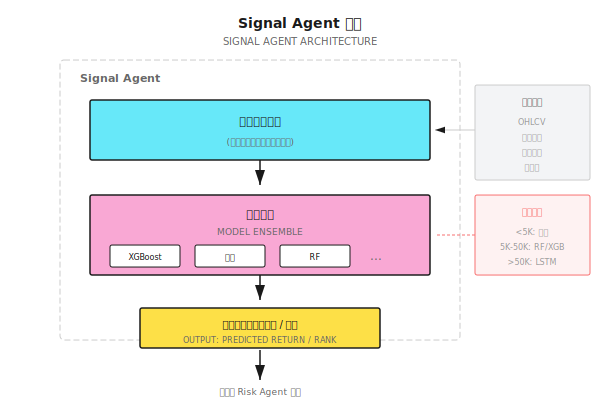

# 第 09 课：监督学习在量化中的应用

> **机器学习不是魔法，而是统计规律的放大镜。如果数据里没有规律，再强的模型也榨不出 Alpha。**

---

## 从"圣杯"到"工具"

2017 年，一家对冲基金招募了一批顶级 AI 研究员，承诺用深度学习"革命"量化交易。

他们构建了一个 10 层 LSTM 网络，用 20 年的分钟级数据训练，GPU 集群跑了三个月。

**回测结果：年化 150%，夏普 4.0。**

创始人兴奋地宣布："我们找到了圣杯！"

**实盘三个月后**：

- 第一个月：+5%（符合预期）
- 第二个月：-8%（开始担忧）
- 第三个月：-15%（恐慌）

累计亏损 18%，而同期标普 500 涨了 8%。

**发生了什么？**

1. **过拟合到历史噪音**：10 层 LSTM 有数百万参数，完美"记住"了历史数据，但那些规律只是噪音
2. **预测 ≠ 盈利**：模型的准确率 52%，听起来不错，但扣除交易成本后净亏损
3. **分布漂移**：2017 年的市场结构和训练数据（1997-2016）已经不同

**教训**：机器学习在量化中的正确定位不是"预测涨跌"，而是**从噪音中提取微弱但稳健的信号**。这一课教你如何正确使用监督学习。

---

## 9.1 监督学习的量化视角

### 什么是监督学习？

用已知答案的数据"训练"模型，让它学会预测未知数据的答案。

```
训练数据：
  输入 X（特征）        →  输出 Y（标签）
  [昨日收益, 成交量, RSI]  →  [明天涨/跌]
  [0.02, 1.5M, 65]        →  [涨]
  [-0.01, 2.0M, 35]       →  [跌]

模型学到的：
  "当 RSI > 60 且成交量放大时，明天涨的概率较高"

预测阶段：
  新输入 [0.01, 1.8M, 70]  →  模型预测 [涨?]
```

### 量化中的"标签"困境

传统机器学习：标签很明确（猫/狗、垃圾邮件/正常邮件）

量化问题：**标签该怎么定义？**

| 标签定义方式 | 问题 |
|------------|------|
| "明天涨 = 1，跌 = 0" | 涨 0.01% 和涨 5% 都是"涨"？ |
| "5 天后收益 > 1%" | 这 5 天中间可能先跌 10% 再涨回来 |
| "收益率本身" | 噪音太大，模型很难学到规律 |
| "夏普 > 1 的持仓" | 需要回看整个持仓期，有前瞻偏差风险 |

**正确的做法**：标签应该反映**可执行的交易决策**，而非抽象的预测目标。

### 常见误区

| 误区 | 事实 |
|-----|------|
| "准确率越高越好" | 52% 准确率但盈亏比 3:1 远好于 70% 准确率盈亏比 1:1 |
| "复杂模型更强" | 金融数据信噪比低，简单模型往往更稳健 |
| "更多特征更好" | 特征过多导致维度灾难和过拟合 |
| "深度学习万能" | 深度学习需要大量数据，量化数据通常不够 |

---

## 9.2 特征工程：量化的核心战场

> 80% 的 Alpha 来自特征工程，不是模型选择。

### 特征的分类

| 特征类型 | 示例 | 信息来源 |
|---------|------|---------|
| **价格特征** | 收益率、波动率、动量 | OHLCV |
| **技术指标** | RSI、MACD、布林带 | 价格派生 |
| **统计特征** | 偏度、峰度、自相关 | 分布特性 |
| **跨资产特征** | 板块动量、市场情绪 | 相关资产 |
| **另类数据** | 卫星图像、社交媒体 | 外部数据 |

### 📝 特征构建示例

假设我们有 AAPL 的日线数据，构建以下特征：

```
基础数据（5 天）：
日期      开盘    最高    最低    收盘    成交量
Day 1    $180   $182   $178   $181   10M
Day 2    $181   $185   $180   $184   12M
Day 3    $184   $186   $183   $183   11M
Day 4    $183   $184   $180   $181   15M
Day 5    $181   $183   $179   $182   13M

特征计算（在 Day 5 收盘后）：

1. 动量特征
   5日收益率 = (182 - 181) / 181 = 0.55%
   3日收益率 = (182 - 184) / 184 = -1.09%

2. 波动率特征
   5日收益序列: [1.66%, -0.54%, -1.09%, 0.55%]
   日波动率 = std() = 1.11%
   年化波动率 = 1.11% × √252 = 17.6%

3. 成交量特征
   5日均量 = (10+12+11+15+13)/5 = 12.2M
   今日量/均量 = 13/12.2 = 1.07 (略放量)

4. 价格位置
   5日最高 = $186, 最低 = $178
   当前位置 = (182-178)/(186-178) = 50% (中间位置)
```

### 好特征的标准

| 标准 | 检验方法 | 不满足的后果 |
|-----|---------|------------|
| **有预测力** | 单变量测试 IC > 0.03 | 浪费计算资源 |
| **稳定性** | 不同时期 IC 波动小 | 过拟合到特定时期 |
| **低相关** | 与现有特征相关 < 0.7 | 信息冗余 |
| **可解释** | 能说清楚逻辑 | 难以调试 |

### 特征选择的实用方法

**方法 1：单变量筛选**

计算每个特征与标签的相关性（IC，Information Coefficient）：

```
IC = corr(特征排名, 收益排名)

好特征：IC 均值 > 0.03，IC 稳定性（IC/std(IC)）> 0.5
```

**方法 2：重要性剪枝**

训练一个简单模型（如随机森林），看特征重要性：

```
如果 top 5 特征贡献 > 80% 重要性：
  → 只保留 top 5-10 个特征
  → 其他特征可能是噪音
```

**方法 3：递归消除**

逐步删除最不重要的特征，观察模型表现：

```
起始：50 个特征，Sharpe 1.2
删到 30 个：Sharpe 1.3 (反而上升！)
删到 10 个：Sharpe 1.4 (继续上升)
删到 5 个：Sharpe 1.1 (开始下降)

→ 最优特征数量约 10 个
```

---

## 9.3 常用模型及其适用场景

### 模型对比

| 模型 | 优点 | 缺点 | 适用场景 |
|-----|------|------|---------|
| **线性回归** | 简单、可解释、不易过拟合 | 只能捕捉线性关系 | 因子投资、风险模型 |
| **随机森林** | 非线性、抗过拟合、特征重要性 | 慢、不擅长外推 | 分类、特征选择 |
| **XGBoost/LightGBM** | 强大、快速、处理缺失值 | 容易过拟合、黑盒 | 通用分类/回归 |
| **LSTM** | 捕捉时序依赖 | 需要大量数据、慢 | 仅限数据充足场景 |
| **Transformer** | 强大的注意力机制 | 数据需求更大、难训练 | 研究前沿，实战少 |

### 模型失效条件

**线性模型失效**：
- 特征与收益的关系是非线性的
- 存在强交互效应（如"低估值 + 高动量"）

**树模型失效**：
- 需要外推（预测超出训练数据范围的值）
- 特征是连续变化的（树模型做阶梯状预测）

**深度学习失效**：
- 数据量 < 10 万条（通常过拟合）
- 特征质量差（垃圾进垃圾出）
- 分布漂移严重（历史不代表未来）

### 量化中的实用选择

```
问自己：我有多少数据？

数据量 < 5000 条（如日线 20 年）
  → 线性模型、岭回归
  → 特征数量 < 20

数据量 5000-50000 条（如分钟线 1 年）
  → 随机森林、XGBoost
  → 特征数量 20-50

数据量 > 50000 条（如 tick 数据）
  → 可以尝试 LSTM/Transformer
  → 但仍需验证是否优于简单模型
```

---

## 9.4 金融数据的特殊挑战

### 低信噪比

金融数据的信号极其微弱：

| 数据类型 | 信噪比 | 可达到的预测力 |
|---------|-------|--------------|
| 图像识别 | 高 | 准确率 95%+ |
| 自然语言 | 中 | 准确率 80%+ |
| 金融预测 | **极低** | 准确率 52-55% 已是顶级 |

**为什么金融信噪比这么低？**
- 市场接近有效：明显的规律很快被套利消除
- 参与者众多：你发现的规律别人也在用
- 噪音主导：短期价格 90% 是随机波动

### 非平稳分布

训练数据和预测数据的分布不同：

```
训练集（2015-2019）：
  波动率均值 15%
  趋势为主

测试集（2020）：
  波动率飙升到 80%
  暴涨暴跌

→ 模型在 2020 年失效
```

**应对方法**：
- 使用滚动窗口，不断重训练
- 特征归一化用滚动统计量
- 多个 regime 分别建模

### 类别不平衡

如果用"大涨（>3%）= 1，其他 = 0"：

```
大涨天数：约 5%
普通天数：约 95%

模型会学到"永远预测 0"，准确率 95%，但完全没用
```

**应对方法**：
- 调整类别权重
- 使用 AUC 而非准确率评估
- 分层抽样保证训练集类别平衡

---

## 9.5 模型评估：不是看准确率

### 量化专用评估指标

| 指标 | 计算 | 好的标准 |
|-----|------|---------|
| **IC (Information Coefficient)** | corr(预测排名, 实际收益排名) | > 0.03 |
| **IR (Information Ratio)** | IC 均值 / IC 标准差 | > 0.5 |
| **多空收益** | Top 组 - Bottom 组的收益差 | 显著为正 |
| **换手率调整收益** | 收益 - 交易成本 | 仍然为正 |

### 📝 模型评估示例

假设模型预测 100 只股票明天的收益排名：

```
模型预测排名（高→低）：
  股票 A: 1 (预测最涨)
  股票 B: 2
  ...
  股票 Z: 100 (预测最跌)

实际收益排名（高→低）：
  股票 A: 5
  股票 B: 10
  ...
  股票 Z: 95

IC = corr([1,2,...,100], [5,10,...,95])
   = 0.85 (预测排名和实际排名高度相关)
```

**解读**：
- IC = 0.85 说明预测排名和实际排名高度一致
- 如果做多 Top 10、做空 Bottom 10，预期有明显超额收益
- 但真实市场 IC 通常只有 0.02-0.05

### 真实世界的期望

```
顶级量化基金的 IC：0.03-0.05
普通量化策略的 IC：0.01-0.03
随机猜测的 IC：0

不要追求 IC > 0.1，那几乎一定是过拟合
```

### 生产级 IC 计算

在实际生产环境中，IC 计算需要处理缺失值、选择正确的相关性方法：

```python
import numpy as np
from scipy.stats import spearmanr

def calculate_ic(
    signals: np.ndarray,
    returns: np.ndarray,
    method: str = "spearman"
) -> float:
    """计算信息系数 (IC) - 信号与收益的相关性

    Args:
        signals: 预测信号数组
        returns: 实际收益数组
        method: "spearman" (推荐) 或 "pearson"

    Returns:
        IC值，范围 [-1, 1]
    """
    if len(signals) != len(returns):
        raise ValueError("signals and returns must have same length")
    if len(signals) < 2:
        return 0.0

    # 处理缺失值 - 生产环境必须
    mask = ~(np.isnan(signals) | np.isnan(returns))
    signals, returns = signals[mask], returns[mask]

    if len(signals) < 2:
        return 0.0

    if method == "spearman":
        ic, _ = spearmanr(signals, returns)
    else:
        ic = np.corrcoef(signals, returns)[0, 1]

    return float(ic) if not np.isnan(ic) else 0.0
```

#### 为什么推荐 Spearman？

| 特性 | Pearson | Spearman |
|-----|---------|----------|
| 对异常值敏感度 | 高 | 低（使用排名） |
| 捕获关系类型 | 仅线性 | 任意单调 |
| 分布假设 | 需要正态 | 无假设 |
| 金融数据适用性 | 受肥尾影响 | 更稳健 |

#### 使用示例

```python
# 计算动量因子的 IC
momentum_signal = df['return_20d'].shift(1)  # 20日动量
forward_return = df['return_5d'].shift(-5)   # 未来5日收益
ic = calculate_ic(momentum_signal.values, forward_return.values)
print(f"动量因子 IC: {ic:.4f}")

# 滚动 IC - 评估因子稳定性
rolling_ic = df.groupby('date').apply(
    lambda x: calculate_ic(x['signal'].values, x['return'].values)
)
ic_mean = rolling_ic.mean()
ic_std = rolling_ic.std()
ir = ic_mean / ic_std  # Information Ratio
print(f"IC Mean: {ic_mean:.4f}, IC Std: {ic_std:.4f}, IR: {ir:.2f}")
```

#### 生产环境注意事项

1. **数据对齐**：确保信号和收益时间对齐，避免 look-ahead bias
2. **最小样本量**：IC 计算至少需要 30+ 个样本才有统计意义
3. **IC 衰减监控**：连续 20 天 IC < 0 应触发因子失效警报
4. **行业中性化**：计算 IC 前先对信号做行业中性化处理

---

## 9.6 多智能体视角

### Signal Agent 的模型选择

在多智能体系统中，监督学习模型是 Signal Agent 的核心：



### 模型失效时怎么办？

Signal Agent 需要检测自身模型是否失效：

| 检测指标 | 阈值 | 触发动作 |
|---------|------|---------|
| 滚动 IC < 0 连续 20 天 | - | 降低信号权重 50% |
| 预测分布异常 | 偏度 > 2 | 暂停信号输出 |
| 模型置信度下降 | 预测方差增大 | 通知 Meta Agent |

**关键设计**：Signal Agent 不是永远正确的，它需要有"自我怀疑"机制。

---

## 💻 代码实现（可选）

<details>
<summary>展开代码示例</summary>

```python
import pandas as pd
import numpy as np
from sklearn.ensemble import RandomForestClassifier
from sklearn.model_selection import TimeSeriesSplit

def create_features(df: pd.DataFrame, lookback: int = 20) -> pd.DataFrame:
    """构建量化特征"""
    features = pd.DataFrame(index=df.index)

    # 动量特征
    features['ret_1d'] = df['close'].pct_change(1)
    features['ret_5d'] = df['close'].pct_change(5)
    features['ret_20d'] = df['close'].pct_change(20)

    # 波动率特征
    features['vol_20d'] = df['close'].pct_change().rolling(20).std()

    # 成交量特征
    features['vol_ratio'] = df['volume'] / df['volume'].rolling(20).mean()

    # 价格位置
    features['price_pos'] = (
        (df['close'] - df['low'].rolling(20).min()) /
        (df['high'].rolling(20).max() - df['low'].rolling(20).min())
    )

    return features.shift(1)  # 避免 look-ahead bias

def create_label(df: pd.DataFrame, horizon: int = 5, threshold: float = 0.02):
    """创建标签：未来 n 天收益是否超过阈值"""
    future_ret = df['close'].pct_change(horizon).shift(-horizon)
    label = (future_ret > threshold).astype(int)
    return label

def calculate_ic(predictions: pd.Series, returns: pd.Series) -> float:
    """计算 Information Coefficient"""
    return predictions.corr(returns, method='spearman')

def walk_forward_train(df: pd.DataFrame, n_splits: int = 5):
    """Walk-Forward 训练和评估"""
    features = create_features(df)
    labels = create_label(df)

    # 对齐数据
    valid_idx = features.dropna().index.intersection(labels.dropna().index)
    X = features.loc[valid_idx]
    y = labels.loc[valid_idx]

    tscv = TimeSeriesSplit(n_splits=n_splits)
    results = []

    for train_idx, test_idx in tscv.split(X):
        X_train, X_test = X.iloc[train_idx], X.iloc[test_idx]
        y_train, y_test = y.iloc[train_idx], y.iloc[test_idx]

        model = RandomForestClassifier(n_estimators=100, max_depth=5, random_state=42)
        model.fit(X_train, y_train)

        predictions = model.predict_proba(X_test)[:, 1]
        # 计算前向收益（未来5天），与预测对齐
        forward_returns = df.loc[X_test.index, 'close'].pct_change(5).shift(-5)
        ic = calculate_ic(pd.Series(predictions, index=X_test.index),
                         forward_returns)

        results.append({
            'test_start': X_test.index[0],
            'test_end': X_test.index[-1],
            'ic': ic,
            'accuracy': (model.predict(X_test) == y_test).mean()
        })

    return pd.DataFrame(results)
```

</details>

---

## 本课交付物

完成本课后，你将获得：

1. **对监督学习在量化中定位的理解** - 知道它能做什么、不能做什么
2. **特征工程的实用技能** - 能构建和筛选有效的量化特征
3. **模型选择框架** - 根据数据量选择合适的模型
4. **正确的评估方法** - 用 IC/IR 而非准确率评估模型

### ✅ 验收标准

| 检查项 | 验收标准 | 自测方法 |
|-------|---------|---------|
| **特征构建** | 能从 OHLCV 数据构建 5 个特征 | 给定价格数据，手算特征值 |
| **模型选择** | 能根据数据量推荐模型 | 给定"3 年日线"场景，说出推荐 |
| **IC 计算** | 能解释 IC=0.03 的含义 | 不看笔记，解释 IC 的业务意义 |
| **失效检测** | 能列出 3 个模型失效信号 | 设计 Signal Agent 的自检逻辑 |

---

## 本课要点回顾

- [x] 理解监督学习在量化中的正确定位：提取微弱信号，而非预测涨跌
- [x] 掌握特征工程的核心方法：构建、筛选、评估
- [x] 认识金融数据的特殊挑战：低信噪比、非平稳、类别不平衡
- [x] 学会用 IC/IR 而非准确率评估模型
- [x] 理解 Signal Agent 如何集成监督学习模型

---

## 延伸阅读

- *Advances in Financial Machine Learning* by Marcos López de Prado
- [背景知识：LLM 量化研究进展](背景知识/LLM量化研究进展.md) - 最新研究方向

---

## 下一课预告

**第 10 课：从模型到 Agent**

模型只会输出预测，但交易需要决策。如何把一个"预测模型"包装成一个"能做决策的 Agent"？下一课我们跨越从模型到 Agent 的鸿沟。
