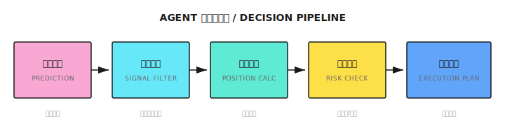
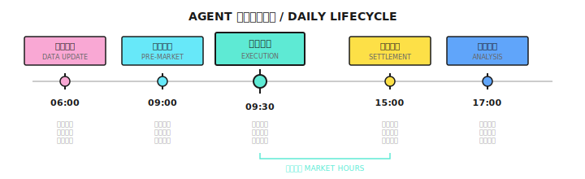
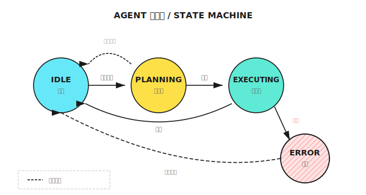
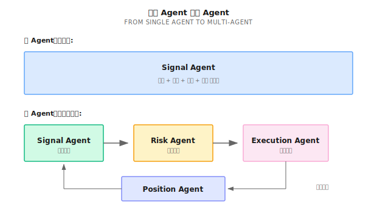

# 第 10 课：从模型到 Agent

> **模型说"明天涨"，但涨多少？买多少？什么时候卖？模型不回答这些问题，Agent 必须回答。**

---

## 模型的局限

一个量化团队训练了一个高质量的预测模型：

- IC = 0.05（顶级水平）
- 每天预测 500 只股票的收益排名
- 回测验证稳定有效

他们把模型接入交易系统，规则很简单：
- 每天买入预测排名前 10 的股票
- 每只股票平均分配资金
- 持有 5 天后卖出

**第一个月**：收益 +3%，符合预期

**第二个月**：收益 -5%

发生了什么？

1. **没有考虑相关性**：买入的 10 只股票都是科技股，市场科技板块下跌，全部一起亏
2. **没有考虑波动率**：有的股票日波动 5%，有的只有 1%，但资金平均分配
3. **没有止损机制**：一只股票持续下跌 15%，仍然持有到第 5 天
4. **没有应对突发事件**：某只股票停牌，资金被锁定

**模型只负责"预测"，而 Agent 需要负责"决策"。** 决策涉及：
- **买什么？**（资产选择）
- **买多少？**（仓位管理）
- **什么时候买/卖？**（时机选择）
- **出问题怎么办？**（异常处理）

这一课教你如何把一个"预测模型"升级为一个"能决策的 Agent"。

---

## 10.1 预测 vs 决策

### 核心差异

| | 预测模型 | 交易 Agent |
|--|---------|-----------|
| **输入** | 特征向量 | 特征 + 状态 + 约束 |
| **输出** | 预测值/概率 | 具体行动 |
| **评估** | 预测误差 (IC, MSE) | 收益/风险/成本 |
| **时间** | 单点预测 | 持续决策 |
| **错误处理** | 无 | 必须有 |

### 直观例子

```
模型输出：
  "AAPL 明天预期收益率 +0.5%，置信度 60%"

Agent 需要回答：
  1. 买入吗？ → 需要对比其他股票，考虑当前持仓
  2. 买多少？ → 需要考虑资金、风险限制、相关性
  3. 什么价买？→ 市价单还是限价单？挂在哪里？
  4. 止损在哪？→ 如果预测错了，亏多少离场？
  5. 卖出时机？→ 目标价、持有期限、还是动态止盈？
```

### Agent 的决策链



---

## 10.2 Agent 的核心组件

### 状态 (State)

Agent 需要知道"当前处于什么情况"：

| 状态类型 | 内容示例 |
|---------|---------|
| **市场状态** | 当前价格、波动率、成交量、趋势/震荡 |
| **持仓状态** | 持有什么、成本价、盈亏、持仓时长 |
| **账户状态** | 可用资金、保证金、已用杠杆 |
| **系统状态** | API 正常？延迟多少？有无告警？ |

### 行动空间 (Action Space)

Agent 可以采取的行动：

```
基础行动：
  - BUY(symbol, quantity, order_type, price)
  - SELL(symbol, quantity, order_type, price)
  - HOLD()

复合行动：
  - REBALANCE(target_weights)
  - REDUCE_RISK(target_exposure)
  - CLOSE_ALL()

约束条件：
  - 单笔不超过可用资金的 10%
  - 总杠杆不超过 2 倍
  - 单一股票不超过总仓位的 20%
```

### 决策函数

将状态映射到行动：

```
action = decide(state, prediction, constraints)

示例：
  state = {
    cash: $100,000,
    positions: {AAPL: 100股, $180成本},
    market_regime: "trend"
  }

  prediction = {
    AAPL: +0.5%,
    MSFT: +0.8%,
    GOOGL: +0.3%
  }

  constraints = {
    max_position: 20%,
    max_drawdown: 10%,
    stop_loss: 5%
  }

  action = decide(state, prediction, constraints)
  → BUY(MSFT, 50股, LIMIT, $380)
```

---

## 10.3 仓位管理：从预测到头寸

### 等权分配（最简单）

```
规则：买入 Top N，每只分配 1/N 的资金

示例：
  Top 5 股票，资金 $100,000
  每只分配 $20,000
```

**问题**：没有考虑预测强度、波动率差异、相关性

### 按预测强度分配

```
规则：预测越强，分配越多

预测收益：
  AAPL: +1.0%
  MSFT: +0.5%
  GOOGL: +0.3%

权重计算：
  AAPL: 1.0 / 1.8 = 56%
  MSFT: 0.5 / 1.8 = 28%
  GOOGL: 0.3 / 1.8 = 16%
```

**问题**：高波动股票可能权重过高

### 按波动率调整（风险平价）

```
规则：让每只股票贡献相等的风险

波动率：
  AAPL: 25%
  MSFT: 20%
  GOOGL: 15%

波动率倒数权重：
  AAPL: 1/0.25 = 4
  MSFT: 1/0.20 = 5
  GOOGL: 1/0.15 = 6.67

归一化后：
  AAPL: 4/15.67 = 26%
  MSFT: 5/15.67 = 32%
  GOOGL: 6.67/15.67 = 42%
```

### Kelly 公式（最优化）

理论上最优的仓位大小：

```
Kelly 比例 = p/a - q/b

p = 胜率
q = 1 - p
a = 平均亏损率
b = 平均盈利率

示例：
  胜率 55%，盈亏比 1.5:1
  Kelly = 0.55/1 - 0.45/1.5 = 0.55 - 0.30 = 25%

实际应用：使用半 Kelly (12.5%) 更保守
```

### Half-Kelly + Van Tharp 混合模型（推荐）

**为什么需要混合模型？**

单独使用 Kelly 公式有两个问题：
1. **假设无限可分**：现实中股票有最小交易单位
2. **忽略肥尾风险**：市场崩盘时，亏损可能远超历史均值

Van Tharp 的 R-Multiple 方法弥补了这个缺陷——它强制把止损融入仓位计算，确保单笔亏损永远不超过账户的固定比例。

**两种方法的角色**：

| 方法 | 角色 | 目的 |
|-----|-----|-----|
| **Half-Kelly** | 进攻端 - 设置上限 | 最大化长期复合增长 |
| **Van Tharp R-Multiple** | 防守端 - 设置下限 | 生存 - 单笔亏损永不致命 |

**公式**：

```
Half-Kelly（进攻上限）:
  f = (p × (b + 1) - 1) / b，然后除以 2

  p = 胜率
  b = 盈亏比（平均盈利 / 平均亏损）

Van Tharp R-Multiple（防守下限）:
  position_size = (equity × risk_pct) / stop_loss_distance

  equity = 账户净值
  risk_pct = 单笔风险比例（通常 1%）
  stop_loss_distance = 止损距离（入场价 - 止损价）
```

**实现模式**：

```python
def half_kelly(win_rate: float, reward_risk_ratio: float) -> float:
    """计算 Half-Kelly 仓位上限"""
    full_kelly = (win_rate * (reward_risk_ratio + 1) - 1) / reward_risk_ratio
    return max(0, full_kelly / 2)

def van_tharp_limit(equity: float, risk_pct: float, stop_loss_dist: float, price: float) -> float:
    """计算 Van Tharp 仓位上限（返回仓位比例）"""
    max_loss = equity * risk_pct
    shares = max_loss / stop_loss_dist
    position_value = shares * price
    return position_value / equity

# 最终仓位 = 三者取最小
strategy_cap = half_kelly(win_rate=0.55, reward_risk_ratio=1.5)  # 例：0.10 (10%)
risk_cap = van_tharp_limit(equity=100000, risk_pct=0.01, stop_loss_dist=5, price=100)  # 例：0.08 (8%)
max_notional_per_pair = 0.05  # 硬限制：单笔不超过 5%

final_position = min(strategy_cap, risk_cap, max_notional_per_pair)
```

**示例计算**：

```
账户: $100,000
策略历史: 胜率 55%，盈亏比 1.5:1
标的: AAPL 现价 $200，止损设在 $190（距离 $10）

Step 1: Half-Kelly 上限
  f = (0.55 × 2.5 - 1) / 1.5 / 2 = 0.375 / 2 = 18.75%
  → 最多投入 $18,750

Step 2: Van Tharp 下限
  单笔最大亏损 = $100,000 × 1% = $1,000
  可买股数 = $1,000 / $10 = 100 股
  仓位价值 = 100 × $200 = $20,000
  → 按风控，最多投入 $20,000

Step 3: 硬限制
  单笔上限 = $100,000 × 5% = $5,000

最终仓位 = min($18,750, $20,000, $5,000) = $5,000
→ 买入 25 股 AAPL
```

**核心原则**：

> **Half-Kelly 定义进攻上限；Van Tharp R-Multiple 定义生存下限。**

两者结合确保：
1. 机会来临时不会太保守（Kelly 的数学优化）
2. 判断错误时不会致命（Van Tharp 的风控底线）
3. 硬限制防止过度集中（无论模型多自信）

### 📝 仓位计算示例

假设：
- 资金 $100,000
- 最大单仓 20%（$20,000）
- 最大总仓位 80%（$80,000）

模型预测 Top 3：

| 股票 | 预测收益 | 波动率 | 原始权重 | 风险调整权重 | 最终仓位 |
|-----|---------|-------|---------|------------|---------|
| AAPL | +1.0% | 25% | 40% | 30% | $24,000 → **$20,000**（触限） |
| MSFT | +0.8% | 20% | 32% | 35% | $28,000 → **$20,000**（触限） |
| GOOGL | +0.7% | 15% | 28% | 35% | $28,000 → **$20,000**（触限） |

最终：AAPL/MSFT/GOOGL 各 $20,000，总仓位 60%

---

## 10.4 风险控制集成

### Agent 内置的风险规则

| 规则类型 | 示例 | 触发动作 |
|---------|------|---------|
| **止损** | 单笔亏损 > 5% | 平仓 |
| **止盈** | 单笔盈利 > 10% | 减仓 50% |
| **总回撤** | 账户回撤 > 15% | 停止开仓 |
| **集中度** | 单股 > 25% | 禁止加仓 |
| **时间** | 持仓 > 20 天 | 强制平仓 |

### 与 Risk Agent 的协作

```
Signal Agent 提出：
  "买入 AAPL $30,000"

Agent 内部检查：
  ✓ 单笔 < 最大仓位
  ✓ 有足够现金
  ✗ 如果买入，科技股占比将超过 60%

内部处理选项：
  A) 缩小订单到 $15,000
  B) 同时卖出部分其他科技股
  C) 放弃这笔交易

→ 选择 A，提交 $15,000 订单给 Risk Agent 审核

Risk Agent 审核：
  ✓ 符合账户级风控
  ✓ 无异常
  → 批准执行
```

---

## 10.5 异常处理

### 必须处理的异常

| 异常类型 | 发生场景 | 处理方式 |
|---------|---------|---------|
| **订单拒绝** | 资金不足、标的停牌 | 记录日志、调整计划 |
| **部分成交** | 流动性不足 | 决定是否继续追单 |
| **价格跳空** | 隔夜大涨大跌 | 重新评估止损价 |
| **API 超时** | 网络问题 | 重试机制 + 熔断 |
| **数据缺失** | 数据源故障 | 使用备用数据源或暂停 |

### 异常处理设计原则

1. **快速失败**：不确定时停止，而非继续执行
2. **降级运行**：主功能失败时有备选方案
3. **人工介入**：严重异常触发告警，等待人工决策
4. **事后审计**：所有异常都记录，便于复盘

---

## 10.6 Agent 的生命周期

### 每日流程



### 状态机视角



---

## 10.7 多智能体视角

### Signal Agent 的定位

```
Signal Agent 职责：
  - 运行预测模型
  - 生成原始信号（预测排名/收益）
  - 初步仓位计算
  - 信号置信度评估

Signal Agent 不负责：
  - 最终下单决策（Risk Agent）
  - 订单执行（Execution Agent）
  - 持仓监控（Position Agent）
```

### 从单 Agent 到多 Agent



本课学习的是"单 Agent 做完所有事"的简化版。第 11 课开始，我们会把不同职责拆分到专门的 Agent。

---

## 💻 代码实现（可选）

<details>
<summary>展开代码示例</summary>

```python
from dataclasses import dataclass
from typing import Dict, List, Optional
from enum import Enum

class OrderType(Enum):
    MARKET = "market"
    LIMIT = "limit"

@dataclass
class Order:
    symbol: str
    quantity: int
    side: str  # "buy" or "sell"
    order_type: OrderType
    price: Optional[float] = None

@dataclass
class Position:
    symbol: str
    quantity: int
    avg_cost: float
    current_price: float

    @property
    def pnl_pct(self) -> float:
        return (self.current_price - self.avg_cost) / self.avg_cost

class TradingAgent:
    def __init__(
        self,
        capital: float,
        max_position_pct: float = 0.2,
        max_total_exposure: float = 0.8,
        stop_loss_pct: float = 0.05
    ):
        self.capital = capital
        self.max_position_pct = max_position_pct
        self.max_total_exposure = max_total_exposure
        self.stop_loss_pct = stop_loss_pct
        self.positions: Dict[str, Position] = {}

    def get_current_exposure(self) -> float:
        """计算当前总敞口占资本比例"""
        total_value = sum(
            pos.quantity * pos.current_price
            for pos in self.positions.values()
        )
        return total_value / self.capital

    def calculate_position_size(
        self,
        symbol: str,
        prediction: float,
        volatility: float,
        current_price: float
    ) -> int:
        """计算仓位大小"""
        # 检查总敞口限制
        current_exposure = self.get_current_exposure()
        remaining_exposure = self.max_total_exposure - current_exposure
        if remaining_exposure <= 0:
            return 0  # 已达总敞口上限

        # 基于预测强度的原始权重
        raw_weight = abs(prediction)

        # 波动率调整
        vol_adjusted_weight = raw_weight / volatility

        # 限制单仓，同时不超过剩余敞口空间
        capped_weight = min(vol_adjusted_weight, self.max_position_pct, remaining_exposure)

        # 计算股数
        position_value = self.capital * capped_weight
        shares = int(position_value / current_price)

        return shares

    def check_stop_loss(self) -> List[Order]:
        """检查止损"""
        orders = []
        for symbol, pos in self.positions.items():
            if pos.pnl_pct < -self.stop_loss_pct:
                orders.append(Order(
                    symbol=symbol,
                    quantity=pos.quantity,
                    side="sell",
                    order_type=OrderType.MARKET
                ))
        return orders

    def generate_orders(
        self,
        predictions: Dict[str, float],
        volatilities: Dict[str, float],
        prices: Dict[str, float]
    ) -> List[Order]:
        """生成订单"""
        orders = []

        # 1. 先检查止损
        stop_loss_orders = self.check_stop_loss()
        orders.extend(stop_loss_orders)

        # 2. 计算目标持仓
        for symbol, pred in predictions.items():
            if pred > 0.001:  # 只处理正预测
                target_shares = self.calculate_position_size(
                    symbol, pred,
                    volatilities.get(symbol, 0.2),
                    prices[symbol]
                )

                current_shares = self.positions.get(symbol, Position(symbol, 0, 0, 0)).quantity
                diff = target_shares - current_shares

                if diff > 0:
                    orders.append(Order(
                        symbol=symbol,
                        quantity=diff,
                        side="buy",
                        order_type=OrderType.LIMIT,
                        price=prices[symbol] * 0.999  # 稍低于现价
                    ))
                elif diff < 0:
                    orders.append(Order(
                        symbol=symbol,
                        quantity=-diff,
                        side="sell",
                        order_type=OrderType.LIMIT,
                        price=prices[symbol] * 1.001  # 稍高于现价
                    ))

        return orders
```

</details>

---

## 本课交付物

完成本课后，你将获得：

1. **预测到决策的转化思维** - 理解模型输出如何变成具体交易行动
2. **Agent 架构设计** - 状态、行动空间、决策函数的设计方法
3. **仓位管理技能** - 等权、预测加权、风险平价的计算方法
4. **异常处理意识** - 知道必须处理哪些异常情况

### ✅ 验收标准

| 检查项 | 验收标准 | 自测方法 |
|-------|---------|---------|
| **预测 vs 决策** | 能说出 3 个核心差异 | 不看笔记，列举差异 |
| **仓位计算** | 能手算风险平价权重 | 给定 3 只股票波动率，计算权重 |
| **决策链** | 能画出从预测到订单的完整流程 | 白纸画图 |
| **异常处理** | 能列出 5 种必须处理的异常 | 设计异常处理表 |

**📝 场景练习**：

模型预测：AAPL +1.2%, TSLA +0.8%, MSFT +0.5%
波动率：AAPL 25%, TSLA 50%, MSFT 20%
资金：$100,000，最大单仓 20%

问：按风险平价计算，每只股票应分配多少资金？

<details>
<summary>点击查看答案</summary>

波动率倒数：
- AAPL: 1/0.25 = 4
- TSLA: 1/0.50 = 2
- MSFT: 1/0.20 = 5
- 总和: 11

归一化权重：
- AAPL: 4/11 = 36.4%
- TSLA: 2/11 = 18.2%
- MSFT: 5/11 = 45.4%

资金分配（考虑 20% 单仓限制）：
- AAPL: $36,400 → **$20,000**（触限）
- TSLA: $18,200 → $18,200
- MSFT: $45,400 → **$20,000**（触限）

最终：AAPL $20k, TSLA $18.2k, MSFT $20k，总仓位 58.2%

</details>

---

## 本课要点回顾

- [x] 理解预测模型和交易 Agent 的核心差异
- [x] 掌握 Agent 的核心组件：状态、行动空间、决策函数
- [x] 学会多种仓位管理方法：等权、预测加权、风险平价、Kelly
- [x] 认识必须处理的异常类型和处理原则
- [x] 理解 Signal Agent 在多智能体系统中的定位

---

## 延伸阅读

- *Active Portfolio Management* by Grinold & Kahn - 仓位管理的经典著作
- [第 15 课：风险控制与资金管理](../Part4-多智能体/第15课：风险控制与资金管理.md) - 更详细的风控内容

---

## Part 3 总结

恭喜你完成了机器学习阶段！

| 课程 | 核心收获 |
|-----|---------|
| 第 09 课 | 监督学习的量化定位、特征工程、模型选择、IC 评估 |
| 第 10 课 | 从预测到决策的转化、Agent 架构、仓位管理 |

**下一阶段预告**：

Part 4 将进入多智能体系统：
- 第 11 课：为什么需要多智能体
- 第 12 课：市场状态识别 (Regime Detection)
- 第 13 课：Regime 误判与系统性崩溃模式
- 第 14 课：LLM 在量化中的应用
- 第 15 课：风险控制与资金管理
- 第 16 课：组合构建与风险暴露管理
- 第 17 课：在线学习与策略进化

你将学会如何构建一个完整的多智能体交易系统，让不同的专家 Agent 协作完成从分析到执行的全流程。
