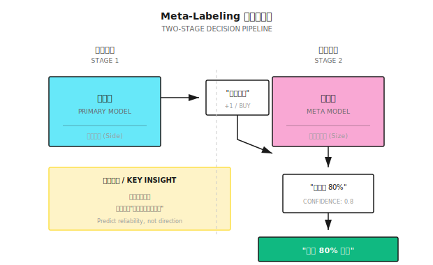

# 背景知识：Meta-Labeling 方法

> "不是预测涨跌，而是预测'这次预测靠不靠谱'。"

---

## 传统方法的问题

**场景**：你有一个趋势跟踪模型，产生买入/卖出信号

```
传统流程：
信号产生 → 直接执行 → 结果好坏参半

问题：
  - 某些信号胜率高（趋势明确时）
  - 某些信号胜率低（震荡市时）
  - 模型无法区分这两种情况
```

**结果**：在不该交易时交易，浪费成本，拖累收益。

---

## Meta-Labeling 的核心思想

**两阶段决策**：



---

## 具体流程

### 步骤 1：主模型生成信号

主模型可以是任何策略：
- 技术分析规则
- 机器学习模型
- 基本面因子

```
主模型输出：
  +1 = 买入信号
  -1 = 卖出信号
   0 = 无信号
```

### 步骤 2：构建元标签

对于每个主模型信号，判断该信号是否正确：

```
元标签定义：
  如果主模型信号方向正确且盈利 → 元标签 = 1
  如果主模型信号方向错误或亏损 → 元标签 = 0

结合 Triple Barrier：
  主模型说"买入"，触发上屏障（止盈）→ 元标签 = 1
  主模型说"买入"，触发下屏障（止损）→ 元标签 = 0
```

### 步骤 3：训练元模型

元模型学习预测主模型信号的成功概率：

```
特征：
  - 主模型信号方向
  - 当前波动率
  - 趋势强度
  - 主模型历史准确率
  - 市场状态指标

目标：
  - 预测该信号是否会盈利（二分类）
  - 或预测置信度（回归）
```

### 步骤 4：决策执行

```
最终决策 = 主模型方向 × 元模型置信度

例如：
  主模型：买入 (+1)
  元模型：置信度 0.3（低）

  决策：
    选项 A：不执行（置信度太低）
    选项 B：小仓位买入（30% 仓位）
```

---

## 数值示例

**设定**：趋势跟踪主模型，过去 100 个信号

| 信号编号 | 主模型方向 | 实际结果 | 元标签 |
|---------|----------|---------|-------|
| 1 | 买入 | 盈利 2% | 1 |
| 2 | 买入 | 亏损 1% | 0 |
| 3 | 卖出 | 盈利 1.5% | 1 |
| 4 | 买入 | 亏损 0.5% | 0 |
| ... | ... | ... | ... |

**统计**：
- 总信号：100 个
- 盈利信号：55 个（55% 胜率）
- 亏损信号：45 个

**元模型分析**：

```
高置信度信号（元模型 > 0.7）：30 个
  - 盈利：25 个（83% 胜率）
  - 亏损：5 个

低置信度信号（元模型 < 0.3）：25 个
  - 盈利：8 个（32% 胜率）
  - 亏损：17 个

策略：只执行高置信度信号
  - 交易次数减少 70%
  - 胜率从 55% 提升到 83%
  - 交易成本降低
```

---

## 元模型的特征设计

### 市场状态特征

| 特征 | 计算方法 | 预测逻辑 |
|-----|---------|---------|
| 波动率 | 20 日收益率标准差 | 高波动时趋势信号更易失败 |
| 趋势强度 | ADX 指标 | 强趋势时信号更可靠 |
| 成交量变化 | 当前 / 20 日均量 | 放量突破更可靠 |
| VIX 水平 | 恐慌指数 | 高 VIX 时信号可靠性下降 |

### 主模型特征

| 特征 | 计算方法 | 预测逻辑 |
|-----|---------|---------|
| 信号强度 | 主模型原始分数 | 强信号更可靠 |
| 滚动胜率 | 过去 20 个信号的准确率 | 近期表现好时更可靠 |
| 信号一致性 | 多指标是否一致 | 多重确认更可靠 |
| 距上次信号时间 | 信号间隔 | 频繁信号可能是噪音 |

### 时间特征

| 特征 | 计算方法 | 预测逻辑 |
|-----|---------|---------|
| 周内位置 | 周一到周五编码 | 周一/周五波动可能不同 |
| 月内位置 | 月初/月末 | 月末可能有机构调仓 |
| 财报季 | 是否在财报发布期 | 财报期噪音更大 |

---

## 仓位定标（Position Sizing）

元模型的置信度可以直接用于仓位管理：

```
方法一：线性映射
  仓位 = 置信度 × 最大仓位

  置信度 0.8 → 80% 仓位
  置信度 0.3 → 30% 仓位

方法二：阈值过滤
  置信度 > 0.6 → 满仓
  置信度 < 0.6 → 不交易

方法三：凸函数映射
  仓位 = 置信度² × 最大仓位

  更激进地减少低置信度仓位：
  置信度 0.8 → 64% 仓位
  置信度 0.5 → 25% 仓位
  置信度 0.3 → 9% 仓位
```

---

## 与直接预测的对比

| 方法 | 目标 | 优点 | 缺点 |
|-----|------|------|------|
| 直接预测 | 预测涨跌 | 简单直接 | 胜率难超 55% |
| Meta-Labeling | 预测信号可靠性 | 提升有效胜率 | 减少交易机会 |

**关键洞察**：

```
直接预测：
  100 次交易，55% 胜率
  期望盈利 = 55 × 1% - 45 × 1% = 10%

Meta-Labeling：
  30 次高置信度交易，80% 胜率
  期望盈利 = 24 × 1% - 6 × 1% = 18%

  虽然交易次数少，但收益更高
```

---

## 多智能体视角

Meta-Labeling 天然契合多智能体架构：

```
Signal Agent（主模型）
  │
  ├─ 输出：交易方向
  │
  ↓
Confidence Agent（元模型）
  │
  ├─ 输入：Signal Agent 的信号 + 市场状态
  ├─ 输出：该信号的置信度
  │
  ↓
Risk Agent
  │
  ├─ 根据置信度调整仓位
  ├─ 低置信度 → 拒绝交易或小仓位
  └─ 高置信度 → 允许正常仓位

Meta Agent
  │
  └─ 监控 Confidence Agent 的准确率
     → 如果持续失效，切换到保守模式
```

---

## 常见误区

**误区一：元模型会学到和主模型相同的东西**

不对。两者目标不同：
- 主模型：预测价格方向
- 元模型：预测主模型何时有效

元模型可以发现"主模型在高波动时失效"这类规律。

**误区二：高置信度一定正确**

不保证。元模型也会犯错：
- 过拟合历史模式
- 市场 Regime 变化
- 样本量不足

仍需保留止损和风控。

**误区三：Meta-Labeling 可以挽救差的主模型**

有限。如果主模型胜率太低（<50%），元模型能做的有限：
- 只能减少亏损
- 无法创造正期望

主模型本身必须有一定的预测能力。

---

## 实用建议

### 1. 验证主模型有基础 Alpha

```
先确认：
  - 主模型胜率 > 50%
  - 或盈亏比 > 1
  - 样本外有正收益

没有基础 Alpha，Meta-Labeling 无法创造
```

### 2. 元模型要简单

```
推荐：
  - 逻辑回归
  - 浅层决策树
  - 简单神经网络（1-2 层）

避免：
  - 深度模型（容易过拟合）
  - 过多特征（增加噪音）
```

### 3. 独立验证

```
验证流程：
  1. 在训练集上训练主模型
  2. 用主模型在验证集生成信号
  3. 用验证集信号的结果训练元模型
  4. 在测试集评估整体表现

关键：主模型和元模型使用不同数据
```

---

## 总结

| 要点 | 说明 |
|-----|------|
| 核心思想 | 用二级模型预测一级模型的可靠性 |
| 输出 | 置信度分数 → 用于过滤或仓位定标 |
| 优势 | 提升有效胜率，减少无效交易 |
| 前提 | 主模型本身需要有正期望 |
| 多智能体应用 | Confidence Agent 专门负责置信度评估 |
