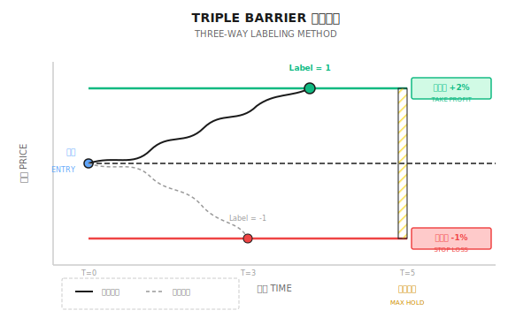

# 背景知识：Triple Barrier 标签方法

> "传统的涨跌标签忽略了一个关键问题：你能拿住多久？"

---

## 传统标签的问题

假设你用机器学习预测明天 AAPL 是涨还是跌：

```
标签 = 1 if 明天收盘 > 今天收盘 else 0
```

**问题在哪？**

| 场景 | 明天涨跌 | 传统标签 | 实际结果 |
|-----|---------|---------|---------|
| 开盘跌 3%，收盘涨 0.5% | 涨 | 1 (正确) | 止损出局，亏 3% |
| 稳步上涨 2% | 涨 | 1 (正确) | 持有，赚 2% |
| 先涨 5%，收盘涨 0.1% | 涨 | 1 (正确) | 没止盈，错过 5% |

传统标签完全无视**过程中的波动**和**风险管理**。

---

## Triple Barrier 的核心思想

设置三个"屏障"，哪个先触及就决定标签：



**三个屏障**：
1. **上屏障（Upper Barrier）**：价格上涨到止盈位 → 标签 = 1
2. **下屏障（Lower Barrier）**：价格下跌到止损位 → 标签 = -1
3. **时间屏障（Vertical Barrier）**：持有期结束 → 标签 = 0 或按收益方向

---

## 具体计算示例

**设定**：
- 入场价：$185.00 (AAPL)
- 止盈：2%（$188.70）
- 止损：1%（$183.15）
- 最大持有期：5 天

**情景一**：第 2 天触及 $189.00
```
结果：触及上屏障
标签：1（盈利出场）
实际收益：+2%
```

**情景二**：第 3 天跌到 $182.50
```
结果：触及下屏障
标签：-1（止损出场）
实际收益：-1%
```

**情景三**：5 天内在 $184-$187 震荡
```
结果：触及时间屏障
标签：0 或根据最终价格
实际收益：取决于出场价
```

---

## 动态屏障：基于波动率

固定 2% 止盈在不同市场环境下不合理：

| 市场状态 | 日均波动率 | 固定 2% 止盈 | 问题 |
|---------|----------|------------|------|
| 低波动期 | 0.5% | 需要 4 天才能到 | 可能先到时间屏障 |
| 高波动期 | 3% | 当天就触发 | 没捕捉到趋势 |

**解决方案**：用 ATR（平均真实波幅）或滚动标准差定义屏障

```
上屏障 = 入场价 × (1 + k × σ)
下屏障 = 入场价 × (1 - k × σ)

其中：
  σ = 过去 20 天收益率标准差
  k = 倍数（通常 1-3）
```

**实例**：
- σ = 1.5%
- k = 2
- 入场价 = $185

```
上屏障 = $185 × (1 + 2 × 1.5%) = $190.55
下屏障 = $185 × (1 - 2 × 1.5%) = $179.45
```

---

## 非对称屏障

真实交易中，止盈和止损常常不对称：

| 策略类型 | 止盈倍数 | 止损倍数 | 盈亏比 |
|---------|---------|---------|-------|
| 趋势跟踪 | 3σ | 1σ | 3:1 |
| 均值回归 | 1σ | 2σ | 1:2 |
| 高胜率策略 | 1σ | 1σ | 1:1 |

**趋势策略示例**：
```
止盈 = 3 × 1.5% = 4.5%
止损 = 1 × 1.5% = 1.5%

胜率只需 >25% 就能盈利：
期望 = 胜率 × 4.5% - (1-胜率) × 1.5%
当胜率 = 30%：期望 = 0.3% (正收益)
```

---

## 标签分布的重要性

Triple Barrier 产生三类标签，分布会影响模型训练：

| 标签 | 含义 | 理想比例 | 实际情况 |
|-----|------|---------|---------|
| 1 | 止盈出场 | 33% | 震荡市可能 <20% |
| -1 | 止损出场 | 33% | 趋势市可能 <20% |
| 0 | 时间出场 | 33% | 常常 >50% |

**类别不平衡处理**：
- 过采样少数类（SMOTE）
- 欠采样多数类
- 调整类别权重
- 调整屏障宽度使分布更均匀

---

## 与传统标签的对比

| 维度 | 传统标签 | Triple Barrier |
|-----|---------|----------------|
| 信息量 | 只有方向 | 方向 + 风险 + 时间 |
| 与实盘一致性 | 低 | 高 |
| 计算复杂度 | O(1) | O(T) 每个样本 |
| 标签噪音 | 高 | 较低 |
| 适用策略 | 简单预测 | 实际交易系统 |

---

## 多智能体视角

在多智能体架构中，Triple Barrier 可以这样应用：

```
Signal Agent：预测标签（1, 0, -1）
     ↓
Risk Agent：动态调整屏障宽度
     ↓
     - 高波动期 → 宽屏障，避免频繁止损
     - 低波动期 → 窄屏障，提高资金效率
     ↓
Execution Agent：监控屏障触发，执行出场
```

---

## 常见误区

**误区一：屏障设得越宽越好**

不对。宽屏障虽然减少止损触发，但：
- 单笔亏损更大
- 资金占用时间更长
- 可能错过其他机会

**误区二：时间屏障不重要**

很重要。没有时间屏障，资金可能被长期套牢。5 天还没触发任何屏障，说明判断可能错误，应该出场重新评估。

**误区三：Triple Barrier 标签一定比传统标签好**

不一定。如果你的策略本身不用止盈止损（如 T+1 必须次日卖出），传统标签可能更匹配。标签方法要与实际交易逻辑一致。

---

## 实用建议

1. **从简单开始**：先用固定比例屏障，验证有效再加入波动率调整
2. **检查标签分布**：三类标签比例差异过大时需要调整
3. **回测要一致**：训练用 Triple Barrier，回测也要模拟相同的止盈止损逻辑
4. **考虑交易成本**：屏障过窄会导致频繁交易，成本吞噬收益

---

## 总结

| 要点 | 说明 |
|-----|------|
| 核心思想 | 用止盈、止损、时间三个屏障决定标签 |
| 优势 | 标签与实际交易逻辑一致，降低噪音 |
| 关键参数 | 屏障宽度、是否对称、时间长度 |
| 动态调整 | 基于波动率（ATR 或 σ）设置屏障 |
| 多智能体应用 | Risk Agent 根据市场状态调整屏障 |
