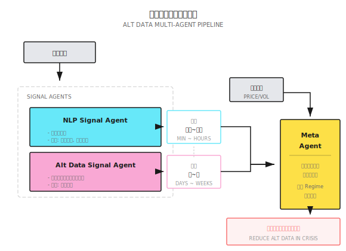

# 背景知识：另类数据（NLP 与卫星）

> "当所有人都在看同样的价量数据时，Alpha 在别处。"

---

## 什么是另类数据？

**传统数据**：价格、成交量、财务报表——所有人都能轻易获取

**另类数据**：从非传统来源提取的、具有预测价值的信息

| 数据类型 | 来源示例 | 预测目标 |
|---------|---------|---------|
| 文本情绪 | 新闻、社交媒体、财报电话会 | 短期价格波动 |
| 卫星图像 | 停车场、农田、油罐 | 营收预测 |
| 信用卡交易 | 消费者支付数据 | 零售业绩 |
| 网页流量 | App 下载量、网站访问 | 用户增长 |
| 供应链 | 航运追踪、港口数据 | 供需预测 |

---

## 文本数据与 NLP

### 情绪分析基础

将文本转化为数值信号：

```
新闻标题："Apple 季度营收创新高，超出分析师预期"
情绪分数：+0.8（正面）

新闻标题："Tesla 被曝存在安全隐患，面临监管调查"
情绪分数：-0.7（负面）
```

### 情绪信号的构建

**简单方法**：词典计数

```
正面词汇：{"增长", "超预期", "创新高", "突破"...}
负面词汇：{"下跌", "亏损", "调查", "召回"...}

情绪分数 = (正面词数 - 负面词数) / 总词数
```

**进阶方法**：预训练语言模型

```
使用 BERT/GPT 类模型：
1. 输入：新闻全文
2. 输出：情绪类别（正/中/负）或连续分数
3. 优势：理解上下文和讽刺
```

### 文本数据源对比

| 来源 | 时效性 | 覆盖度 | 噪音 | 成本 |
|-----|-------|-------|------|------|
| 新闻（路透、彭博） | 分钟级 | 大盘股 | 低 | $$$$ |
| Twitter/X | 秒级 | 热门股 | 高 | $ |
| Reddit (r/wallstreetbets) | 分钟级 | 散户热门 | 极高 | 免费 |
| 财报电话会议记录 | 季度 | 全覆盖 | 低 | $$ |
| SEC 文件 | 即时 | 全覆盖 | 低 | 免费 |

### 文本信号的时效衰减

```
新闻发布后情绪信号强度：

   强度
    │
 100│ ████
  80│ ████ ████
  60│ ████ ████ ████
  40│ ████ ████ ████ ████
  20│ ████ ████ ████ ████ ████
    └────────────────────────────→ 时间
        5分  30分  1小时  4小时  1天

结论：情绪信号主要在发布后几小时内有效
```

---

## 卫星数据应用

### 典型应用场景

**零售业**：停车场车辆计数
```
监测：Walmart、Target 停车场
指标：车辆数量变化
预测：季度同店销售增长
领先时间：季报公布前 1-2 周
```

**能源**：油罐储量监测
```
监测：全球原油储存设施
方法：根据浮顶油罐阴影计算储量
预测：原油库存变化
数据频率：每周更新
```

**农业**：作物健康监测
```
监测：美国中西部农田
指标：植被指数（NDVI）
预测：玉米、大豆产量
影响：农产品期货定价
```

**航运**：港口活动追踪
```
监测：全球主要港口
指标：集装箱数量、船舶停留时间
预测：进出口活动、供应链瓶颈
应用：航运股、零售库存
```

### 卫星数据处理流程

```
1. 图像获取
   ├─ 卫星过境频率：每 1-7 天
   ├─ 分辨率：0.3-10 米
   └─ 云层遮挡：需要多日平均

2. 图像处理
   ├─ 大气校正
   ├─ 几何配准
   └─ 目标检测（停车场边界、油罐位置）

3. 特征提取
   ├─ 车辆计数（目标检测模型）
   ├─ 面积计算（像素分析）
   └─ 时间序列构建

4. 信号生成
   ├─ 与历史数据对比
   ├─ 季节性调整
   └─ 标准化（Z-Score）
```

---

## 另类数据的 Alpha 衰减

**核心问题**：一旦数据被广泛使用，Alpha 消失

```
另类数据生命周期：

发现期   │ 少数机构使用，Alpha 显著
        │
扩散期   │ 更多人获取，Alpha 下降
        │
成熟期   │ 成为主流，Alpha ≈ 0
        │
        └──────────────────────→ 时间

典型周期：2-5 年
```

**实例**：卫星停车场数据
- 2015 年：少数对冲基金使用，超额收益明显
- 2018 年：多家数据商提供，竞争加剧
- 2022 年：已成标配，需要更精细的分析才能获取 Alpha

---

## 成本与收益分析

| 数据类型 | 年成本 | 覆盖股票 | 预期 IC | 性价比 |
|---------|-------|---------|--------|-------|
| 新闻情绪 | $50K+ | 500+ | 0.03 | 中 |
| 社交媒体 | $10K | 100+ | 0.02 | 低 |
| 卫星图像 | $100K+ | 50+ | 0.05 | 低 |
| 信用卡交易 | $500K+ | 200+ | 0.08 | 中 |
| 网络流量 | $30K | 100+ | 0.04 | 中 |

**经济逻辑**：
```
假设：
- 数据成本：$100,000/年
- 覆盖 50 只股票
- IC 提升：0.05

需要的资金规模：
- 每只股票平仓 $1,000,000
- 总规模 $50,000,000
- 年化提升 0.05 × 12% ≈ 0.6%
- 收益提升 $300,000

结论：至少需要 $50M 规模才划算
```

---

## 自建 vs 购买

| 维度 | 自建 | 购买 |
|-----|------|------|
| 成本结构 | 高固定成本，低边际成本 | 按数据量付费 |
| 时间投入 | 6-12 个月 | 即插即用 |
| 独特性 | 可能有独特 Alpha | 与他人相同 |
| 维护 | 需要持续投入 | 供应商负责 |
| 适合规模 | 大型机构 | 中小型基金 |

**小型团队建议**：
- 免费数据起步（SEC 文件、Reddit、Twitter）
- 验证信号有效后再购买付费数据
- 专注于数据处理差异化，而非数据获取

---

## 多智能体视角

另类数据在多智能体架构中的角色：



---

## 常见误区

**误区一：另类数据一定有 Alpha**

不一定。很多另类数据：
- 与价格已经同步反应（没有领先性）
- 噪音太大无法提取信号
- 样本太少无法验证统计显著性

**误区二：LLM 可以轻松提取情绪**

需要谨慎。LLM 的挑战：
- 金融领域术语理解
- 讽刺和双关语识别
- 一致性和可复现性
- 推理成本

**误区三：卫星数据很准确**

现实更复杂：
- 云层遮挡导致数据缺失
- 车辆检测有误差（±10-20%）
- 季节性和特殊事件需要调整
- 不同停车场布局影响检测

---

## 实用建议

### 1. 从免费数据开始

```
推荐起步数据源：
- SEC EDGAR（财报、8-K 文件）
- Twitter API（需要开发者账号）
- Reddit API
- 免费新闻 API
```

### 2. 关注信号独特性

```
问自己：
- 这个信号和价量信号相关吗？
- 多少人已经在用这个数据？
- 我的处理方法有什么独特之处？
```

### 3. 小心数据窥探

```
验证流程：
1. 在样本内发现信号
2. 在样本外测试（必须是未见过的数据）
3. 计算多重检验校正后的 p 值
4. 理解信号背后的经济逻辑
```

---

## 总结

| 要点 | 说明 |
|-----|------|
| 核心价值 | 在价量数据之外寻找差异化信息 |
| 主要类型 | 文本情绪、卫星图像、交易数据、网络流量 |
| 关键挑战 | 成本高、Alpha 衰减快、噪音大 |
| 适用规模 | $50M+ 才能覆盖数据成本 |
| 起步建议 | 免费数据 + 独特处理方法 |
