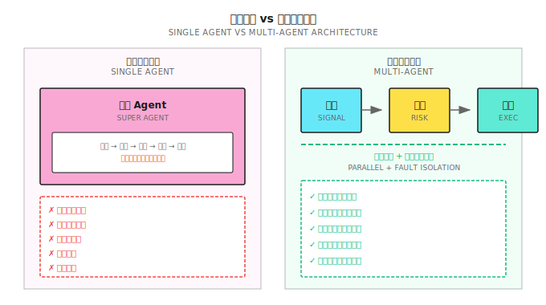

# 第 11 课：为什么需要多智能体

> **一个人不可能同时是外科医生、律师和飞行员。交易系统也一样——专业分工才能做到极致。**

---

## 全能选手的困境

2018 年，一个量化团队开发了一个"全能 Agent"：

- 能识别市场状态
- 能生成交易信号
- 能管理风险
- 能执行订单
- 能监控异常

**回测表现惊艳**：年化 45%，夏普 2.3，最大回撤 12%。

他们信心满满地上线了。

**三个月后的复盘**：

| 问题 | 发生了什么 | 根因 |
|-----|-----------|------|
| 信号延迟 | 行情来时，Agent 还在计算风控 | 串行处理，无法并行 |
| 风控失效 | 极端行情时止损被跳过 | 一个模块出问题，全部阻塞 |
| 难以调试 | 亏钱了，不知道是哪里出问题 | 职责混在一起，无法定位 |
| 无法改进 | 想优化执行，担心影响信号 | 紧耦合，牵一发动全身 |

**核心问题**：他们的 Agent 是一个"超级大脑"，什么都做，结果什么都做不好。

这就像让一个外科医生同时当麻醉师、护士和院长——理论上可以，实际上必然出事。

---

## 11.1 单 Agent 的结构性缺陷

### 为什么单 Agent 不够？

| 缺陷 | 说明 | 影响 |
|-----|------|------|
| **无法并行** | 一个 Agent 只能顺序处理任务 | 错过时效性机会 |
| **单点故障** | 一个模块崩溃，整个系统停止 | 风险失控 |
| **难以专精** | 每个功能都做，每个都不精 | 整体表现平庸 |
| **调试困难** | 问题出在哪？信号？风控？执行？ | 复盘低效 |
| **扩展受限** | 加新功能需要改动整个系统 | 迭代缓慢 |

### 直观对比



---

## 11.2 多智能体的核心优势

### 优势 1：专业分工

每个 Agent 只做一件事，但做到极致：

| Agent | 专精领域 | 评估指标 |
|-------|---------|---------|
| **Signal Agent** | 预测未来收益 | IC, IR, 方向准确率 |
| **Risk Agent** | 保护资金安全 | 最大回撤, VaR |
| **Execution Agent** | 最优成交价 | 滑点, 成交率 |
| **Regime Agent** | 识别市场状态 | 切换准确率, 延迟 |

**类比**：一个交易系统就像一家医院——需要专科医生，不是万能全科。

### 优势 2：并行处理

```
场景：行情突变，需要同时做多件事

单 Agent：
  09:30:00 接收行情
  09:30:01 计算信号
  09:30:02 计算风控
  09:30:03 准备订单
  09:30:04 提交订单  ← 4秒延迟，可能错过机会

多 Agent：
  09:30:00 行情广播
           ├─ Signal Agent: 计算信号
           ├─ Risk Agent: 评估风险
           └─ Execution Agent: 准备执行环境
  09:30:01 信号就绪 → Risk Agent 秒级审核
  09:30:01.5 订单提交  ← 1.5秒，快 2.5 倍
```

### 优势 3：故障隔离

```
场景：Execution Agent 出现 Bug

单 Agent：
  整个系统崩溃
  → 无法止损
  → 无法监控
  → 灾难性后果

多 Agent：
  Execution Agent 故障
  → Risk Agent 检测到执行异常
  → 触发紧急熔断
  → 通知人工介入
  → 其他 Agent 继续运行
  → 损失可控
```

### 优势 4：独立迭代

```
场景：想优化执行算法

单 Agent：
  改动执行代码
  → 担心影响信号逻辑
  → 需要全量测试
  → 迭代周期 2 周

多 Agent：
  只改 Execution Agent
  → 接口不变，其他 Agent 无需调整
  → 单独测试执行逻辑
  → 迭代周期 2 天
```

---

## 11.3 多智能体的协作机制

### 通信模式

| 模式 | 适用场景 | 示例 |
|-----|---------|------|
| **请求-响应** | 需要确认的操作 | Signal → Risk: "能买 AAPL 吗？" |
| **发布-订阅** | 广播通知 | Data Agent 发布新行情，所有订阅者接收 |
| **队列** | 异步处理 | 订单队列，执行 Agent 逐个处理 |
| **共享状态** | 需要一致视图 | 所有 Agent 共享持仓状态 |

### 决策仲裁

当多个 Agent 意见冲突时，如何决策？

**方案 1：层级结构**

```
                  Meta Agent (最高决策权)
                       │
         ┌─────────────┼─────────────┐
         ↓             ↓             ↓
    Signal Agent  Risk Agent  Execution Agent
```

Meta Agent 有最终决策权，其他 Agent 只提供建议。

**方案 2：投票机制**

```
Signal Agent: 买入 AAPL (+1 票)
Risk Agent: 不买，集中度超限 (-1 票)
Regime Agent: 当前趋势市，倾向跟随信号 (+1 票)

投票结果: +1，执行买入（可能缩小仓位以满足风控）
```

**方案 3：一票否决**

```
Risk Agent 有否决权：
  任何交易必须经过 Risk Agent 批准
  Risk Agent 说"不"，交易就不执行
  这是保护资金的最后一道防线
```

### 责任边界

| Agent | 负责 | 不负责 |
|-------|-----|-------|
| **Signal Agent** | 生成信号、预测收益 | 风控、执行 |
| **Risk Agent** | 审核订单、强制止损 | 信号质量 |
| **Execution Agent** | 最优成交、订单管理 | 信号、风控 |
| **Regime Agent** | 识别市场状态 | 交易决策 |
| **Meta Agent** | 协调、仲裁、全局决策 | 具体执行 |

**黄金法则**：每个 Agent 只关心自己的职责，信任其他 Agent 做好自己的工作。

---

## 11.4 多智能体架构设计

### 标准架构


### 各 Agent 职责详解

| Agent | 输入 | 输出 | 关键指标 |
|-------|------|------|---------|
| **Data Agent** | 外部数据源 | 清洗后的数据 | 延迟、完整性 |
| **Signal Agent** | 特征 | 预测收益/排名 | IC, IR |
| **Regime Agent** | 价格、波动率 | 当前市场状态 | 准确率、切换延迟 |
| **Position Agent** | 当前持仓 | 目标持仓 | 换手率、成本 |
| **Risk Agent** | 待执行订单 | 批准/拒绝/调整 | 阻止的亏损 |
| **Execution Agent** | 批准的订单 | 成交报告 | 滑点、成交率 |
| **Meta Agent** | 全局状态 | 调度指令 | 系统健康度 |

---

## 11.5 多智能体的失效场景

### 什么时候多 Agent 反而更差？

| 场景 | 原因 | 更好选择 |
|-----|------|---------|
| **策略极简** | 规则就几条，不需要分工 | 单脚本即可 |
| **低延迟要求** | Agent 通信有开销，可能增加 1-10ms | 单进程优化 |
| **团队太小** | 1 人无法维护多个 Agent | 先用单 Agent 验证 |
| **协调成本 > 收益** | Agent 太多，通信复杂度爆炸 | 减少 Agent 数量 |

### 多 Agent 的常见问题

| 问题 | 表现 | 解决方案 |
|-----|------|---------|
| **死锁** | Agent 互相等待 | 超时机制 + 优先级 |
| **消息丢失** | 关键信号未送达 | 确认机制 + 重试 |
| **状态不一致** | 各 Agent 看到的持仓不同 | 共享状态 + 同步机制 |
| **雪崩故障** | 一个故障引发连锁反应 | 熔断 + 降级 |

---

## 11.6 渐进式演进路径

### 从单 Agent 到多 Agent

不要一开始就构建复杂系统。推荐路径：

```
阶段 1：单 Agent
  ├─ 验证策略可行性
  ├─ 快速迭代
  └─ 积累经验

阶段 2：信号 + 风控分离
  ├─ Signal Agent
  └─ Risk Agent（一票否决）

阶段 3：加入执行
  ├─ Signal Agent
  ├─ Risk Agent
  └─ Execution Agent

阶段 4：加入 Regime
  ├─ Regime Agent
  ├─ Signal Agent（根据 Regime 调整）
  ├─ Risk Agent
  └─ Execution Agent

阶段 5：完整架构
  ├─ Meta Agent
  ├─ Data Agent
  ├─ Regime Agent
  ├─ Signal Agent
  ├─ Position Agent
  ├─ Risk Agent
  └─ Execution Agent
```

### 每个阶段的验收标准

| 阶段 | 验收标准 |
|-----|---------|
| 1 → 2 | 策略 Sharpe > 1，需要更严格风控 |
| 2 → 3 | 滑点成本 > 收益的 10%，需要优化执行 |
| 3 → 4 | 不同市场状态表现差异大，需要 Regime 识别 |
| 4 → 5 | 系统复杂度需要统一调度 |

---

## 11.7 多智能体视角

### 本课的位置

```
Part 1-3：构建单个 Agent 的能力
  ├─ 理解市场
  ├─ 掌握数学统计
  ├─ 学会机器学习
  └─ 从模型到 Agent

Part 4（从本课开始）：构建多 Agent 系统
  ├─ 第 11 课：为什么需要多智能体 ← 你在这里
  ├─ 第 12 课：市场状态识别 (Regime Agent)
  ├─ 第 13 课：Regime 误判与系统性崩溃模式
  ├─ 第 14 课：LLM 在量化中的应用
  ├─ 第 15 课：风险控制与资金管理 (Risk Agent)
  ├─ 第 16 课：组合构建与风险暴露管理
  └─ 第 17 课：在线学习与策略进化
```

### 后续课程预览

| 课程 | 聚焦 Agent | 核心能力 |
|-----|-----------|---------|
| 第 12 课 | Regime Agent | 识别牛市/熊市/震荡 |
| 第 13 课 | Resilience Layer | 误判诊断、降级策略 |
| 第 14 课 | Research Agent (LLM) | 信息提取、辅助分析 |
| 第 15 课 | Risk Agent | 一票否决、资金管理 |
| 第 16 课 | Portfolio Agent | 仓位分配、暴露监控 |
| 第 17 课 | Evolution Agent | 在线学习、策略进化 |

---

## 本课交付物

完成本课后，你将获得：

1. **对多智能体架构的深刻理解** - 知道为什么需要分工协作
2. **架构设计能力** - 能画出多 Agent 系统的标准架构
3. **协作机制设计** - 理解通信、仲裁、责任边界
4. **渐进演进策略** - 知道何时从单 Agent 升级到多 Agent

### ✅ 验收标准

| 检查项 | 验收标准 | 自测方法 |
|-------|---------|---------|
| **单 Agent 缺陷** | 能列出 5 个结构性问题 | 不看笔记，列举 |
| **架构图** | 能画出标准多 Agent 架构 | 白纸画图，标注各 Agent 职责 |
| **协作机制** | 能解释 3 种决策仲裁方式 | 给定冲突场景，说出解决方案 |
| **演进路径** | 能说出从单到多的 5 个阶段 | 不看笔记，描述演进过程 |

**📝 设计练习**：

你有一个运行中的单 Agent 策略，表现如下：
- 年化收益 25%
- 最大回撤 18%
- 在震荡市亏损明显
- 执行滑点约占收益的 15%

问：应该如何演进架构？优先拆分哪个 Agent？

<details>
<summary>点击查看答案</summary>

**分析**：
1. 震荡市亏损 → 需要 Regime Agent 识别市场状态
2. 滑点 15% → 需要 Execution Agent 优化执行
3. 回撤 18% 较高 → Risk Agent 需要更强的风控

**推荐演进顺序**：
1. **首先**：拆分 Risk Agent（回撤 18% 太高，风控优先）
2. **其次**：加入 Regime Agent（解决震荡市亏损问题）
3. **最后**：拆分 Execution Agent（优化 15% 滑点）

**理由**：先保护资金，再提升收益。

</details>

---

## 本课要点回顾

- [x] 理解单 Agent 的 5 个结构性缺陷
- [x] 掌握多 Agent 的 4 个核心优势：专业分工、并行处理、故障隔离、独立迭代
- [x] 了解 3 种决策仲裁机制：层级结构、投票、一票否决
- [x] 认识多 Agent 的失效场景：极简策略、低延迟、小团队
- [x] 掌握从单 Agent 到多 Agent 的渐进演进路径

---

## 延伸阅读

- [背景知识：多智能体框架对比](背景知识/多智能体框架对比.md) - 主流框架的技术选型
- [背景知识：量化开源框架对比](背景知识/量化开源框架对比.md) - 量化系统的技术栈

---

## 下一课预告

**第 12 课：市场状态识别 (Regime Detection)**

趋势市用趋势策略，震荡市用均值回归——这个道理人人都懂。但问题是：**怎么识别当前是什么市场？** 下一课我们深入 Regime Agent 的核心能力。
