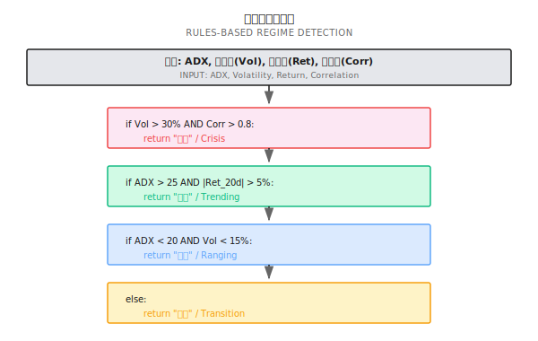
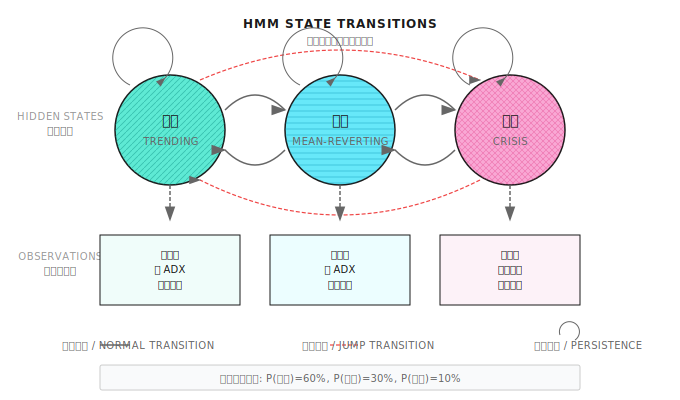
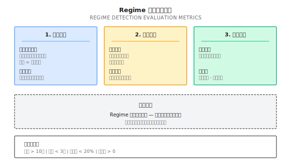
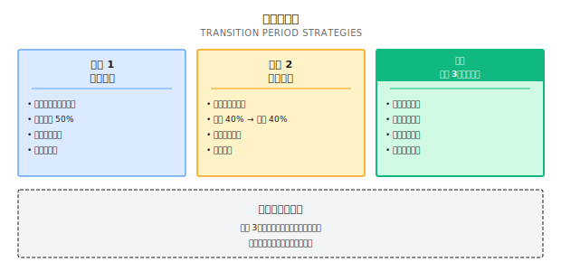
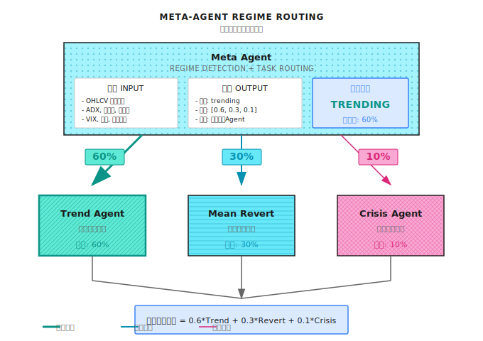

# 第 12 课：市场状态识别（Regime Detection）

> **目标**：让系统知道"现在是什么市场"，才能选择正确的策略。

---

## 一个典型场景（示意）

> 注：以下为合成示例，用于说明常见现象；数字为示意，不对应任何具体机构/产品。

2021 年初，一家量化基金同时运行两套策略：趋势跟随和均值回归。两套策略在各自擅长的市场里都表现优秀。

问题是，他们用的是**固定权重**——各 50%。

结果：
- 趋势市里，趋势策略赚 20%，均值回归亏 15%，净赚 2.5%
- 震荡市里，均值回归赚 15%，趋势策略亏 20%，净亏 2.5%
- 全年下来，两边互相抵消，收益接近零

他们的竞争对手呢？同样两套策略，但加了一个**Regime Detection 模块**：
- 趋势市里，趋势策略权重 80%，均值回归 20%
- 震荡市里，反过来

结果：全年收益 18%，夏普比率 1.6。

**差距在哪？** 不是策略本身，而是**知道什么时候用什么策略**。这就是市场状态识别的价值——它是多智能体系统的"路由器"。

---

## 12.1 什么是市场状态（Regime）

### 三种基本状态

市场在任何时刻都处于某种"状态"，虽然状态之间没有清晰边界，但可以粗略分为：

| 状态 | 特征 | 最佳策略 | 典型持续时间 |
|-----|------|---------|------------|
| **趋势市 (Trending)** | 价格持续单向运动，波动率上升 | 动量/趋势跟随 | 数周到数月 |
| **震荡市 (Mean-Reverting)** | 价格在区间内波动，均值回归有效 | 均值回归/网格 | 数周到数月 |
| **危机市 (Crisis)** | 剧烈波动，相关性飙升，流动性枯竭 | 风控优先/现金为王 | 数天到数周 |

### 为什么识别状态这么难？

| 挑战 | 解释 |
|-----|------|
| **后视镜问题** | 事后看状态很清楚，实时看很模糊 |
| **边界模糊** | 趋势和震荡之间没有清晰分界线 |
| **状态嵌套** | 日线震荡、周线趋势、月线震荡可以同时存在 |
| **检测滞后** | 等你确认状态时，可能已经快结束了 |
| **误切换成本** | 频繁切换策略本身就是成本 |

### 纸上练习：识别历史状态

看下面这组数据，判断每个时期的市场状态：

| 时期 | 20日收益率 | 20日波动率 | ADX | 你的判断 |
|-----|-----------|----------|-----|---------|
| A | +12% | 18% | 35 | ? |
| B | -2% | 8% | 15 | ? |
| C | -25% | 45% | 28 | ? |
| D | +3% | 12% | 22 | ? |

<details>
<summary>点击展开答案</summary>

| 时期 | 判断 | 理由 |
|-----|------|------|
| A | **趋势市（上涨）** | 高收益 + 中等波动 + 高 ADX（>25 表示趋势强） |
| B | **震荡市** | 低收益 + 低波动 + 低 ADX（<20 表示无趋势） |
| C | **危机市** | 大幅下跌 + 极高波动（>30%年化是警戒线） |
| D | **弱趋势/过渡期** | 收益和 ADX 都在中间地带，难以判断 |

**关键发现**：D 时期最难判断，这就是实战中最常遇到的情况——大部分时间市场都在"灰色地带"。

</details>

---

## 12.2 Regime 检测的四种方法

### 方法对比

| 方法 | 原理 | 优点 | 缺点 | 适用场景 |
|-----|------|------|------|---------|
| **规则法** | 用指标阈值判断 | 简单、可解释、无滞后 | 阈值难选、边界硬 | 快速原型、基线 |
| **统计法** | 用统计检验识别结构变化 | 数学严谨 | 需要历史数据、有滞后 | 离线分析 |
| **机器学习** | 用 ML 模型分类 | 可捕捉复杂模式 | 需要标签、过拟合风险 | 有足够标注数据时 |
| **隐马尔可夫** | 假设状态服从马尔可夫链 | 能估计状态概率 | 假设可能不成立 | 状态数已知时 |

### 方法一：规则法（最实用）

用技术指标的阈值组合来判断状态：



**纸上练习：设计你的规则**

给定以下市场数据，用上面的规则判断状态：

| 场景 | ADX | 20日波动率 | 20日收益率 | 资产相关性 | 状态 |
|-----|-----|----------|----------|----------|------|
| 1 | 32 | 22% | +8% | 0.4 | ? |
| 2 | 18 | 12% | -1% | 0.3 | ? |
| 3 | 25 | 38% | -15% | 0.85 | ? |
| 4 | 23 | 18% | +3% | 0.5 | ? |

<details>
<summary>点击展开答案</summary>

| 场景 | 状态 | 判断路径 |
|-----|------|---------|
| 1 | **趋势市** | Vol=22% < 30%（非危机）→ ADX=32 > 25 且 Ret=8% > 5%（趋势） |
| 2 | **震荡市** | Vol=12% < 30%（非危机）→ ADX=18 < 20 且 Vol=12% < 15%（震荡） |
| 3 | **危机市** | Vol=38% > 30% 且 Corr=0.85 > 0.8（危机优先判断） |
| 4 | **过渡期** | 不满足任何明确条件（ADX=23 在 20-25 之间） |

</details>

### 方法二：隐马尔可夫模型（HMM）

HMM 假设市场在几个隐藏状态之间切换，我们只能观察到价格，但看不到真实状态。



**HMM 的核心输出**：
- **状态概率**：当前处于每个状态的概率（如：趋势 60%、震荡 30%、危机 10%）
- **转移概率**：从一个状态切换到另一个状态的概率

**纸上练习：理解状态概率**

HMM 输出当前状态概率为：趋势 55%、震荡 35%、危机 10%

| 策略权重方案 | 趋势策略 | 均值回归 | 风控策略 | 问题 |
|------------|---------|---------|---------|------|
| 硬切换 | 100% | 0% | 0% | 忽略了 35% 的震荡概率 |
| 概率加权 | 55% | 35% | 10% | 更稳健，但危机时反应不够快 |
| 调整后加权 | 50% | 30% | 20% | 放大危机权重作为保险 |

**关键洞察**：状态概率不应该直接用作策略权重，需要根据风险偏好调整。

<details>
<summary>💻 代码实现（工程师参考）</summary>

```python
# 注意：以下为示意代码，展示 HMM 的基本用法
# 需要安装 hmmlearn: pip install hmmlearn

import numpy as np
from hmmlearn import hmm

class RegimeDetector:
    """基于 HMM 的市场状态检测器"""

    def __init__(self, n_states: int = 3):
        self.n_states = n_states
        self.model = hmm.GaussianHMM(
            n_components=n_states,
            covariance_type="full",
            n_iter=100
        )

    def fit(self, features: np.ndarray):
        """
        训练 HMM 模型

        features: shape (n_samples, n_features)
                  通常包括：收益率、波动率、ADX 等
        """
        self.model.fit(features)
        return self

    def predict_proba(self, features: np.ndarray) -> np.ndarray:
        """
        预测当前状态概率

        返回: shape (n_states,) 的概率分布
        """
        # 获取后验概率
        posteriors = self.model.predict_proba(features)
        return posteriors[-1]  # 最新时刻的概率

    def get_regime(self, features: np.ndarray, threshold: float = 0.5) -> str:
        """
        获取当前状态（带置信度阈值）
        """
        probs = self.predict_proba(features)
        max_prob = np.max(probs)
        max_state = np.argmax(probs)

        if max_prob < threshold:
            return "uncertain"

        state_names = ["trending", "mean_reverting", "crisis"]
        return state_names[max_state]
```

</details>

### 方法三：波动率聚类（实用变体）

一个简化但实用的方法是只看波动率的状态：

| 波动率区间 | 状态 | 策略建议 |
|-----------|------|---------|
| < 15% | 低波动（震荡） | 均值回归、卖期权 |
| 15% - 25% | 正常波动 | 正常运行 |
| 25% - 35% | 高波动（趋势） | 趋势跟随、减仓 |
| > 35% | 极高波动（危机） | 风控优先、大幅减仓 |

**为什么波动率如此重要？**
- 波动率是市场"体温"，能快速反映市场健康状态
- 波动率有聚集效应（高波动后往往还是高波动）
- 波动率比收益率更容易预测

---

## 12.3 Regime 检测的评估

识别状态不是目的，目的是**提升策略收益**。所以评估 Regime 检测的标准不是"准确率"，而是"有没有帮策略赚更多钱"。

### 评估框架



### 纸上练习：计算 Regime 检测的价值

**场景**：你的 Regime 检测模块在过去一年的表现：

| 指标 | 数值 |
|-----|------|
| 状态切换次数 | 24 次 |
| 平均状态持续时间 | 15 天 |
| 切换滞后 | 3 天 |
| 误切换率 | 20%（切换后 5 天内又切回来） |

**策略表现对比**：

| 方案 | 年化收益 | 最大回撤 | 夏普比率 |
|-----|---------|---------|---------|
| 无 Regime（固定 50/50） | 8% | 18% | 0.6 |
| 有 Regime（动态切换） | 15% | 12% | 1.2 |
| 切换成本（24次×0.5%） | -12% | - | - |

**问题**：
1. Regime 检测的净增值是多少？
2. 如果误切换率降到 10%，预期收益会如何变化？
3. 切换成本太高怎么办？

<details>
<summary>点击展开答案</summary>

1. **净增值计算**：
   - 毛收益提升 = 15% - 8% = 7%
   - 切换成本 = 24 × 0.5% = 12%（这里假设每次切换涉及全部仓位调整）
   - **净增值 = 7% - 12% = -5%**（反而亏了！）

   **问题**：切换太频繁，成本吃掉了收益！

2. **误切换率降到 10%**：
   - 误切换次数从 4.8 次降到 2.4 次
   - 减少 2.4 次无效切换，节省 2.4 × 0.5% = 1.2%
   - 净增值 = -5% + 1.2% = -3.8%（还是负的）

3. **解决切换成本高的方法**：
   - **渐进切换**：不要 0→100%，而是 50%→70%→90%
   - **确认延迟**：状态连续 N 天才切换，减少误切换
   - **软切换**：用概率加权而非硬切换
   - **降低频率**：只在状态非常明确时才切换

**关键教训**：Regime 检测的价值 = 识别准确性 × 策略差异 - 切换成本

</details>

### 切换滞后的代价

| 滞后天数 | 在趋势市的影响 | 在危机市的影响 |
|---------|--------------|--------------|
| 1 天 | 错过约 5% 的行情 | 多承受约 3% 的损失 |
| 3 天 | 错过约 15% 的行情 | 多承受约 10% 的损失 |
| 5 天 | 错过约 25% 的行情 | 可能错过止损时机 |
| 10 天 | 趋势可能已经过半 | 危机可能已经结束 |

**结论**：宁可有一些误判，也不要滞后太多。特别是**危机检测必须快**。

---

## 12.4 常见误区

**误区一：Regime Detection 准确率越高越好**

不完全对。评估 Regime 检测的标准不是"准确率"，而是"有没有帮策略赚更多钱"。准确率 80% 但切换成本吃掉收益，不如准确率 60% 但切换少。

**误区二：趋势/震荡是二元判断**

现实中大部分时间市场处于"灰色地带"。强行二元判断会导致频繁误切换。正确做法：用概率加权（趋势 60%/震荡 40%）或承认"过渡期"。

**误区三：检测到状态变化就立即切换策略**

危险做法。切换本身有成本（交易成本、滑点），频繁切换可能亏掉所有收益。正确做法：确认延迟（状态连续 N 天）+ 渐进切换（50%→70%→90%）。

**误区四：危机检测可以"等确认"**

危机检测必须快。等你确认时，可能已经亏了 20%。宁可误判为危机（少赚），也不要漏判（巨亏）。

---

## 12.5 过渡期处理

现实中最难处理的不是明确的趋势或震荡，而是**过渡期**——状态正在切换，但还不确定。

### 过渡期的特征

| 特征 | 表现 |
|-----|------|
| 指标矛盾 | ADX 说趋势，波动率说震荡 |
| 概率模糊 | HMM 输出 40%/35%/25%，没有明显主导 |
| 信号冲突 | 趋势策略和均值回归策略给出相反信号 |

### 过渡期策略



**推荐**：对于大多数投资者，**策略 3（风险优先）** 是最稳妥的选择。过渡期往往是风险最高的时期。

---

## 12.5 多智能体视角

在多智能体架构中，Regime Detection 是**Meta Agent 的核心能力**。

### 架构设计



### Regime Agent 的职责

| 职责 | 具体内容 | 触发条件 |
|-----|---------|---------|
| **状态识别** | 判断当前市场处于什么状态 | 每日/每小时 |
| **信号路由** | 决定把任务分发给哪个专家 Agent | 状态变化时 |
| **权重分配** | 根据状态概率分配专家权重 | 持续 |
| **切换控制** | 防止过度切换，管理过渡期 | 状态模糊时 |
| **回顾归因** | 记录状态判断，用于事后分析 | 持续 |

### 与其他 Agent 的协作

| 协作对象 | 协作方式 |
|---------|---------|
| **Signal Agent** | 接收 Regime 信号，调整策略参数 |
| **Risk Agent** | 危机状态时，Risk Agent 获得更大否决权 |
| **Execution Agent** | 状态切换时，Execution Agent 负责平滑调仓 |
| **Evolution Agent** | 提供状态识别的历史准确率，用于模型进化 |

---

## ✅ 验收标准

完成本课后，用以下标准检验学习效果：

| 验收项 | 达标标准 | 自测方法 |
|-------|---------|---------|
| 理解三种状态 | 能描述趋势/震荡/危机的特征和最佳策略 | 用自己的话解释 |
| 掌握规则法 | 能用 ADX/波动率/相关性设计判断规则 | 完成纸上练习 |
| 理解 HMM 原理 | 能解释状态概率的含义和用法 | 解释为什么不直接用概率做权重 |
| 评估检测价值 | 能计算净增值 = 收益提升 - 切换成本 | 完成评估练习 |
| 处理过渡期 | 能说出三种过渡期策略及其适用场景 | 给出你的选择和理由 |

### 综合练习

**设计你的 Regime 检测系统**：

1. 选择检测方法（规则法/HMM/其他）并说明理由
2. 定义输入特征和阈值
3. 设计过渡期处理策略
4. 设定切换确认条件（防止过度切换）
5. 定义评估指标

---

## 本课交付物

完成本课后，你将获得：

1. **Regime 检测的设计框架** - 从方法选择到评估指标的完整思路
2. **规则法的实用模板** - 可直接使用的 ADX/波动率/相关性判断规则
3. **评估 Regime 检测价值的方法** - 净增值 = 收益提升 - 切换成本
4. **过渡期处理策略** - 三种方案及其适用场景

---

## 本课要点回顾

- [x] 理解市场状态（Regime）的概念及其对策略选择的影响
- [x] 掌握四种 Regime 检测方法：规则法、统计法、ML、HMM
- [x] 理解 Regime 检测的评估不是"准确率"而是"经济价值"
- [x] 掌握过渡期的处理策略

---

## 延伸阅读

- [第 05 课：经典策略范式](../Part2-量化基础/第05课：经典策略范式.md) - 不同状态对应的策略
- [第 11 课：为什么需要多智能体](第11课：为什么需要多智能体.md) - Regime 检测在多智能体中的角色
- [背景知识：历史著名量化事故](../Part1-快速体验/背景知识/历史著名量化事故.md) - 未能识别危机状态的后果

---

## 下一课预告

**第 13 课：Regime 误判与系统性崩溃模式**

Regime Detection 是多智能体系统的核心，但它会犯错——误判、滞后、边界震荡。下一课我们深入分析 Regime 检测的五种失败模式，以及如何设计降级策略防止系统性崩溃。
