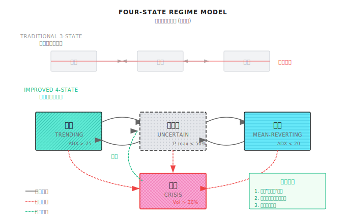

# 第 13 课：Regime 误判与系统性崩溃模式

> **最大回撤往往来自：错误的状态判断 + 错误的策略被激活。**

---

## 一个典型场景（示意）

> 注：以下为合成示例，用于说明常见现象；数字为示意，不对应任何具体机构/产品。

2020 年 2 月，一家量化基金的 Regime Detection 系统显示：**"震荡市"**。

这是合理的判断——过去几个月市场波动率低，ADX 在 20 以下，没有明显趋势。

基于这个判断，系统激活了**均值回归策略**，在每次下跌时加仓买入。

然后，3 月来了。

| 日期 | 标普 500 | 系统状态判断 | 策略动作 | 结果 |
|-----|---------|------------|---------|------|
| 2/20 | 3,373 | 震荡市 | 正常持仓 | - |
| 2/24 | 3,225 (-4.4%) | 震荡市 | 加仓（抄底） | 亏损 |
| 2/27 | 2,954 (-8.4%) | 过渡期 | 继续持仓 | 亏损加剧 |
| 3/9 | 2,746 (-7.6%) | 趋势市？ | 困惑中 | 已深度套牢 |
| 3/12 | 2,480 (-9.5%) | 危机市！ | 触发止损 | 损失 25% |
| 3/16 | 2,386 (-3.8%) | 危机市 | 已清仓 | 错过反弹 |
| 3/23 | 2,237（底部） | 危机市 | 空仓 | - |
| 4/9 | 2,789 (+24.7%) | 过渡期 | 观望 | 错过反弹 |

**最终结果**：
- 从高点回撤 **32%**
- 比简单持有指数多亏 **7%**
- Regime 系统不仅没帮上忙，反而**放大了损失**

**为什么会这样？**

1. **检测滞后**：从"震荡"切换到"危机"用了 3 周
2. **错误策略被激活**：震荡市策略在趋势市中疯狂加仓
3. **止损太晚**：确认危机时已经错过了最佳逃离时机
4. **恢复太慢**：危机确认后过于保守，错过反弹

这就是 **Regime 误判的代价**——它往往发生在你最需要正确判断的时候。

---

## 13.1 为什么 Regime 检测一定会错

### 13.1.1 不可避免的滞后性

任何 Regime 检测方法都需要**观察一段历史数据**才能做出判断。这意味着：

```
真实状态变化时间点 ──────────────────┐
                                    │
                                    ▼
         ┌──────────────────────────┼──────────────────────────┐
时间轴:  │     旧状态              │检测窗口│    新状态           │
         └──────────────────────────┼───────┼──────────────────┘
                                    │       │
                                    ▼       ▼
                            系统确认新状态的时间点

滞后 = 检测窗口 + 确认延迟
典型值: 3-10 个交易日
```

**纸上练习：滞后的代价**

假设市场从"震荡"切换到"危机"，标普 500 在 5 天内下跌 15%。

| 滞后天数 | 你在哪天确认危机 | 已亏损多少 | 还能做什么 |
|---------|----------------|----------|-----------|
| 1 天 | 第 2 天 | -3% | 止损，保住 12% |
| 3 天 | 第 4 天 | -9% | 止损，保住 6% |
| 5 天 | 第 6 天 | -15% | 已经跌完了 |
| 10 天 | 第 11 天 | -15% | 可能市场已经反弹 |

**结论**：在快速崩盘时，3 天的滞后就可能意味着错过 60% 的止损机会。

### 13.1.2 后视镜问题

```
┌─────────────────────────────────────────────────────────────┐
│                                                             │
│   事后看:  ────────────────────┬──────────────────────      │
│                               │                             │
│              明显是震荡市      │      明显是趋势市           │
│                               │                             │
│   实时看:  ╶╶╶╶╶╶╶╶╶╶╶╶╶╶╶╶╶╶┼╶╶╶╶╶╶╶╶╶╶╶╶╶╶╶╶╶╶╶╶╶╶╶      │
│                               │                             │
│              这是震荡结束？    │   这只是假突破？            │
│              还是趋势开始？    │   还是真趋势？              │
│                               │                             │
└─────────────────────────────────────────────────────────────┘
```

**关键洞察**：回测时，你知道未来发生了什么。实盘时，你不知道。

### 13.1.3 边界模糊性

市场状态不是离散的开关，而是连续的光谱：

```
       震荡市 ◄────────────────────────────────────► 趋势市
         │                                           │
  ADX=15 │                                           │ ADX=35
  Vol=10%│                                           │ Vol=25%
         │                                           │
         │        ┌─────────────────────┐            │
         │        │                     │            │
         │        │   灰色地带          │            │
         │        │   ADX 18-25         │            │
         │        │   Vol 12-20%        │            │
         │        │                     │            │
         │        └─────────────────────┘            │
         │                                           │
         ▼                                           ▼
    明确震荡                                      明确趋势

问题：市场 70% 的时间都在灰色地带
```

---

## 13.2 五种典型误判模式

### 13.2.1 模式一：False Positive（把震荡判成趋势）

**场景**：
- ADX 短暂突破 25
- 连续 3 天上涨 5%
- 系统判断：趋势市开始，激活动量策略

**实际情况**：
- 只是震荡区间内的正常波动
- 随后价格回落到区间中间
- 动量策略在高位买入，低位止损

**损失来源**：
- 高位追涨的损失
- 频繁止损的交易成本
- 策略切换的摩擦成本

```
价格图:
      /\            /\
     /  \    ←── 误判为趋势
    /    \  /  \
───/──────\/────\──────  实际是震荡区间
                 \
```

### 13.2.2 模式二：False Negative（把趋势判成震荡）

**场景**：
- 趋势刚开始，波动率还没升高
- ADX 还在 20 以下
- 系统判断：震荡市，激活均值回归策略

**实际情况**：
- 真正的趋势已经开始
- 均值回归策略在下跌时不断抄底
- 越抄越深

**这就是开篇故事中发生的事情。**

### 13.2.3 模式三：滞后型误判

**特征**：方向判断正确，但时间太晚。

| 时间点 | 真实状态 | 系统判断 | 错位 |
|-------|---------|---------|------|
| T | 趋势开始 | 震荡 | ✗ |
| T+3 | 趋势中段 | 过渡期 | ✗ |
| T+7 | 趋势末期 | 趋势确认！| ✗ |
| T+10 | 趋势结束 | 趋势 | ✗ |
| T+13 | 新震荡 | 过渡期 | ✗ |

**损失来源**：
- 错过趋势最好的入场点
- 在趋势末期才进场
- 趋势结束后还在持仓

### 13.2.4 模式四：过敏型误判

**特征**：对噪音过度敏感，频繁切换状态。

```
真实状态:  ═════════════════════════════════════════════════
             持续震荡

系统判断:  ─┬──┬──┬──┬──┬──┬──┬──┬──┬──┬──┬──┬──┬──┬──┬──
            │  │  │  │  │  │  │  │  │  │  │  │  │  │  │
            震 趋 震 趋 震 过 震 趋 震 危 震 趋 震 过 震
            荡 势 荡 势 荡 渡 荡 势 荡 机 荡 势 荡 渡 荡

切换次数: 15 次/月
每次切换成本: 0.5%
总成本: 7.5%/月
```

**损失来源**：
- 每次切换的交易成本
- 策略没有时间发挥作用
- 系统资源消耗

### 13.2.5 模式五：边界震荡型误判

**特征**：在阈值附近反复切换。

```
阈值线 (ADX = 25): ─────────────────────────────────────────
                           ↑  ↓  ↑  ↓  ↑↓
实际 ADX:          ─────/\─/\─/\─/\─\/────────────────
                       24 26 24 26 2324

系统状态:               震 趋 震 趋 震趋震
                        荡 势 荡 势 荡势荡

问题: ADX 在 23-27 之间波动，系统不断切换
```

---

## 13.3 误判的量化代价

### 13.3.1 建立误判成本模型

```
总误判成本 = 直接损失 + 机会成本 + 切换成本

其中:
  直接损失 = Σ(错误策略在错误状态下的亏损)
  机会成本 = Σ(正确策略在正确状态下本应赚的钱)
  切换成本 = 切换次数 × 单次切换成本
```

### 13.3.2 历史案例分析

**案例：2020年3月暴跌**

| 策略类型 | 正确 Regime 判断 | 错误 Regime 判断 | 差距 |
|---------|-----------------|-----------------|------|
| 动量策略 | -5%（提前减仓） | -25%（持仓） | 20% |
| 均值回归 | -8%（停止抄底） | -35%（不断抄底） | 27% |
| 风险平价 | -12%（被动跟随） | -18%（主动加仓） | 6% |

**案例：2022年加息周期**

| 月份 | 正确判断 | 错误判断 | 差距原因 |
|-----|---------|---------|---------|
| 1月 | 识别趋势反转 | 仍认为牛市 | 高位没有减仓 |
| 3月 | 确认下跌趋势 | 认为是回调 | 继续抄底 |
| 6月 | 维持防御 | 认为底部 | 再次抄底失败 |

### 13.3.3 纸上练习：计算你的误判敏感度

假设你的策略在不同状态组合下的预期收益：

| 实际状态 | 激活策略 | 月收益 |
|---------|---------|-------|
| 趋势 | 趋势策略 | +5% |
| 趋势 | 均值回归 | -8% |
| 震荡 | 趋势策略 | -3% |
| 震荡 | 均值回归 | +3% |
| 危机 | 趋势策略 | -15% |
| 危机 | 均值回归 | -25% |
| 危机 | 防御策略 | -5% |

**问题**：如果你的 Regime 检测准确率是 70%，年化收益损失是多少？

<details>
<summary>点击展开分析框架</summary>

**分析方法**：

1. 假设状态分布：趋势 30%，震荡 50%，危机 20%

2. 正确识别时的收益：
   - 趋势正确（30% × 70%）: 21% × 5% = 1.05%
   - 震荡正确（50% × 70%）: 35% × 3% = 1.05%
   - 危机正确（20% × 70%）: 14% × (-5%) = -0.7%
   - 月收益 ≈ 1.4%

3. 错误识别时的收益（假设随机错配）：
   - 趋势误判为震荡（30% × 30% / 2）: 4.5% × (-8%) = -0.36%
   - 趋势误判为危机（30% × 30% / 2）: 4.5% × (-5%) = -0.23%
   - ...（其他组合）

4. 综合月收益 ≈ 0.5%（远低于 1.4%）

**结论**：30% 的误判率可能导致收益减少 **65%**。

</details>

---

## 13.4 设计"不确定状态"

### 13.4.1 从三状态到四状态



### 13.4.2 "不确定"状态的定义

| 触发条件 | 解释 |
|---------|------|
| HMM 最高概率 < 50% | 没有一个状态占主导 |
| 多个指标矛盾 | ADX 说趋势，波动率说震荡 |
| 刚发生状态切换 | 切换后 N 天内保持不确定 |
| 接近阈值边界 | ADX 在 22-28 之间 |

### 13.4.3 "不确定"状态下的策略

```
┌─────────────────────────────────────────────────────────────┐
│                  不确定状态处理策略                          │
├─────────────────────────────────────────────────────────────┤
│                                                             │
│  策略 1: 降仓观望                                          │
│  ┌─────────────────────────────────────────┐               │
│  │ 确定状态时仓位: 100%                     │               │
│  │ 不确定状态仓位:  50%                     │               │
│  │ 等待状态明确后再恢复                     │               │
│  └─────────────────────────────────────────┘               │
│                                                             │
│  策略 2: 策略混合                                          │
│  ┌─────────────────────────────────────────┐               │
│  │ 趋势概率 40%, 震荡概率 40%, 危机概率 20% │               │
│  │ 趋势策略权重: 40%                        │               │
│  │ 均值回归权重: 40%                        │               │
│  │ 防御策略权重: 20%                        │               │
│  └─────────────────────────────────────────┘               │
│                                                             │
│  策略 3: 最坏情况准备                                      │
│  ┌─────────────────────────────────────────┐               │
│  │ 不确定 = 可能是危机前兆                  │               │
│  │ 主动启动对冲                             │               │
│  │ 收紧止损                                 │               │
│  │ 宁可错过机会，不可放大风险               │               │
│  └─────────────────────────────────────────┘               │
│                                                             │
└─────────────────────────────────────────────────────────────┘
```

### 13.4.4 状态切换的确认机制

为了减少过敏型误判，引入确认延迟：

```
状态切换规则:
1. 单次触发：记录但不切换
2. 连续 N 天触发：进入"待确认"
3. 待确认期无回撤：确认切换
4. 待确认期回撤：恢复原状态

参数建议:
- N = 3（快速响应）到 N = 5（稳健）
- 待确认期 = 2-3 天
```

**切换流程图**：

```
当前状态: 震荡
      │
      ▼
检测到趋势信号 ──────────► 记录信号
      │                      │
      │                      ▼
      │                 计数器 +1
      │                      │
      │             ┌────────┴────────┐
      │             │                 │
      │        计数 < 3          计数 >= 3
      │             │                 │
      │             ▼                 ▼
      │         保持震荡         进入待确认
      │                              │
      │                    ┌─────────┴─────────┐
      │                    │                   │
      │              2天后仍趋势           2天后回震荡
      │                    │                   │
      │                    ▼                   ▼
      │              确认切换趋势          恢复震荡
      │                                   计数器归零
      ▼
下一个信号
```

---

## 13.5 多智能体视角

### 13.5.1 Meta Agent 的降级策略

当 Regime 检测不可靠时，系统需要有 fallback 机制：

```
┌─────────────────────────────────────────────────────────────┐
│                 Meta Agent 降级策略                          │
├─────────────────────────────────────────────────────────────┤
│                                                             │
│  Level 0: 正常模式                                         │
│  ├── Regime 清晰（概率 > 70%）                             │
│  ├── 按状态路由到对应专家                                   │
│  └── 正常仓位运行                                          │
│                                                             │
│  Level 1: 谨慎模式                                         │
│  ├── Regime 模糊（50% < 概率 < 70%）                       │
│  ├── 多专家并行，权重混合                                   │
│  └── 仓位降至 70%                                          │
│                                                             │
│  Level 2: 防御模式                                         │
│  ├── Regime 检测失效（连续矛盾信号）                        │
│  ├── 激活防御策略为主                                      │
│  └── 仓位降至 50%                                          │
│                                                             │
│  Level 3: 安全模式                                         │
│  ├── 系统检测到异常（数据质量、延迟）                       │
│  ├── 停止所有主动交易                                      │
│  └── 只保留对冲和止损执行                                   │
│                                                             │
└─────────────────────────────────────────────────────────────┘
```

### 13.5.2 Regime Agent 自身的健康监控

```
Regime Agent 健康指标:

1. 稳定性指标
   - 状态切换频率 < 3次/周（否则可能过敏）
   - 平均状态持续时间 > 5天（否则可能噪音）

2. 一致性指标
   - 多个检测方法的一致率 > 70%
   - 与市场表现的吻合度（事后检验）

3. 及时性指标
   - 危机检测滞后 < 3天
   - 重大转折捕捉率 > 60%

4. 自检机制
   - 每日对比预测 vs 实际
   - 累计误判超阈值时自动降级
```

### 13.5.3 误判后的归因与学习

```
误判发生后的处理流程:

1. 识别误判
   ├── 策略亏损 + Regime 变化 = 疑似误判
   └── 事后确认真实状态

2. 归因分析
   ├── 是检测方法问题还是参数问题？
   ├── 是滞后太多还是过于敏感？
   └── 是单一指标失效还是系统性问题？

3. 反馈学习
   ├── 记录误判案例
   ├── 更新检测参数（在线学习）
   └── 如果频繁失效，考虑更换方法

4. 通知其他 Agent
   ├── Risk Agent: 更新风险评估
   ├── Signal Agent: 调整信号阈值
   └── Evolution Agent: 纳入训练数据
```

---

## ✅ 验收标准

完成本课后，用以下标准检验学习效果：

| 验收项 | 达标标准 | 自测方法 |
|-------|---------|---------|
| 理解滞后性 | 能解释为什么 Regime 检测一定有滞后 | 给出滞后来源 |
| 识别五种误判 | 能描述每种误判的特征和损失来源 | 举例说明 |
| 量化误判成本 | 能用框架估算误判的收益影响 | 完成纸上练习 |
| 设计不确定状态 | 能说出不确定状态的触发条件和处理策略 | 设计一个规则 |
| 理解降级机制 | 能描述 Meta Agent 的四级降级策略 | 画出降级流程 |

---

## 本课交付物

完成本课后，你将获得：

1. **Regime 误判分类框架** - 识别五种典型误判模式
2. **误判成本量化方法** - 评估误判对收益的影响
3. **四状态模型** - 加入"不确定"状态的改进方案
4. **降级策略模板** - Meta Agent 在 Regime 不可靠时的处理方式

---

## 本课要点回顾

- [x] Regime 检测一定会有滞后，这是由其方法论决定的
- [x] 五种典型误判：False Positive、False Negative、滞后型、过敏型、边界震荡型
- [x] 最大回撤往往来自：错误状态 + 错误策略被激活
- [x] 引入"不确定"状态可以减少强制分类的错误
- [x] Meta Agent 需要有完善的降级策略

---

## 延伸阅读

- [第 12 课：市场状态识别](第12课：市场状态识别.md) - Regime Detection 的基础方法
- [第 15 课：风险控制与资金管理](第15课：风险控制与资金管理.md) - 风控如何应对 Regime 误判
- [背景知识：历史著名量化事故](../Part1-快速体验/背景知识/历史著名量化事故.md) - Regime 误判导致的真实案例

---

## 下一课预告

**第 14 课：LLM 在量化中的应用**

Regime Detection 告诉我们"现在是什么市场"，但市场背后的"为什么"往往藏在新闻、财报、社交媒体里。下一课我们探讨如何用 LLM 提取这些非结构化信息，增强我们的 Regime 判断。
