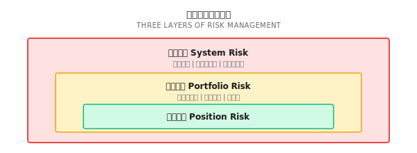
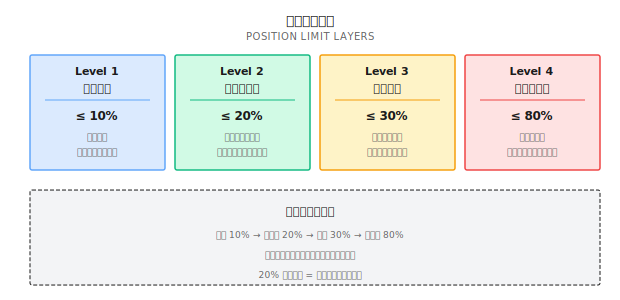
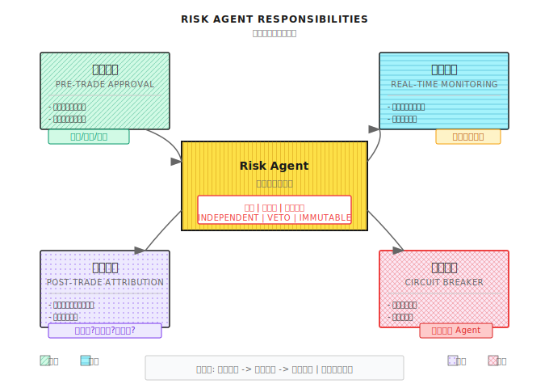
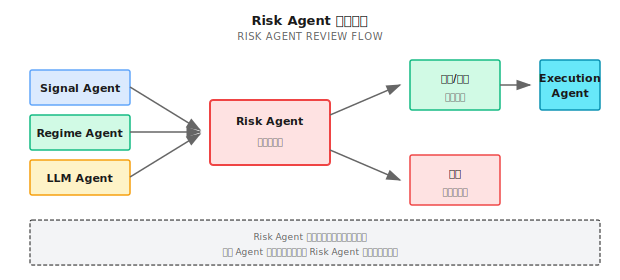

# 第 15 课：风险控制与资金管理

> **目标**：理解"活下来"比"赚得多"更重要，掌握 Risk Agent 的设计原则。

---

## 一个真实的故事（公开案例：LTCM，1998）

> 注：以下为公开历史案例的简化复盘口径，用于说明风险管理要点；细节以公开资料为准。

1998 年，长期资本管理公司（LTCM）是华尔街最耀眼的对冲基金。创始人包括两位诺贝尔经济学奖得主，团队汇集了顶尖数学家和交易员。

他们的策略很简单：利用债券市场的微小定价偏差进行套利。回测收益稳定，风险看起来很低。

问题在于，他们用了 **25 倍杠杆**。

1998 年俄罗斯债务危机爆发，市场恐慌导致流动性枯竭。那些"微小偏差"不但没有收敛，反而急剧扩大。LTCM 的模型假设这种情况"百年一遇"，但它就发生了。

结果：46 亿美元资本，几周内亏损殆尽。美联储不得不协调华尔街 14 家大银行紧急救援，防止系统性崩溃。

**教训是什么？**
1. 模型假设会失效，特别是在极端情况下
2. 杠杆放大收益，也放大风险
3. 流动性危机时，所有资产相关性趋近于 1
4. **风险控制必须独立于策略，拥有一票否决权**

这就是为什么我们需要一个独立的 **Risk Agent**——它不关心策略能赚多少，只关心系统会不会死。

---

## 15.1 风险的三个层次

### 分层风险管理



| 层次 | 关注点 | 控制手段 | 触发条件 |
|-----|-------|---------|---------|
| **头寸风险** | 单笔交易的损失 | 止损、仓位限制 | 单笔亏损达阈值 |
| **组合风险** | 策略之间的叠加 | 分散化、相关性监控 | 组合回撤达阈值 |
| **系统风险** | 整个账户的存亡 | 熔断、全面减仓 | 账户回撤达阈值 |

### 风险预算思维

**核心思想**：先决定能亏多少，再决定能赚多少。

```
总风险预算: 20%（最大可接受回撤）
    │
    ├── 策略 A: 8%（动量策略，波动大）
    ├── 策略 B: 6%（均值回归，波动中等）
    ├── 策略 C: 4%（套利策略，波动小）
    └── 预留缓冲: 2%（应对极端情况）
```

**纸上练习：分配风险预算**

你有 100 万本金，最大可接受回撤 15%。现有三个策略：

| 策略 | 历史最大回撤 | 年化收益 | 夏普比率 |
|-----|------------|---------|---------|
| A | 25% | 35% | 1.4 |
| B | 12% | 18% | 1.5 |
| C | 8% | 12% | 1.5 |

**问题**：如何分配仓位使组合回撤不超过 15%？

<details>
<summary>点击展开答案</summary>

**方法一：等风险贡献（Risk Parity）**

| 策略 | 回撤 | 1/回撤 | 权重 | 风险贡献 |
|-----|------|-------|------|---------|
| A | 25% | 0.04 | 0.04/0.215 = 18.6% | 25% × 18.6% = 4.6% |
| B | 12% | 0.083 | 0.083/0.215 = 38.6% | 12% × 38.6% = 4.6% |
| C | 8% | 0.125 | 0.125/0.215 = 58.1% | 8% × 58.1% = 4.6% |
| **总计** | | 0.215 | 115.3%（需缩放） | 13.8% |

缩放后权重：A=16%, B=34%, C=50%，预期组合回撤 ≈ 12%（低于 15%）

**方法二：简化计算**

如果假设策略不相关，组合回撤 ≈ √(Σ(权重×回撤)²)

设 A 权重 x，让 √((0.25x)² + (0.12×0.4)² + (0.08×0.5)²) ≤ 15%

解出 x ≤ 20%，所以 A 最多配 20%

**关键洞察**：高波动策略必须低配，否则会主导组合风险。

</details>

---

## 15.2 仓位管理

### Kelly 公式：理论最优仓位

Kelly 公式告诉你，在给定胜率和赔率下，应该下注多少比例才能最大化长期财富增长：

```
f* = (p × b - q) / b

其中：
- f* = 最优仓位比例
- p = 胜率
- q = 1 - p = 败率
- b = 赔率（盈利/亏损比）
```

**纸上练习：计算 Kelly 仓位**

| 场景 | 胜率 p | 赔率 b | Kelly f* | 解读 |
|-----|-------|-------|---------|------|
| A | 60% | 1.0 | (0.6×1-0.4)/1 = 20% | 每次下注 20% |
| B | 55% | 1.5 | (0.55×1.5-0.45)/1.5 = 25% | 赔率高，可多下 |
| C | 50% | 1.0 | (0.5×1-0.5)/1 = 0% | 期望为零，不下注 |
| D | 45% | 2.0 | (0.45×2-0.55)/2 = 17.5% | 胜率低但赔率高 |
| E | 70% | 0.5 | (0.7×0.5-0.3)/0.5 = 10% | 高胜率低赔率 |

### 为什么实战中用"半 Kelly"

| 问题 | 解释 | 解决方案 |
|-----|------|---------|
| 估计误差 | 胜率和赔率都是估计值，可能不准 | 用 1/2 Kelly 或 1/4 Kelly |
| 波动太大 | 满 Kelly 的波动可能让人无法坚持 | 降低仓位换取舒适度 |
| 破产风险 | 连续亏损时，满 Kelly 可能亏光 | 设置最低仓位限制 |
| 相关性 | Kelly 假设独立，但持仓可能相关 | 组合层面再打折 |

**实战建议**：用 Kelly/2 作为仓位上限，再结合其他约束条件。

### Kelly 与参数不确定性

**核心问题**：Kelly 公式假设你知道真实的胜率和赔率，但实际上这些都是估计值。

```
估计误差的影响:

真实胜率: 55%
估计胜率: 60%（高估 5%）
赔率: 1.0

真实 Kelly: (0.55×1 - 0.45)/1 = 10%
估计 Kelly: (0.60×1 - 0.40)/1 = 20%（高估 100%!）

你用 20% 仓位交易一个只应该用 10% 的策略
→ 风险翻倍，可能爆仓
```

#### 贝叶斯 Kelly 公式

考虑参数不确定性的方法是使用贝叶斯框架：

```python
import numpy as np
from scipy import stats

def bayesian_kelly(wins: int, losses: int,
                   avg_win: float, avg_loss: float,
                   confidence: float = 0.9) -> dict:
    """
    贝叶斯 Kelly：考虑胜率估计的不确定性

    wins: 历史胜利次数
    losses: 历史失败次数
    avg_win: 平均盈利比例
    avg_loss: 平均亏损比例
    confidence: 置信水平
    """
    n = wins + losses

    # 胜率的贝叶斯后验（Beta 分布）
    # 使用均匀先验 Beta(1,1)
    alpha = wins + 1
    beta = losses + 1

    # 胜率的点估计和区间
    p_mean = alpha / (alpha + beta)
    p_lower = stats.beta.ppf((1 - confidence) / 2, alpha, beta)
    p_upper = stats.beta.ppf((1 + confidence) / 2, alpha, beta)

    # 赔率
    odds = avg_win / avg_loss

    # 不同胜率假设下的 Kelly
    kelly_mean = (p_mean * odds - (1 - p_mean)) / odds
    kelly_lower = (p_lower * odds - (1 - p_lower)) / odds
    kelly_upper = (p_upper * odds - (1 - p_upper)) / odds

    # 保守 Kelly：使用置信下限
    kelly_conservative = max(0, kelly_lower)

    return {
        'p_estimate': p_mean,
        'p_interval': (p_lower, p_upper),
        'kelly_mean': max(0, kelly_mean),
        'kelly_conservative': kelly_conservative,
        'kelly_interval': (max(0, kelly_lower), max(0, kelly_upper)),
        'sample_size': n,
        'recommendation': kelly_conservative / 2  # 再打五折
    }


# 示例
result = bayesian_kelly(wins=60, losses=40, avg_win=0.02, avg_loss=0.015)

print(f"胜率估计: {result['p_estimate']:.1%}")
print(f"胜率 90% 置信区间: [{result['p_interval'][0]:.1%}, {result['p_interval'][1]:.1%}]")
print(f"Kelly (点估计): {result['kelly_mean']:.1%}")
print(f"Kelly (保守): {result['kelly_conservative']:.1%}")
print(f"推荐仓位: {result['recommendation']:.1%}")
```

**输出示例**：
```
胜率估计: 60.0%
胜率 90% 置信区间: [51.1%, 68.4%]
Kelly (点估计): 26.7%
Kelly (保守): 6.8%
推荐仓位: 3.4%
```

**关键洞察**：
- 100 次交易估计的胜率 60%，真实值可能在 51%-68% 之间
- 如果用点估计的 Kelly (26.7%)，风险巨大
- 保守 Kelly (6.8%) 基于胜率下限，更安全
- 推荐仓位再打五折 (3.4%)，留有余地

#### 样本量与 Kelly 折扣

| 历史交易次数 | 胜率估计误差 | 建议 Kelly 折扣 |
|------------|------------|---------------|
| < 30 | 估计极不可靠 | 不建议使用 Kelly |
| 30-100 | ±10-15% | Kelly × 0.25 |
| 100-300 | ±5-10% | Kelly × 0.5 |
| 300-1000 | ±3-5% | Kelly × 0.7 |
| > 1000 | ±1-3% | Kelly × 0.8 |

**纸上练习：Kelly 折扣**

| 场景 | 交易次数 | 估计胜率 | 估计赔率 | 点估计 Kelly | 折扣系数 | 实际仓位 |
|-----|---------|---------|---------|-------------|---------|---------|
| A | 50 | 55% | 1.2 | 12.5% | 0.25 | 3.1% |
| B | 200 | 55% | 1.2 | 12.5% | 0.5 | 6.3% |
| C | 500 | 55% | 1.2 | 12.5% | 0.7 | 8.8% |

**结论**：样本越少，Kelly 折扣越大。永远不要在数据不足时满仓。

### 仓位限制规则



---

## 15.3 止损与止盈

### 止损的三种类型

| 类型 | 定义 | 优点 | 缺点 |
|-----|------|------|------|
| **固定止损** | 亏损 X% 就平仓 | 简单、确定 | 可能被震荡洗出 |
| **移动止盈** | 从高点回撤 X% 就平仓 | 让利润奔跑 | 可能回吐利润 |
| **时间止损** | 持仓 N 天无利就平仓 | 避免资金占用 | 可能错过后续行情 |

### 止损位置的计算

**方法一：ATR 倍数**

```
止损价 = 入场价 - N × ATR

其中：
- ATR = 平均真实波幅（Average True Range）
- N = 倍数（通常 1.5 - 3）

例子：
- 入场价 = $100
- ATR = $2
- N = 2
- 止损价 = $100 - 2 × $2 = $96（止损 4%）
```

**方法二：波动率调整**

```
止损幅度 = k × σ

其中：
- σ = 标的的日波动率
- k = 倍数（通常 2 - 3）

例子：
- 日波动率 = 2%
- k = 2.5
- 止损幅度 = 2.5 × 2% = 5%
```

**纸上练习：设计止损策略**

| 标的 | 入场价 | 日波动率 | ATR | 固定5%止损 | ATR×2止损 | 波动率×2.5止损 |
|-----|-------|---------|-----|-----------|----------|--------------|
| AAPL | $180 | 1.5% | $2.7 | $171 | $174.6 | $173.3 |
| TSLA | $250 | 3.5% | $8.8 | $237.5 | $232.4 | $228.1 |
| SPY | $450 | 0.8% | $3.6 | $427.5 | $442.8 | $441 |

**观察**：
- 固定止损对高波动标的太紧（TSLA），容易被震出
- ATR/波动率止损根据标的特性自动调整
- 低波动标的（SPY）的止损可以更紧

### 止损的心理陷阱

| 陷阱 | 表现 | 后果 |
|-----|------|------|
| **不愿止损** | "再等等，会涨回来的" | 小亏变大亏 |
| **过早止损** | 看到一点亏损就跑 | 频繁被震出，亏手续费 |
| **移动止损太紧** | 赚了一点就锁定 | 无法捕捉大行情 |
| **亏损后加仓** | "摊低成本" | 在错误的方向加大赌注 |

**核心原则**：止损是交易系统的一部分，不是失败的标志。

### 常见误区

**误区一：高杠杆只是放大收益**

同时也放大风险和情绪压力。LTCM 用 25 倍杠杆，几周亏光 46 亿。杠杆让你在对的时候赚更多，但在错的时候死得更快。

**误区二：分散投资 = 持有更多标的**

持有 10 只科技股不叫分散。分散的核心是**低相关性**，不是标的数量。股票+债券+商品的分散效果远好于 10 只股票。

**误区三：风控可以事后补救**

风控必须是事前设计。等亏了 30% 再想风控已经太晚。正确做法：开仓前就定好止损位、仓位上限、回撤熔断线。

**误区四：Risk Agent 的否决权可以被"更好的理由"覆盖**

绝对不能。Risk Agent 的硬约束是系统设计的安全边界，任何理由都不能绕过。这是防止"一次失误毁掉所有"的最后防线。

---

## 15.4 组合风险管理

### 相关性陷阱

**问题**：你以为分散了，实际上没有。

| 组合 | 看起来 | 实际相关性 | 危机时相关性 |
|-----|-------|----------|------------|
| AAPL + MSFT + GOOGL | 三个不同公司 | 0.7 | 0.9 |
| 股票 + 债券 | 不同资产类别 | 0.2 | 0.6 |
| 美股 + 港股 | 不同市场 | 0.5 | 0.85 |
| 比特币 + 以太坊 | 两种加密货币 | 0.85 | 0.95 |

**关键洞察**：危机时相关性会飙升，这正是你最需要分散的时候，但分散失效了。

### 组合回撤控制

```
组合回撤监控层次：

警戒线（黄灯）：回撤 5%
- 降低新开仓规模
- 提高止损敏感度

控制线（红灯）：回撤 10%
- 停止新开仓
- 开始减仓

熔断线（黑灯）：回撤 15%
- 全面减仓至 30%
- 启动冷静期（如 5 天）
```

### 纸上练习：回撤场景模拟

**初始状态**：100 万本金，80% 仓位

| 天数 | 账户净值 | 回撤 | 触发线 | 行动 |
|-----|---------|------|-------|------|
| 0 | 100万 | 0% | - | 正常运行 |
| 5 | 97万 | 3% | - | 正常运行 |
| 10 | 94万 | 6% | 黄灯 | 减少新仓，提高止损 |
| 15 | 91万 | 9% | 黄灯 | 继续控制 |
| 20 | 88万 | 12% | 红灯 | 停止开仓，开始减仓 |
| 25 | 85万 | 15% | 黑灯 | 减仓至 30%，冷静期 |
| 30 | 86万 | 14% | 红灯 | 维持 30% 仓位 |
| 35 | 89万 | 11% | 红灯 | 可考虑缓慢加仓 |

---

## 15.5 Risk Agent 设计

### Risk Agent 的核心职责



### 否决权设计

| 场景 | Signal Agent 请求 | Risk Agent 决策 | 理由 |
|-----|------------------|----------------|------|
| 正常 | 买入 AAPL 10% 仓位 | 通过 | 符合所有限制 |
| 超限 | 买入 AAPL 15% 仓位 | 缩小至 10% | 超过单笔上限 |
| 集中 | 买入 MSFT 10%（已持有 AAPL 15%） | 拒绝 | 科技股已超行业上限 |
| 回撤 | 加仓 | 拒绝 | 组合已触发红灯 |
| 熔断 | 任何买入 | 拒绝 | 系统处于冷静期 |

### Risk Agent 的实现原则

```
1. 硬约束不可覆盖
   - 仓位上限、回撤熔断等规则写死
   - 即使其他 Agent 有"更好的理由"也不能绕过
   - 人工干预需要特殊流程（如双人确认）

2. 独立数据源
   - Risk Agent 有自己的行情数据源
   - 不完全依赖其他 Agent 提供的数据
   - 防止被"喂假数据"绕过风控

3. 审计日志完整
   - 每个决策都记录：时间、请求、决策、理由
   - 支持事后回溯："为什么那天没有止损？"
   - 日志不可修改

4. 降级策略
   - 如果 Risk Agent 自身故障，系统进入安全模式
   - 安全模式：禁止新开仓，只能减仓
   - 不能因为风控故障就跳过风控
```

<details>
<summary>💻 代码实现（工程师参考）</summary>

```python
from dataclasses import dataclass
from enum import Enum
from typing import Optional
import logging

class Decision(Enum):
    APPROVE = "approve"
    REDUCE = "reduce"
    REJECT = "reject"

@dataclass
class RiskCheckResult:
    decision: Decision
    reason: str
    adjusted_size: Optional[float] = None

class RiskAgent:
    """风险控制 Agent - 拥有一票否决权"""

    def __init__(self, config: dict):
        self.max_single_position = config.get("max_single_position", 0.10)
        self.max_symbol_exposure = config.get("max_symbol_exposure", 0.20)
        self.max_sector_exposure = config.get("max_sector_exposure", 0.30)
        self.max_total_exposure = config.get("max_total_exposure", 0.80)
        self.drawdown_warning = config.get("drawdown_warning", 0.05)
        self.drawdown_stop = config.get("drawdown_stop", 0.10)
        self.drawdown_circuit = config.get("drawdown_circuit", 0.15)

        self.is_circuit_breaker_active = False
        self.logger = logging.getLogger("RiskAgent")

    def check_order(
        self,
        symbol: str,
        size: float,  # 占总资金比例
        current_portfolio: dict,
        current_drawdown: float
    ) -> RiskCheckResult:
        """
        审核订单请求

        返回: 通过/缩小/拒绝
        """

        # 检查熔断状态
        if self.is_circuit_breaker_active:
            return RiskCheckResult(
                Decision.REJECT,
                "Circuit breaker active - no new positions"
            )

        # 检查回撤状态
        if current_drawdown >= self.drawdown_stop:
            return RiskCheckResult(
                Decision.REJECT,
                f"Drawdown {current_drawdown:.1%} >= stop threshold"
            )

        # 检查单笔上限
        if size > self.max_single_position:
            return RiskCheckResult(
                Decision.REDUCE,
                f"Size {size:.1%} > max {self.max_single_position:.1%}",
                adjusted_size=self.max_single_position
            )

        # 检查标的集中度
        current_symbol_exposure = current_portfolio.get(symbol, 0)
        if current_symbol_exposure + size > self.max_symbol_exposure:
            allowed = self.max_symbol_exposure - current_symbol_exposure
            if allowed <= 0:
                return RiskCheckResult(
                    Decision.REJECT,
                    f"Symbol {symbol} already at max exposure"
                )
            return RiskCheckResult(
                Decision.REDUCE,
                f"Reducing to stay within symbol limit",
                adjusted_size=allowed
            )

        # 检查总仓位
        total_exposure = sum(current_portfolio.values()) + size
        if total_exposure > self.max_total_exposure:
            return RiskCheckResult(
                Decision.REJECT,
                f"Total exposure {total_exposure:.1%} would exceed limit"
            )

        return RiskCheckResult(Decision.APPROVE, "All checks passed")

    def check_drawdown(self, current_drawdown: float) -> str:
        """检查回撤状态并返回建议"""

        if current_drawdown >= self.drawdown_circuit:
            self.is_circuit_breaker_active = True
            self.logger.critical(f"CIRCUIT BREAKER TRIGGERED: {current_drawdown:.1%}")
            return "circuit_breaker"

        if current_drawdown >= self.drawdown_stop:
            self.logger.warning(f"STOP LEVEL: {current_drawdown:.1%}")
            return "stop_new_positions"

        if current_drawdown >= self.drawdown_warning:
            self.logger.info(f"WARNING LEVEL: {current_drawdown:.1%}")
            return "reduce_risk"

        return "normal"
```

</details>

---

## 15.6 多智能体协作中的风控

### Risk Agent 与其他 Agent 的关系



### 危机时的协作

| 状态 | Regime Agent | Signal Agent | Risk Agent | Execution Agent |
|-----|-------------|--------------|------------|-----------------|
| 正常 | 识别趋势/震荡 | 正常发信号 | 正常审核 | 正常执行 |
| 警戒 | 标记"可能危机" | 降低信号频率 | 提高审核标准 | 减小订单规模 |
| 危机 | 标记"危机确认" | 停止多头信号 | 启动减仓 | 优先执行平仓 |
| 熔断 | - | 停止所有信号 | 强制减仓至目标 | 只执行平仓单 |

### 风险归因

| 归因维度 | 问题 | 改进方向 |
|---------|------|---------|
| **标的选择** | 某个标的贡献 50% 回撤 | 降低该标的权重上限 |
| **策略选择** | 趋势策略在震荡市大亏 | 加强 Regime 检测 |
| **时机选择** | 在高波动期开仓 | 高波动时降低仓位 |
| **仓位过大** | 单笔亏损超过预期 | 收紧仓位限制 |
| **止损失效** | 止损没有执行 | 检查止损机制 |

---

## ✅ 验收标准

完成本课后，用以下标准检验学习效果：

| 验收项 | 达标标准 | 自测方法 |
|-------|---------|---------|
| 理解风险层次 | 能区分头寸/组合/系统三层风险 | 举例说明每层的控制手段 |
| 计算 Kelly 仓位 | 能用公式计算最优仓位 | 完成纸上练习 |
| 设计止损策略 | 能用 ATR/波动率设计止损 | 为你的策略设计止损规则 |
| 理解相关性陷阱 | 能解释为什么分散可能失效 | 解释危机时相关性变化 |
| 设计 Risk Agent | 能描述 Risk Agent 的四个职责 | 画出风控审核流程图 |

### 综合练习

**设计你的风控系统**：

1. 定义你的风险预算（最大可接受回撤）
2. 设计仓位限制规则（单笔/单标的/行业/总仓位）
3. 设计止损策略（类型、参数）
4. 设计回撤触发机制（警戒线/控制线/熔断线）
5. 描述 Risk Agent 与其他 Agent 的协作方式

---

## 本课交付物

完成本课后，你将获得：

1. **风险预算框架** - 先决定能亏多少，再分配策略
2. **仓位管理规则** - Kelly 公式 + 多层限制
3. **止损设计方法** - ATR/波动率止损的计算
4. **Risk Agent 设计模板** - 四个职责 + 否决权机制

---

## 本课要点回顾

- [x] 理解风险管理的三个层次：头寸、组合、系统
- [x] 掌握 Kelly 公式及其实战调整
- [x] 理解止损的类型和参数选择
- [x] 理解相关性陷阱和组合风险
- [x] 掌握 Risk Agent 的设计原则：独立、否决权、不可覆盖

---

## 附录：风险指标速查表

> 此表总结了量化交易中常用的风险指标及其行业标准，供快速参考。

### 核心风险指标

| 风险指标 | 优秀标准 | 合格标准 | 控制方法 |
|---------|---------|---------|---------|
| **最大回撤** | <10%（中性）/ <15%（指增）| <20%（中性）/ <25%（指增）| 动态止损、仓位控制 |
| **夏普比率** | >2.0 | >1.0 | 优化收益波动比 |
| **年化波动率** | <8%（中性）/ <15%（指增）| <12%（中性）/ <20%（指增）| 波动率目标策略 |
| **下行风险** | <5% | <10% | 非对称风险管理 |
| **胜率** | >55% | >50% | 信号质量提升 |
| **盈亏比** | >2.0 | >1.5 | 让利润奔跑，截断亏损 |
| **Calmar比率** | >1.5 | >0.5 | 年化收益/最大回撤 |

### 仓位控制标准

| 限制类型 | 保守标准 | 激进标准 | 说明 |
|---------|---------|---------|------|
| 单笔风险 | 1% | 2% | 单笔交易最大亏损占总资金比例 |
| 单标的持仓 | 5% | 10% | 单只股票占总资金比例 |
| 行业集中度 | 20% | 30% | 单一行业占总资金比例 |
| 总仓位 | 60-80% | 80-100% | 股票占总资金比例 |
| 杠杆倍数 | 1x | 1.5x | 除非专业机构，不建议>1x |

### 回撤触发机制

| 回撤水平 | 行动 | 说明 |
|---------|------|------|
| 5% | 警戒 | 开始关注，检查持仓 |
| 10% | 减仓 | 降低仓位20-30% |
| 15% | 控制 | 停止新建仓位，继续减仓 |
| 20% | 熔断 | 强制减仓至最小水平 |

---

## 延伸阅读

- [背景知识：历史著名量化事故](../Part1-快速体验/背景知识/历史著名量化事故.md) - LTCM 等风控失败案例
- [背景知识：夏普比率的统计陷阱](../Part2-量化基础/背景知识/夏普比率的统计陷阱.md) - 评估策略时的统计误区
- [第 12 课：市场状态识别](第12课：市场状态识别.md) - 危机检测与风控的配合
- [第 10 课：从模型到 Agent](../Part3-机器学习/第10课：从模型到Agent.md) - Agent 设计的基础

---

## 下一课预告

**第 16 课：组合构建与风险暴露管理**

有了多个策略信号后，如何把它们组合成一个组合？如何分配仓位？如何监控因子暴露？下一课我们深入组合层——从 Signal 到 Portfolio 的关键一步。
