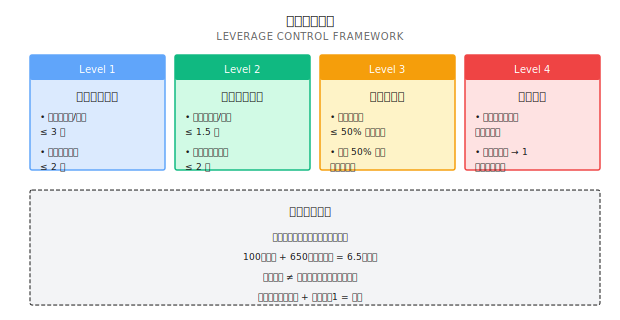
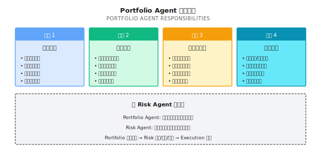

# 第 16 课：组合构建与风险暴露管理

> **多策略 ≠ 低风险。相关性才是风险的本质。**

---

## 一个典型场景（示意）

> 注：以下为合成示例，用于说明常见现象；数字为示意，不对应任何具体个人/账户。

2022 年初，一位投资者向我展示了他的"分散化组合"：

| 策略 | 类型 | 历史夏普 | 历史最大回撤 | 配置权重 |
|-----|------|---------|------------|---------|
| 策略 A | 美股动量 | 1.5 | 18% | 30% |
| 策略 B | 科技股趋势 | 1.8 | 22% | 25% |
| 策略 C | 成长因子 | 1.3 | 15% | 25% |
| 策略 D | 多头轮动 | 1.4 | 20% | 20% |

他问我："这四个策略都很优秀，组合在一起应该更稳定吧？"

我做了一个简单的相关性分析：

| | 策略 A | 策略 B | 策略 C | 策略 D |
|---|-------|-------|-------|-------|
| 策略 A | 1.00 | 0.85 | 0.78 | 0.82 |
| 策略 B | 0.85 | 1.00 | 0.88 | 0.80 |
| 策略 C | 0.78 | 0.88 | 1.00 | 0.75 |
| 策略 D | 0.82 | 0.80 | 0.75 | 1.00 |

**发现**：所有策略的相关性都在 0.75 以上。

**结果**：2022 年，这个"分散化组合"回撤了 35%——比任何单一策略都大。

**为什么？**

这四个策略看起来不同，实际上都在做同一件事：**做多美股科技股**。当科技股整体下跌时，它们同时亏损，相关性趋近于 1，分散效果消失。

**这就是缺少组合层的代价**——你以为在分散风险，实际上在叠加相同的赌注。

---

## 16.1 组合层的必要性

### 16.1.1 标准量化流程

```
完整的量化系统应该是:

信号 → 组合优化 → 风控 → 执行
 │         │         │       │
 └─ 各策略  └─ 统一    └─ 二次  └─ 真实
    信号       配置      审核      交易

很多系统缺了"组合优化"这一层:

信号 → [缺失] → 风控 → 执行
 │                 │       │
 └─ 直接交易       └─ 被动  └─ 可能
    信号              检查      爆炸
```

### 16.1.2 组合层解决什么问题？

| 问题 | 没有组合层 | 有组合层 |
|-----|----------|---------|
| **权重分配** | 凭感觉、等权分配 | 基于风险贡献、优化目标 |
| **相关性** | 不知道策略之间的关系 | 显式建模和控制 |
| **因子暴露** | 隐性暴露不可见 | 监控并约束 |
| **杠杆控制** | 可能隐性加杠杆 | 显式计算真实杠杆 |
| **再平衡** | 随机、被动 | 规则化、主动 |

### 16.1.3 信号质量 ≠ 组合质量

这是很多人忽略的关键区别：

```
单策略视角:
  信号强 → 大仓位 → 高收益

组合视角:
  信号强 + 高相关 → 大仓位 → 集中风险 → 可能大亏
  信号强 + 低相关 → 大仓位 → 分散风险 → 更稳健
```

---

## 16.2 Position Sizing 方法

### 16.2.1 四种常见方法对比

| 方法 | 公式 | 优点 | 缺点 | 适用场景 |
|-----|------|------|------|---------|
| **等权** | w_i = 1/N | 简单 | 忽略风险差异 | 策略风险相近 |
| **等波动** | w_i ∝ 1/σ_i | 考虑波动 | 忽略相关性 | 策略独立 |
| **等风险贡献** | RC_i = RC_j | 风险均衡 | 计算复杂 | 长期配置 |
| **均值-方差** | max(收益/风险) | 理论最优 | 估计误差大 | 有可靠预期 |

### 16.2.2 等权 vs 等风险贡献

**纸上练习**：

你有两个策略：
- 策略 A：年化波动率 10%
- 策略 B：年化波动率 30%

| 方法 | 策略 A 权重 | 策略 B 权重 | 组合波动 |
|-----|-----------|-----------|---------|
| 等权 | 50% | 50% | ? |
| 等波动 | 75% | 25% | ? |

<details>
<summary>点击展开答案</summary>

假设相关性 = 0（独立）

**等权配置**：
- A 贡献波动 = 50% × 10% = 5%
- B 贡献波动 = 50% × 30% = 15%
- 组合波动 = √(5%² + 15%²) = √(0.25% + 2.25%) = 15.8%
- **B 贡献了 90% 的风险**

**等波动配置**：
- w_A = (1/10%) / (1/10% + 1/30%) = 0.1 / 0.133 = 75%
- w_B = (1/30%) / (1/10% + 1/30%) = 0.033 / 0.133 = 25%
- A 贡献波动 = 75% × 10% = 7.5%
- B 贡献波动 = 25% × 30% = 7.5%
- 组合波动 = √(7.5%² + 7.5%²) = 10.6%
- **两者风险贡献相等**

**结论**：等权配置让高波动策略主导了组合风险。

</details>

### 16.2.3 Kelly 在组合层面的应用

单策略 Kelly：
```
f* = (p × b - q) / b
```

多策略 Kelly（考虑相关性）：
```
f* = Σ^(-1) × μ

其中:
- f* = 最优权重向量
- Σ = 协方差矩阵
- μ = 预期收益向量

关键:
- 高相关策略被降权
- 负相关策略被升权
```

**实战建议**：
- 使用 1/2 Kelly 或 1/4 Kelly
- 对协方差矩阵做稳健估计（见下节）
- 设置单策略权重上限

---

## 16.3 协方差估计与收缩

### 16.3.1 样本协方差的问题

均值-方差优化需要协方差矩阵 Σ。最自然的做法是用历史数据估计：

```
样本协方差矩阵:
Σ̂ = (1/T) × Σ(r_t - μ̂)(r_t - μ̂)'

其中:
  r_t = 第 t 期的收益向量
  μ̂  = 样本均值向量
  T   = 样本数量
```

**问题**：当资产数量 N 接近样本数量 T 时，样本协方差矩阵会变得极不稳定。

**纸上练习**：

| 场景 | 资产数 N | 样本数 T | 问题 |
|-----|---------|---------|------|
| 30 只股票，1 年日数据 | 30 | 252 | 还好，T/N ≈ 8 |
| 100 只股票，1 年日数据 | 100 | 252 | 危险，T/N ≈ 2.5 |
| 500 只股票，1 年日数据 | 500 | 252 | 灾难，T/N < 1 |

**为什么 T/N 小会导致问题**：

```
1. 估计噪声大
   - 协方差矩阵有 N×(N+1)/2 个参数
   - 100 只股票 = 5,050 个参数
   - 252 个样本估计 5,050 个参数 → 极不可靠

2. 矩阵可能不可逆
   - 当 N > T 时，Σ̂ 奇异（行列式 = 0）
   - 无法求逆 → 无法做组合优化

3. 极端权重
   - 估计误差被优化器放大
   - 产生不合理的大权重或空头权重
```

### 16.3.2 Ledoit-Wolf 收缩估计

**核心思想**：将不稳定的样本协方差矩阵"收缩"向一个稳定的目标矩阵。

```
收缩估计:
Σ_shrunk = δ × F + (1-δ) × Σ̂

其中:
  F = 目标矩阵（结构化的、稳定的）
  Σ̂ = 样本协方差矩阵（无偏但噪声大）
  δ = 收缩强度 (0 ≤ δ ≤ 1)

当 δ → 1: 接近目标矩阵（稳定但有偏）
当 δ → 0: 接近样本矩阵（无偏但噪声大）
```

**常用目标矩阵**：

| 目标类型 | 定义 | 适用场景 |
|---------|------|---------|
| **单因子模型** | F = β × β' × σ_m² + D | 股票组合 |
| **恒定相关性** | 所有资产相关性相同 | 同类资产 |
| **对角矩阵** | 只保留方差，相关性=0 | 弱相关资产 |

**Ledoit-Wolf 公式**（自动计算最优 δ）：

```
δ* = min(1, (Σπ_ij - Σρ_ij + Σγ_ij) / Σ(f_ij - s_ij)²)

其中:
  π_ij = Var[(r_it - μ_i)(r_jt - μ_j)]
  ρ_ij = 与目标矩阵相关的调整项
  γ_ij = 样本协方差与目标的偏差

实践中: 直接用 sklearn 库，公式会自动处理
```

### 16.3.3 代码实现

```python
import numpy as np
from sklearn.covariance import LedoitWolf, OAS

def get_shrunk_covariance(returns: np.ndarray, method: str = 'ledoit_wolf') -> dict:
    """
    计算收缩协方差矩阵

    Parameters:
    -----------
    returns : 收益率矩阵 (T × N)，每行是一个时期，每列是一个资产
    method : 'ledoit_wolf' 或 'oas' (Oracle Approximating Shrinkage)

    Returns:
    --------
    dict : 包含收缩协方差矩阵和收缩强度
    """
    if method == 'ledoit_wolf':
        estimator = LedoitWolf()
    elif method == 'oas':
        estimator = OAS()
    else:
        raise ValueError(f"Unknown method: {method}")

    estimator.fit(returns)

    return {
        'covariance': estimator.covariance_,
        'shrinkage': estimator.shrinkage_,
        'sample_cov': np.cov(returns, rowvar=False)
    }


def compare_covariance_stability(returns: np.ndarray, n_splits: int = 5) -> dict:
    """
    对比样本协方差和收缩协方差的稳定性

    通过分割数据比较两种方法在不同子样本上的一致性
    """
    T, N = returns.shape
    split_size = T // n_splits

    sample_covs = []
    shrunk_covs = []

    for i in range(n_splits):
        start = i * split_size
        end = start + split_size
        subset = returns[start:end]

        sample_covs.append(np.cov(subset, rowvar=False))

        lw = LedoitWolf()
        lw.fit(subset)
        shrunk_covs.append(lw.covariance_)

    # 计算不同子样本间的差异（Frobenius 范数）
    sample_diffs = []
    shrunk_diffs = []

    for i in range(n_splits):
        for j in range(i+1, n_splits):
            sample_diffs.append(np.linalg.norm(sample_covs[i] - sample_covs[j], 'fro'))
            shrunk_diffs.append(np.linalg.norm(shrunk_covs[i] - shrunk_covs[j], 'fro'))

    return {
        'sample_cov_variation': np.mean(sample_diffs),
        'shrunk_cov_variation': np.mean(shrunk_diffs),
        'stability_improvement': np.mean(sample_diffs) / np.mean(shrunk_diffs)
    }
```

### 16.3.4 使用示例

```python
import numpy as np
from sklearn.covariance import LedoitWolf

# 模拟 50 只股票，1 年日度数据
np.random.seed(42)
n_assets = 50
n_days = 252

# 生成带有因子结构的收益（更真实）
factor_returns = np.random.normal(0.0005, 0.015, n_days)
betas = np.random.uniform(0.5, 1.5, n_assets)
idio_returns = np.random.normal(0, 0.02, (n_days, n_assets))
returns = np.outer(factor_returns, betas) + idio_returns

# 样本协方差
sample_cov = np.cov(returns, rowvar=False)

# Ledoit-Wolf 收缩协方差
lw = LedoitWolf()
lw.fit(returns)
shrunk_cov = lw.covariance_

print(f"资产数量: {n_assets}")
print(f"样本数量: {n_days}")
print(f"T/N 比例: {n_days/n_assets:.2f}")
print(f"收缩强度 δ: {lw.shrinkage_:.3f}")
print(f"样本协方差条件数: {np.linalg.cond(sample_cov):.0f}")
print(f"收缩协方差条件数: {np.linalg.cond(shrunk_cov):.0f}")

# 输出示例:
# 资产数量: 50
# 样本数量: 252
# T/N 比例: 5.04
# 收缩强度 δ: 0.234
# 样本协方差条件数: 847
# 收缩协方差条件数: 142
```

**解读**：
- 收缩强度 δ = 0.234 意味着 23.4% 来自目标矩阵，76.6% 来自样本矩阵
- 条件数从 847 降到 142，意味着矩阵更稳定、求逆更可靠

### 16.3.5 何时使用收缩估计

| 场景 | T/N 比例 | 建议 |
|-----|---------|------|
| T/N > 10 | 宽裕 | 样本协方差可接受，收缩改进有限 |
| 5 < T/N ≤ 10 | 边界 | 建议使用收缩，改进明显 |
| 2 < T/N ≤ 5 | 危险 | 必须使用收缩 |
| T/N ≤ 2 | 灾难 | 收缩 + 降维（因子模型） |

**实战建议**：

```
1. 默认使用收缩估计
   - 即使 T/N 较大，收缩也不会变差
   - sklearn 自动计算最优收缩强度

2. 滚动窗口时更需要收缩
   - 滚动窗口 = 更少样本
   - 收缩帮助平滑协方差变化

3. 结合因子模型
   - 大规模组合（>100 资产）用因子模型降维
   - 对残差协方差做收缩估计
```

---

## 16.4 因子暴露管理

### 16.4.1 什么是因子暴露？

**因子 (Factor)** 是驱动资产收益的共同来源。常见因子：

| 因子类型 | 因子名称 | 含义 |
|---------|---------|------|
| **市场因子** | Beta | 对市场整体的敏感度 |
| **风格因子** | Size | 大盘 vs 小盘 |
| | Value | 价值股 vs 成长股 |
| | Momentum | 过去赢家 vs 输家 |
| | Quality | 高质量 vs 低质量 |
| | Volatility | 低波动 vs 高波动 |
| **行业因子** | Sector | 行业暴露 |

### 16.4.2 隐性因子暴露

**问题**：你可能不知道自己在押注什么因子。

```
案例：四个"不同"的策略

策略 A: 买入高 ROE 股票
策略 B: 买入低 PE 股票
策略 C: 买入财务稳健股票
策略 D: 买入高分红股票

看起来: 四种不同的选股方法
实际上: 都在做多 "Quality + Value" 因子

结果: 当 Value 因子失效（如 2019-2020），四个策略同时亏损
```

### 16.4.3 因子暴露计算

**纸上练习**：

你的组合持有以下股票：

| 股票 | 权重 | Size Beta | Value Beta | Momentum Beta |
|-----|------|-----------|-----------|---------------|
| AAPL | 30% | 0.8 (大盘) | -0.5 (成长) | 0.6 |
| MSFT | 25% | 0.7 (大盘) | -0.3 (成长) | 0.4 |
| JPM | 25% | 0.9 (大盘) | 0.8 (价值) | -0.2 |
| XOM | 20% | 1.0 (大盘) | 1.2 (价值) | -0.5 |

计算组合的因子暴露：

<details>
<summary>点击展开答案</summary>

**Size 暴露**：
= 30% × 0.8 + 25% × 0.7 + 25% × 0.9 + 20% × 1.0
= 0.24 + 0.175 + 0.225 + 0.2
= **0.84（偏大盘）**

**Value 暴露**：
= 30% × (-0.5) + 25% × (-0.3) + 25% × 0.8 + 20% × 1.2
= -0.15 - 0.075 + 0.2 + 0.24
= **0.215（略偏价值）**

**Momentum 暴露**：
= 30% × 0.6 + 25% × 0.4 + 25% × (-0.2) + 20% × (-0.5)
= 0.18 + 0.1 - 0.05 - 0.1
= **0.13（略偏动量）**

**解读**：
- 组合偏向大盘股（可能被动跟随市场）
- 组合略偏价值因子（但不强）
- 组合有轻微动量暴露

</details>

### 16.4.4 因子中性化

如果你想要一个因子中性的组合：

```
目标: 因子暴露 ≈ 0

方法 1: 约束优化
  max  预期收益
  s.t. 因子暴露 = 0
       权重和 = 1
       权重 >= 0

方法 2: 对冲
  如果组合有 0.5 的 Value 暴露
  做空 0.5 单位的 Value 因子 ETF

方法 3: 配对
  每买入一个 Value 股
  同时买入一个 Growth 股（等 Value Beta）
```

---

## 16.5 隐性杠杆

### 16.5.1 什么是隐性杠杆？

**显性杠杆**：借钱买股票，100 万本金 + 100 万借款 = 2 倍杠杆

**隐性杠杆**：没有借钱，但组合的风险敞口超过本金

```
案例：期货组合

本金: 100 万
持仓:
  - 股指期货多头: 名义 200 万（保证金 20 万）
  - 债券期货多头: 名义 300 万（保证金 15 万）
  - 商品期货多头: 名义 150 万（保证金 15 万）

使用保证金: 50 万
闲置资金: 50 万

表面上: 只用了 50% 的资金
实际上: 名义敞口 650 万 = 6.5 倍杠杆！
```

### 16.5.2 计算真实杠杆

```
真实杠杆 = Σ|名义敞口| / 本金

或者用风险角度:

风险杠杆 = 组合波动率 / 基准波动率

例如:
  组合年化波动率: 30%
  标普 500 波动率: 15%
  风险杠杆 = 30% / 15% = 2 倍
```

### 16.5.3 杠杆陷阱

| 陷阱 | 表现 | 后果 |
|-----|------|------|
| **低保证金幻觉** | "只用了 20% 保证金" | 实际杠杆可能 5 倍 |
| **跨资产叠加** | 多个资产类别的期货 | 杠杆隐性叠加 |
| **相关性低估** | "不同资产，风险分散" | 危机时相关性飙升 |
| **波动率低估** | 用平时波动率算杠杆 | 危机时波动率翻倍 |

### 16.5.4 杠杆控制规则



---

## 16.6 多策略组合的陷阱

### 16.6.1 相关性的两面性

**正常时期**：策略相关性 = 0.3（分散有效）

**危机时期**：策略相关性 → 0.9（分散失效）

```
为什么危机时相关性会飙升？

1. 流动性挤压
   所有人都在卖 → 所有资产都跌

2. 风险偏好逆转
   "Risk-off" → 只买国债，抛售其他一切

3. 杠杆清算
   保证金追缴 → 被迫卖出 → 价格下跌 → 更多追缴

4. 恐慌蔓延
   一个市场崩盘 → 投资者恐慌 → 抛售所有风险资产
```

### 16.6.2 Drawdown 同步问题

**纸上练习**：

你有三个策略，历史最大回撤都是 15%。

| 假设 | 组合最大回撤 | 计算 |
|-----|------------|------|
| 完全独立（相关性 = 0） | ? | 不会同时回撤 |
| 部分相关（相关性 = 0.5） | ? | 可能部分同步 |
| 高度相关（相关性 = 0.9） | ? | 几乎完全同步 |

<details>
<summary>点击展开答案</summary>

**简化估算**（等权配置）：

1. **完全独立**：
   - 同时最大回撤的概率很低
   - 组合最大回撤 ≈ 8-10%（单策略贡献 15%/3 ≈ 5%，加上一些同步）

2. **部分相关**：
   - 会有部分同步回撤
   - 组合最大回撤 ≈ 12-13%

3. **高度相关**：
   - 几乎完全同步
   - 组合最大回撤 ≈ 14-15%（接近单策略）

**关键洞察**：高相关性时，"分散化"是一种幻觉。

</details>

### 16.6.3 策略容量约束

| 策略类型 | 典型容量 | 原因 |
|---------|---------|------|
| 高频做市 | $10-100M | 流动性限制 |
| 统计套利 | $100M-1B | Alpha 衰减 |
| 动量策略 | $1-10B | 市场冲击 |
| 被动指数 | 无限 | 跟踪误差容忍 |

**问题**：当策略容量不足时，继续加仓会导致：
- 滑点增加
- Alpha 衰减
- 边际收益递减

---

## 16.7 多智能体视角

### 16.7.1 Portfolio Agent 的职责



### 16.7.2 与 Risk Agent 的分工

| 维度 | Portfolio Agent | Risk Agent |
|-----|-----------------|------------|
| **关注点** | 如何配置最优 | 是否超过限制 |
| **时机** | 事前（计划阶段） | 事中事后（执行和监控） |
| **权限** | 建议权重 | 一票否决 |
| **工具** | 优化器、因子模型 | 阈值、熔断机制 |

**协作流程**：

```
Signal Agents ──► Portfolio Agent ──► Risk Agent ──► Execution Agent
                       │                   │
                       ▼                   ▼
                  最优权重            审核/缩减/拒绝
                  因子暴露               杠杆检查
                  相关性               回撤检查
```

### 16.7.3 组合优化的频率

| 频率 | 适用场景 | 成本 |
|-----|---------|------|
| 日内 | 高频策略 | 高交易成本 |
| 每日 | 主动策略 | 中等成本 |
| 每周 | 战术配置 | 低成本 |
| 每月 | 战略配置 | 最低成本 |

**建议**：
- 权重只有变化超过阈值（如 5%）时才调整
- 避免过度交易带来的成本

---

## ✅ 验收标准

完成本课后，用以下标准检验学习效果：

| 验收项 | 达标标准 | 自测方法 |
|-------|---------|---------|
| 理解组合层必要性 | 能解释信号质量≠组合质量 | 举出反例 |
| 计算权重分配 | 能用等权和等风险方法计算权重 | 完成纸上练习 |
| 分析因子暴露 | 能计算组合的因子 Beta | 完成因子练习 |
| 识别隐性杠杆 | 能计算期货组合的真实杠杆 | 给出例子 |
| 理解相关性陷阱 | 能解释危机时相关性飙升的原因 | 分析案例 |

---

## 本课交付物

完成本课后，你将获得：

1. **Position Sizing 方法对比** - 等权、等波动、等风险贡献
2. **因子暴露计算框架** - 识别组合的隐性风险暴露
3. **杠杆控制规则** - 名义杠杆和风险杠杆的约束
4. **Portfolio Agent 设计模板** - 组合优化的职责和流程

---

## 本课要点回顾

- [x] 多策略≠分散化，相关性决定分散效果
- [x] 等权配置让高波动策略主导组合风险
- [x] 因子暴露可能是隐性的，需要显式监控
- [x] 隐性杠杆来自名义敞口超过本金
- [x] 危机时相关性飙升，分散效果失效

---

## 延伸阅读

- [第 08 课：Beta、对冲与市场中性](../Part2-量化基础/第08课：Beta、对冲与市场中性.md) - Beta 和因子的基础
- [第 15 课：风险控制与资金管理](第15课：风险控制与资金管理.md) - 风控与组合层的协作
- [背景知识：夏普比率的统计陷阱](../Part2-量化基础/背景知识/夏普比率的统计陷阱.md) - 组合评估的统计问题
- [背景知识：历史著名量化事故](../Part1-快速体验/背景知识/历史著名量化事故.md) - 杠杆失控的案例

---

## 下一课预告

**第 17 课：在线学习与策略进化**

组合构建好后，市场在变，策略必须进化。如何让系统持续学习、自我更新，而不是等到大亏之后才发现问题？下一课我们探讨在线学习的方法。
