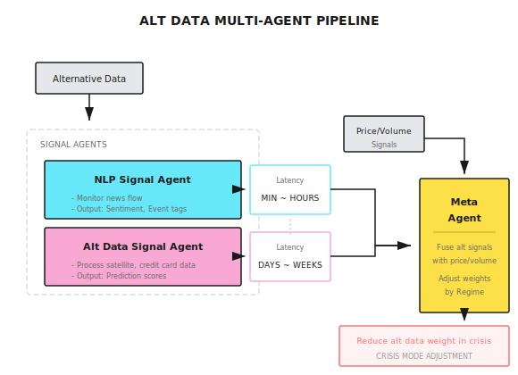

# Background: Alternative Data (NLP and Satellite)

> "When everyone is looking at the same price-volume data, Alpha is elsewhere."

---

## What is Alternative Data?

**Traditional Data**: Price, volume, financial statements - easily accessible to everyone

**Alternative Data**: Information extracted from non-traditional sources that has predictive value

| Data Type | Source Examples | Prediction Target |
|-----------|-----------------|-------------------|
| Text Sentiment | News, social media, earnings calls | Short-term price volatility |
| Satellite Imagery | Parking lots, farmland, oil tanks | Revenue forecasting |
| Credit Card Transactions | Consumer payment data | Retail performance |
| Web Traffic | App downloads, website visits | User growth |
| Supply Chain | Shipping tracking, port data | Supply/demand forecasting |

---

## Text Data and NLP

### Sentiment Analysis Basics

Convert text into numerical signals:

```
News Headline: "Apple quarterly revenue hits record high, exceeds analyst expectations"
Sentiment Score: +0.8 (positive)

News Headline: "Tesla faces safety concerns, under regulatory investigation"
Sentiment Score: -0.7 (negative)
```

### Building Sentiment Signals

**Simple Method**: Dictionary counting

```
Positive words: {"growth", "exceeds", "record", "breakthrough"...}
Negative words: {"decline", "loss", "investigation", "recall"...}

Sentiment Score = (Positive word count - Negative word count) / Total words
```

**Advanced Method**: Pre-trained language models

```
Using BERT/GPT-type models:
1. Input: Full news text
2. Output: Sentiment category (positive/neutral/negative) or continuous score
3. Advantage: Understands context and sarcasm
```

### Text Data Source Comparison

| Source | Timeliness | Coverage | Noise | Cost |
|--------|------------|----------|-------|------|
| News (Reuters, Bloomberg) | Minute-level | Large caps | Low | $$$$ |
| Twitter/X | Second-level | Hot stocks | High | $ |
| Reddit (r/wallstreetbets) | Minute-level | Retail favorites | Very high | Free |
| Earnings Call Transcripts | Quarterly | Full coverage | Low | $$ |
| SEC Filings | Immediate | Full coverage | Low | Free |

### Time Decay of Text Signals

```
Sentiment signal strength after news release:

   Strength
    |
 100| ####
  80| #### ####
  60| #### #### ####
  40| #### #### #### ####
  20| #### #### #### #### ####
    +-----------------------------> Time
        5min  30min  1hr   4hr   1day

Conclusion: Sentiment signals are mainly effective within hours of release
```

---

## Satellite Data Applications

### Typical Application Scenarios

**Retail**: Parking lot vehicle counting
```
Monitoring: Walmart, Target parking lots
Indicator: Vehicle count changes
Prediction: Quarterly same-store sales growth
Lead Time: 1-2 weeks before earnings report
```

**Energy**: Oil tank storage monitoring
```
Monitoring: Global oil storage facilities
Method: Calculate storage from floating roof tank shadows
Prediction: Crude oil inventory changes
Data Frequency: Weekly updates
```

**Agriculture**: Crop health monitoring
```
Monitoring: US Midwest farmland
Indicator: Vegetation index (NDVI)
Prediction: Corn, soybean yields
Impact: Agricultural commodity futures pricing
```

**Shipping**: Port activity tracking
```
Monitoring: Major global ports
Indicator: Container counts, vessel dwell time
Prediction: Import/export activity, supply chain bottlenecks
Application: Shipping stocks, retail inventory
```

### Satellite Data Processing Pipeline

```
1. Image Acquisition
   +- Satellite pass frequency: Every 1-7 days
   +- Resolution: 0.3-10 meters
   +- Cloud cover: Requires multi-day averaging

2. Image Processing
   +- Atmospheric correction
   +- Geometric registration
   +- Target detection (parking lot boundaries, tank locations)

3. Feature Extraction
   +- Vehicle counting (object detection models)
   +- Area calculation (pixel analysis)
   +- Time series construction

4. Signal Generation
   +- Compare with historical data
   +- Seasonal adjustment
   +- Standardization (Z-Score)
```

---

## Alpha Decay in Alternative Data

**Core Problem**: Once data is widely used, Alpha disappears

```
Alternative Data Lifecycle:

Discovery Phase   | Few institutions use it, Alpha is significant
                  |
Diffusion Phase   | More people access it, Alpha declines
                  |
Maturity Phase    | Becomes mainstream, Alpha ≈ 0
                  |
                  +-----------------------------> Time

Typical Cycle: 2-5 years
```

**Example**: Satellite parking lot data
- 2015: Few hedge funds using it, significant excess returns
- 2018: Multiple data vendors offering it, competition intensifies
- 2022: Already standard, need more refined analysis to extract Alpha

---

## Cost-Benefit Analysis

| Data Type | Annual Cost | Stock Coverage | Expected IC | Cost-Effectiveness |
|-----------|-------------|----------------|-------------|---------------------|
| News Sentiment | $50K+ | 500+ | 0.03 | Medium |
| Social Media | $10K | 100+ | 0.02 | Low |
| Satellite Imagery | $100K+ | 50+ | 0.05 | Low |
| Credit Card Transactions | $500K+ | 200+ | 0.08 | Medium |
| Web Traffic | $30K | 100+ | 0.04 | Medium |

**Economic Logic**:
```
Assumptions:
- Data cost: $100,000/year
- Covers 50 stocks
- IC improvement: 0.05

Required Capital Scale:
- $1,000,000 per stock position
- Total scale $50,000,000
- Annualized improvement 0.05 x 12% ≈ 0.6%
- Return improvement $300,000

Conclusion: At least $50M scale needed to break even
```

---

## Build vs Buy

| Dimension | Build | Buy |
|-----------|-------|-----|
| Cost Structure | High fixed cost, low marginal cost | Pay per data volume |
| Time Investment | 6-12 months | Plug and play |
| Uniqueness | May have unique Alpha | Same as others |
| Maintenance | Requires ongoing investment | Vendor responsibility |
| Suitable Scale | Large institutions | Small/medium funds |

**Small Team Recommendations**:
- Start with free data (SEC filings, Reddit, Twitter)
- Buy paid data after validating signals work
- Focus on differentiation in data processing, not data acquisition

---

## Multi-Agent Perspective

The role of alternative data in multi-agent architecture:



---

## Common Misconceptions

**Misconception 1: Alternative data always has Alpha**

Not necessarily. Many alternative data:
- Reacts simultaneously with price (no lead)
- Too noisy to extract signals
- Too few samples to validate statistical significance

**Misconception 2: LLMs can easily extract sentiment**

Be cautious. LLM challenges:
- Financial domain terminology understanding
- Sarcasm and pun recognition
- Consistency and reproducibility
- Inference cost

**Misconception 3: Satellite data is very accurate**

Reality is more complex:
- Cloud cover causes missing data
- Vehicle detection has errors (10-20%)
- Seasonal and special events need adjustment
- Different parking lot layouts affect detection

---

## Practical Recommendations

### 1. Start with Free Data

```
Recommended Starting Sources:
- SEC EDGAR (financial statements, 8-K filings)
- Twitter API (requires developer account)
- Reddit API
- Free news APIs
```

### 2. Focus on Signal Uniqueness

```
Ask Yourself:
- Is this signal correlated with price-volume signals?
- How many people are already using this data?
- What's unique about my processing method?
```

### 3. Beware of Data Snooping

```
Validation Process:
1. Discover signal in-sample
2. Test out-of-sample (must be unseen data)
3. Calculate p-value after multiple testing correction
4. Understand the economic logic behind the signal
```

---

## Summary

| Key Point | Explanation |
|-----------|-------------|
| Core Value | Find differentiated information beyond price-volume data |
| Main Types | Text sentiment, satellite imagery, transaction data, web traffic |
| Key Challenges | High cost, fast Alpha decay, high noise |
| Suitable Scale | $50M+ to cover data costs |
| Starting Recommendation | Free data + unique processing methods |
