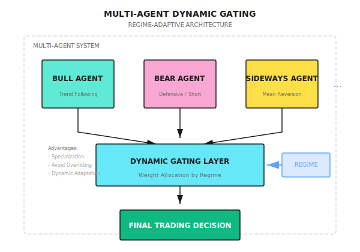

# Background: Frontier ML and RL Methods (2025)

> This document reviews the most cutting-edge machine learning and reinforcement learning methods in quantitative trading as of 2025. These are techniques that top quantitative institutions (Two Sigma, Citadel, High-Flyer, Nine Chapter) are exploring or already using.

---

## 1. Technology Evolution Overview

### 1.1 From Traditional to Frontier

| Generation | Representative Technology | Status |
|------------|---------------------------|--------|
| 1st Gen | Linear Regression, Logistic | Basic, still in use |
| 2nd Gen | LSTM, GRU | Still viable (low-latency, small data), but mainstream focus shifted to Transformer |
| 3rd Gen | Transformer, GNN | Current mainstream |
| 4th Gen | Foundation Models, Diffusion | **Frontier exploration** |

> **Note**: LSTM/GRU are not entirely obsolete. They remain reasonable choices for low-latency scenarios (<1ms inference), small datasets, or simple time-series prediction. See [Model Architecture Selection Guide](Model-Architecture-Selection-Guide.md) for detailed guidance.

### 1.2 Leading Institution Technology Layouts

| Institution | Public Technology Direction | Compute Investment |
|-------------|----------------------------|-------------------|
| High-Flyer Quant | DeepSeek LLM, Firefly II AI Cluster | $150M+ |
| Nine Chapter | Collaboration with Microsoft on vertical AI | Undisclosed |
| Two Sigma | Data Science + Large-Scale ML | $60B AUM support |
| Citadel | HFT Infrastructure + AI | Continuous AI hiring |

---

## 2. Decision Transformer

### 2.1 Core Idea

**Transform reinforcement learning problems into sequence modeling problems**:

```
Traditional RL: State -> Policy -> Action -> Reward -> Update Policy
Decision Transformer: (Return, State, Action) sequence -> Next Action
```

**Key Innovation**:
- No need for value function estimation
- No need for policy gradients
- Directly uses Transformer to model "if I want this return, what should I do"

### 2.2 GPT-2 + LoRA for Trading

**Latest Research (November 2024)**:

```
Architecture:
Pre-trained GPT-2
    |
LoRA Fine-tuning (Low-Rank Adaptation)
    |
Decision Transformer for Trading
```

**Why It Works**:
- GPT-2's pre-trained weights provide powerful sequence modeling capability
- LoRA only fine-tunes a small fraction of parameters (~0.1%), efficient and prevents overfitting
- Suitable for scenarios with scarce financial data

**Performance**: Competitive with CQL, IQL, BC, and other offline RL algorithms, superior in some scenarios

### 2.3 TACR (Transformer Actor-Critic with Regularization)

**Problem Addressed**: Traditional RL assumes Markov property (only looks at current state), but financial markets have long-term dependencies

**Method**: Uses Decision Transformer's attention mechanism to model historical MDP sequences

**Exercise**: Implement a simple Decision Transformer trading framework

---

## 3. LLM-Driven Alpha Mining

### 3.1 AlphaAgent Framework

**Core Idea**: Multi-agent collaboration for alpha factor mining

**Architecture**:

```
┌─────────────────────────────────────────────────────┐
│                   AlphaAgent System                  │
├─────────────────────────────────────────────────────┤
│  Research Agent     →  Generate factor hypotheses    │
│       ↓                                              │
│  Backtest Agent     →  Validate factor effectiveness │
│       ↓                                              │
│  Risk Agent         →  Assess factor risk properties │
│       ↓                                              │
│  Portfolio Agent    →  Optimize weights & allocation │
└─────────────────────────────────────────────────────┘
```

**Key Features**:
- **Multi-agent division**: Each agent focuses on a single task, avoiding single LLM capability bottlenecks
- **Iterative optimization**: Continuous factor improvement through backtest feedback
- **Risk-aware**: Risk Agent embedded in the workflow, not an afterthought
- **Explainability**: Clear reasoning chain at each decision node

**Comparison with Traditional Methods**:

| Feature | Traditional Quant | Single LLM | AlphaAgent |
|---------|------------------|------------|------------|
| Factor mining efficiency | Low (manual) | Medium | High |
| Risk control | Post-hoc | Weak | Built-in |
| Explainability | High | Low | High |
| Iteration speed | Slow | Fast | Fast |

### 3.2 LLM-Guided RL

**Source**: arXiv 2508.02366 (2025)

**Core Idea**:

```
LLM: Generate high-level strategy ("Market is in uptrend, suggest overweight tech stocks")
 |
RL Agent: Execute specific trades ("Buy 100 shares AAPL, limit $185")
 |
Reward: Feedback to LLM for strategy improvement
```

**Advantages**:
- LLM provides interpretable high-level logic
- RL optimizes low-level execution details
- The two complement each other

**Experimental Results**: 4 out of 6 stocks showed better Sharpe ratio than pure RL baseline

### 3.3 Alpha-GPT 2.0

**Position**: Human-in-the-Loop AI

**Process**:
1. LLM generates factor candidates
2. Human experts review/modify
3. Backtest validation
4. Feedback for improvement

**Suitable Scenario**: Institutional applications requiring human oversight

**Exercise**: Implement a simple LLM factor generation pipeline

---

## 4. Graph Neural Networks (GNN)

### 4.1 Why GNN is Needed

**Traditional Method Limitations**:
- Assumes stocks are independent
- Ignores relational connections

**Market Reality**:
- Supply chain relationships (Apple -> TSMC)
- Industry correlations (bank stocks move together)
- Macro factors (interest rates affect all stocks)

### 4.2 Role-Aware Graph Transformer

**Source**: December 2025 research

**Multi-Relationship Modeling**:

| Edge Type | Meaning | Construction Method |
|-----------|---------|---------------------|
| Correlation | Price correlation | Historical return correlation coefficient |
| Fundamental | Fundamental similarity | PE, PB, ROE, etc. |
| Sector | Industry relationship | GICS classification |
| Supply Chain | Supply chain | Earnings report disclosure |

**Role Awareness**:
- Hub Stocks (e.g., AAPL, MSFT): Influence many other stocks
- Bridge Stocks: Connect different industries
- Peripheral Stocks: Passively follow

### 4.3 TFT-GNN Hybrid Model

**Temporal Fusion Transformer + Graph Neural Network**

```
Time Dimension: TFT captures
    |
Relationship Dimension: GNN models
    |
Fusion Layer
    |
Prediction
```

**Performance**: MSE reduced by 10.6% (compared to TFT alone)

**Exercise**: Implement simple stock relationship graph construction and GNN prediction

---

## 5. Diffusion Models

### 5.1 Application Scenarios

| Scenario | Traditional Method | Diffusion Model Advantage |
|----------|-------------------|---------------------------|
| Synthetic Data Generation | GAN | More stable, no mode collapse |
| Market Simulation | Monte Carlo | More realistic statistical properties |
| LOB Simulation | Rule-based models | Captures complex dynamics |

### 5.2 TRADES Framework

**Source**: arXiv 2502.07071 (February 2025)

**Position**: TRAnsformer-based Denoising Diffusion for LOB Simulations

**Architecture**:
```
Limit Order Book State
    |
Transformer Encoder (Captures spatiotemporal features)
    |
DDPM (Denoising Diffusion)
    |
Generated Order Flow
```

**Performance**: Predictive Score improved 3.27x (vs SOTA)

**Open Source**: DeepMarket (First open-source LOB deep learning simulation framework)

### 5.3 Wavelet + DDPM Method

**Source**: arXiv 2410.18897

**Innovation**: Transform time series to images

```
Multiple Time Series (price, volume, spread)
    |
Wavelet Transform -> Image
    |
DDPM generates new images
    |
Inverse Wavelet Transform -> Synthetic time series
```

**Advantages**:
- Captures stylized facts of financial data (fat tails, volatility clustering)
- Generation quality superior to GAN
- Can be used for backtest data augmentation

### 5.4 Application Value

| Application | Description |
|-------------|-------------|
| Data Augmentation | Expand scarce historical data |
| Stress Testing | Generate extreme market scenarios |
| Backtest Robustness | Validate strategies across multiple scenarios |
| Privacy Protection | Generate synthetic data to replace real data |

**Exercise**: Research TRADES framework usability, evaluate integration feasibility

---

## 6. Time Series Foundation Models

### 6.1 Overview

| Model | Developer | Parameters | Features |
|-------|-----------|------------|----------|
| Chronos-2 | Amazon | 120M | Latest (October 2025) |
| TimeGPT | Nixtla | - | Trained on 100B+ tokens |
| TimesFM | Google | - | - |
| Moirai | Salesforce | - | - |

### 6.2 Chronos-2

**Release**: October 20, 2025

**Capabilities**:
- Zero-shot forecasting (no fine-tuning needed)
- Univariate / Multivariate / Covariates
- Single architecture supports all scenarios

**Downloads**: 600M+ (Hugging Face)

### 6.3 Financial Application Considerations

**Research Findings**:
- General foundation models have limited effectiveness in finance
- Domain-aligned models (e.g., FinCast) perform better
- Low signal-to-noise ratio of financial data is the main challenge

**Recommendations**:
- Use as baseline reference
- May need fine-tuning on financial data
- Not recommended for direct production signals

**Exercise**: Evaluate Chronos-2 zero-shot performance on stock prediction tasks

---

## 7. Reinforcement Learning Frontier

### 7.1 Algorithm Selection Guide (2025)

| Scenario | Recommended Algorithm | Reason |
|----------|----------------------|--------|
| Portfolio Allocation | **PPO** | Continuous action space, stable |
| Order Execution Optimization | **SAC** | Exploration-friendly, adapts to volatility |
| Discrete Trading Decisions | **DQN** | Simple and effective |
| Risk-Aware Investing | **QR-DDPG** | Quantile regression captures tail risk |

### 7.2 Hybrid Approaches Trend

**2025 Data**:
- Hybrid approach adoption rate: 42% (only 15% in 2020)
- Pure RL adoption rate: 58% (85% in 2020)

**Hybrid Advantages**:
| Combination | Application | Improvement |
|-------------|-------------|-------------|
| LSTM-DQN | Portfolio Optimization | +15.4% |
| CNN-PPO | Cryptocurrency Trading | +17.9% |
| Attention-DDPG | Market Making | +16.3% |

### 7.3 IMM (Imitative Market Maker)

**Source**: IJCAI 2024

**Innovation**:
- Multi-price level order book modeling
- Imitation learning (learn from expert market makers)
- Integrate expert signals

**Application**: RL optimization for market making strategies

### 7.4 FinRL Framework

**Position**: Open-source standard framework for financial reinforcement learning

**Features**:
- Standardized environment based on OpenAI Gym
- Integrates DQN, PPO, A3C, SAC, and other algorithms
- Supports backtesting and risk assessment

**Recommended Use**: Starting point for RL strategy development

**Exercise**: Evaluate feasibility of FinRL integration into existing framework

---

## 8. Multi-Agent Systems

### 8.1 Dynamic Gating Architecture

**Core Idea**:



**Advantages**:
- Each Agent focuses on specific market states
- Avoids single model overfitting
- Dynamically adapts to market changes

### 8.2 FinMem

**Position**: LLM trading Agent with hierarchical memory

**Memory Structure**:
- Short-term Memory: Recent market events
- Working Memory: Current positions and decision context
- Long-term Memory: Historical patterns and lessons learned

### 8.3 TwinMarket

**Source**: Yang et al. 2025

**Features**: Simulates individual behavior and collective dynamics in markets

**Applications**:
- Research financial bubble formation
- Understand market emergence phenomena
- Test strategy performance in complex markets

**Exercise**: Research multi-agent gating mechanism implementation

---

## 9. Practical Roadmap

### 9.1 Priority Ranking

| Priority | Technology | Reason |
|----------|------------|--------|
| P0 | LLM-Guided RL | Interpretability + Performance |
| P0 | AlphaAgent | Automated factor mining |
| P1 | GNN Relationship Modeling | Captures market structure |
| P1 | Decision Transformer | Replace traditional RL |
| P2 | Diffusion Models | Data augmentation/stress testing |
| P2 | Time Series Foundation Models | Zero-shot prediction capability |

### 9.2 Implementation Recommendations

**Short-term (1-3 months)**:
- Evaluate FinRL framework
- Implement simple LLM factor generation pipeline
- Build stock relationship graph

**Medium-term (3-6 months)**:
- Implement Decision Transformer framework
- Integrate GNN for relationship prediction
- Develop multi-agent gating system

**Long-term (6-12 months)**:
- Complete AlphaAgent system
- Diffusion models for data augmentation
- Production-level deployment and monitoring

---

## 10. Reference Resources

### Papers
- AlphaAgent: Multi-agent alpha factor mining framework
- LLM-Guided RL: arXiv 2508.02366
- Decision Transformer for Trading: arXiv 2411.17900
- TRADES: arXiv 2502.07071
- GNN Survey for Stock: ACM Computing Surveys 2024
- RL in Finance Review: arXiv 2512.10913

### Open-Source Frameworks
- FinRL: https://github.com/AI4Finance-Foundation/FinRL
- DeepMarket: (Released with TRADES paper)
- Chronos-2: https://huggingface.co/amazon/chronos-2
- FinGPT: https://github.com/AI4Finance-Foundation/FinGPT

### Datasets
- FinRL Contest Dataset
- LOBSTER (Academic LOB data)

---

> **Core Principle**: Track the frontier, but don't blindly chase the new. Every technology needs validation in your specific scenario, rather than copying paper conclusions. The advantage of leading institutions lies in their ability to fail at scale and iterate, not in using some "magical" model.
