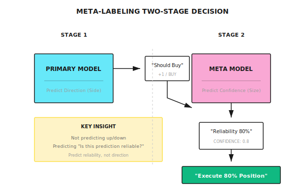

# Background: Meta-Labeling Method

> "Not predicting up or down, but predicting 'whether this prediction is reliable.'"

---

## The Problem with Traditional Methods

**Scenario**: You have a trend-following model that generates buy/sell signals

```
Traditional Flow:
Signal Generated -> Execute Directly -> Results are mixed

Problem:
  - Some signals have high win rate (when trend is clear)
  - Some signals have low win rate (in ranging markets)
  - The model cannot distinguish between these two situations
```

**Result**: Trading when you shouldn't, wasting costs, dragging down returns.

---

## Core Idea of Meta-Labeling

**Two-Stage Decision**:



---

## Detailed Process

### Step 1: Primary Model Generates Signals

The primary model can be any strategy:
- Technical analysis rules
- Machine learning model
- Fundamental factors

```
Primary Model Output:
  +1 = Buy signal
  -1 = Sell signal
   0 = No signal
```

### Step 2: Construct Meta Labels

For each primary model signal, determine whether that signal was correct:

```
Meta Label Definition:
  If primary signal direction is correct and profitable -> Meta Label = 1
  If primary signal direction is wrong or loses money -> Meta Label = 0

Combined with Triple Barrier:
  Primary model says "buy", triggers upper barrier (take-profit) -> Meta Label = 1
  Primary model says "buy", triggers lower barrier (stop-loss) -> Meta Label = 0
```

### Step 3: Train Meta Model

The meta model learns to predict the success probability of primary model signals:

```
Features:
  - Primary model signal direction
  - Current volatility
  - Trend strength
  - Primary model historical accuracy
  - Market state indicators

Target:
  - Predict whether the signal will be profitable (binary classification)
  - Or predict confidence level (regression)
```

### Step 4: Decision Execution

```
Final Decision = Primary Model Direction x Meta Model Confidence

Example:
  Primary Model: Buy (+1)
  Meta Model: Confidence 0.3 (low)

  Decision:
    Option A: Don't execute (confidence too low)
    Option B: Small position buy (30% of normal size)
```

---

## Numerical Example

**Setup**: Trend-following primary model, 100 past signals

| Signal # | Primary Direction | Actual Result | Meta Label |
|----------|-------------------|---------------|------------|
| 1 | Buy | Profit 2% | 1 |
| 2 | Buy | Loss 1% | 0 |
| 3 | Sell | Profit 1.5% | 1 |
| 4 | Buy | Loss 0.5% | 0 |
| ... | ... | ... | ... |

**Statistics**:
- Total signals: 100
- Profitable signals: 55 (55% win rate)
- Losing signals: 45

**Meta Model Analysis**:

```
High Confidence Signals (Meta Model > 0.7): 30
  - Profitable: 25 (83% win rate)
  - Losing: 5

Low Confidence Signals (Meta Model < 0.3): 25
  - Profitable: 8 (32% win rate)
  - Losing: 17

Strategy: Only execute high confidence signals
  - Trading frequency reduced 70%
  - Win rate improved from 55% to 83%
  - Trading costs reduced
```

---

## Feature Design for Meta Model

### Market State Features

| Feature | Calculation Method | Predictive Logic |
|---------|-------------------|------------------|
| Volatility | 20-day return std dev | Trend signals more likely to fail in high volatility |
| Trend Strength | ADX indicator | Strong trends make signals more reliable |
| Volume Change | Current / 20-day avg volume | Breakouts with volume are more reliable |
| VIX Level | Fear index | High VIX reduces signal reliability |

### Primary Model Features

| Feature | Calculation Method | Predictive Logic |
|---------|-------------------|------------------|
| Signal Strength | Primary model raw score | Stronger signals are more reliable |
| Rolling Win Rate | Accuracy of past 20 signals | Better recent performance = more reliable |
| Signal Consistency | Do multiple indicators agree | Multiple confirmations = more reliable |
| Time Since Last Signal | Signal interval | Frequent signals may be noise |

### Time Features

| Feature | Calculation Method | Predictive Logic |
|---------|-------------------|------------------|
| Day of Week | Mon-Fri encoding | Mon/Fri volatility may differ |
| Time of Month | Beginning/End of month | Month-end may have institutional rebalancing |
| Earnings Season | Whether in earnings period | Earnings period has more noise |

---

## Position Sizing

Meta model confidence can be directly used for position management:

```
Method 1: Linear Mapping
  Position = Confidence x Max Position

  Confidence 0.8 -> 80% position
  Confidence 0.3 -> 30% position

Method 2: Threshold Filtering
  Confidence > 0.6 -> Full position
  Confidence < 0.6 -> No trade

Method 3: Convex Function Mapping
  Position = Confidence^2 x Max Position

  More aggressively reduce low confidence positions:
  Confidence 0.8 -> 64% position
  Confidence 0.5 -> 25% position
  Confidence 0.3 -> 9% position
```

---

## Comparison with Direct Prediction

| Method | Target | Pros | Cons |
|--------|--------|------|------|
| Direct Prediction | Predict up/down | Simple and direct | Win rate hard to exceed 55% |
| Meta-Labeling | Predict signal reliability | Improves effective win rate | Reduces trading opportunities |

**Key Insight**:

```
Direct Prediction:
  100 trades, 55% win rate
  Expected profit = 55 x 1% - 45 x 1% = 10%

Meta-Labeling:
  30 high confidence trades, 80% win rate
  Expected profit = 24 x 1% - 6 x 1% = 18%

  Although fewer trades, returns are higher
```

---

## Multi-Agent Perspective

Meta-Labeling naturally fits multi-agent architecture:

```
Signal Agent (Primary Model)
  |
  +- Output: Trading direction
  |
  v
Confidence Agent (Meta Model)
  |
  +- Input: Signal Agent's signal + market state
  +- Output: Confidence of that signal
  |
  v
Risk Agent
  |
  +- Adjust position based on confidence
  +- Low confidence -> Reject trade or small position
  +- High confidence -> Allow normal position

Meta Agent
  |
  +- Monitor Confidence Agent's accuracy
     -> If persistently failing, switch to conservative mode
```

---

## Common Misconceptions

**Misconception 1: Meta model will learn the same thing as primary model**

Wrong. The two have different objectives:
- Primary model: Predict price direction
- Meta model: Predict when primary model is effective

Meta model can discover patterns like "primary model fails in high volatility."

**Misconception 2: High confidence is always correct**

Not guaranteed. Meta model also makes mistakes:
- Overfitting to historical patterns
- Market regime changes
- Insufficient sample size

Still need stop-losses and risk controls.

**Misconception 3: Meta-Labeling can save a poor primary model**

Limited. If primary model win rate is too low (<50%), meta model can only do so much:
- Can only reduce losses
- Cannot create positive expectancy

Primary model itself must have some predictive power.

---

## Practical Recommendations

### 1. Verify Primary Model Has Base Alpha

```
First confirm:
  - Primary model win rate > 50%
  - Or win/loss ratio > 1
  - Positive returns out-of-sample

Without base Alpha, Meta-Labeling cannot create it
```

### 2. Keep Meta Model Simple

```
Recommended:
  - Logistic regression
  - Shallow decision trees
  - Simple neural networks (1-2 layers)

Avoid:
  - Deep models (easy to overfit)
  - Too many features (adds noise)
```

### 3. Independent Validation

```
Validation Process:
  1. Train primary model on training set
  2. Use primary model to generate signals on validation set
  3. Train meta model using validation set signal results
  4. Evaluate overall performance on test set

Key: Primary and meta models use different data
```

---

## Summary

| Key Point | Explanation |
|-----------|-------------|
| Core Idea | Use secondary model to predict primary model's reliability |
| Output | Confidence score -> Used for filtering or position sizing |
| Advantage | Improves effective win rate, reduces ineffective trades |
| Prerequisite | Primary model must have positive expectancy |
| Multi-Agent Application | Confidence Agent dedicated to confidence assessment |
