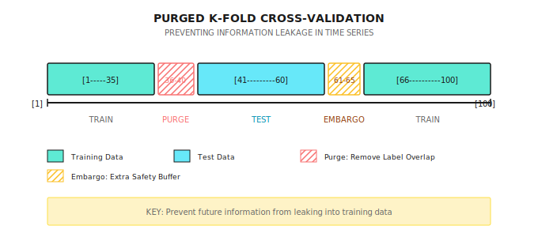

# Background: Time Series Cross-Validation (Purged CV)

> "Using standard K-Fold on financial data is like using tomorrow's newspaper to predict today's stock price."

---

## Why Standard Cross-Validation Fails in Finance?

**Standard K-Fold Assumption**: Samples are mutually independent.

**Financial Data Reality**:
- Today's return is highly correlated with yesterday's (autocorrelation)
- Features used to predict day 100 may include information from days 99, 98
- Labels (returns) often involve multi-day windows

**Result**: Information "leaks" from test set to training set, causing severe overfitting.

---

## A Concrete Leakage Case

**Scenario**: Predicting 5-day future returns

```
Data: Days 1-100
Label: ret_5d[t] = (close[t+5] - close[t]) / close[t]

Sample 95's label uses: Days 95-100 prices
Sample 96's label uses: Days 96-101 prices (partial overlap!)
```

**Standard K-Fold might**:
- Training set includes sample 95 (label involves days 95-100)
- Test set includes sample 96 (label involves days 96-101)
- Days 96-100 information is in both training and testing!

---

## Three Time Series CV Methods

### Method 1: Simple Time Split (Walk-Forward)

```
Fold 1: Train [1-60]  -> Test [61-70]
Fold 2: Train [1-70]  -> Test [71-80]
Fold 3: Train [1-80]  -> Test [81-90]
Fold 4: Train [1-90]  -> Test [91-100]
```

**Pros**: Simple, no future information leakage
**Cons**: Training set grows larger, early data may be stale

### Method 2: Rolling Window

```
Fold 1: Train [1-60]   -> Test [61-70]
Fold 2: Train [11-70]  -> Test [71-80]
Fold 3: Train [21-80]  -> Test [81-90]
Fold 4: Train [31-90]  -> Test [91-100]
```

**Pros**: Fixed training set size, uses most recent data
**Cons**: Low sample utilization

### Method 3: Purged K-Fold (Recommended)

On top of standard K-Fold:
1. **Time Ordering**: Split K folds in chronological order
2. **Purge**: Remove training samples whose labels overlap with test set
3. **Embargo**: Add safety buffer beyond the purge zone

---

## Purged CV Explained

**Problem Setup**:
- Feature window: Past 20 days
- Label window: Future 5 days
- Data: Days 1-100

**Steps**:

```
1. Split Folds (assume 5 folds)
   Fold 3 test set: Days 41-60

2. Identify Leakage Zone
   Test labels involve: Days 41-65 (41+5-1 to 60+5-1)
   Training features involve: Days 21-40 may also affect test

3. Purge
   Remove training samples whose labels overlap with test set
   Remove: Days 36-40 (labels involve 36-45, overlaps with 41-65)

4. Embargo
   Remove N additional samples after the Purge boundary
   If Embargo = 5 days, remove training samples from days 41-45
```

**Visualization**:



---

## The Role of Embargo

**Why is Embargo Needed?**

Even after purging label overlap, there may still be:
- Feature autocorrelation (today's MA20 and tomorrow's MA20 are nearly identical)
- Information propagation delay (news impact lasts several days)
- Market state persistence (trends don't disappear overnight)

**Suggested Embargo Length**:

| Data Frequency | Label Window | Suggested Embargo |
|----------------|--------------|-------------------|
| Daily | 5 days | 3-5 days |
| Daily | 20 days | 10-20 days |
| Minute | 1 hour | 30-60 minutes |
| Tick | 100 Ticks | 50-100 Ticks |

**Rule of Thumb**: Embargo ≈ 0.5 x Label Window

---

## Practical Calculation Example

**Setup**:
- Data: 1000 samples (4 years daily)
- Label: 10-day future return
- K = 5 folds
- Embargo = 5 days

**Fold Allocation**:

| Fold | Original Test Range | Purge Removal | Embargo Removal | Effective Training Samples |
|------|---------------------|---------------|-----------------|---------------------------|
| 1 | 1-200 | None | None | 210-1000 (790) |
| 2 | 201-400 | 191-200 | 401-405 | 1-190, 406-1000 (785) |
| 3 | 401-600 | 391-400 | 601-605 | 1-390, 606-1000 (785) |
| 4 | 601-800 | 591-600 | 801-805 | 1-590, 806-1000 (785) |
| 5 | 801-1000 | 791-800 | None | 1-790 (790) |

**Note**: Each fold loses about 15 samples to prevent leakage.

---

## Comparison with Other Methods

| Method | Info Leakage | Sample Utilization | Compute Complexity | Suitable For |
|--------|--------------|--------------------|--------------------|--------------|
| Standard K-Fold | Severe | High | Low | Not for finance |
| Simple Time Split | None | Medium | Low | Quick validation |
| Rolling Window | None | Low | Medium | Strategy stability testing |
| Purged K-Fold | None | Higher | Medium | Model selection, hyperparameter tuning |
| Purged + Embargo | None | Medium | Medium | Most rigorous validation |

---

## Multi-Agent Perspective

In multi-agent systems, different Agents need different CV strategies:

```
Signal Agent (predicting 5-day returns):
  - Purge: 5-day label window
  - Embargo: 3 days
  - Conservative model performance estimate

Regime Agent (identifying market states):
  - Purge: Usually not needed (state is current)
  - Embargo: Longer (state transitions have inertia)
  - Focus on accuracy during state transitions

Risk Agent (predicting volatility):
  - Purge: Volatility window (e.g., 20 days)
  - Embargo: 5 days
  - Volatility clustering requires longer Embargo
```

---

## Common Misconceptions

**Misconception 1: Using Purged CV prevents overfitting**

Wrong. Purged CV only prevents information leakage, it cannot prevent:
- Overfitting from too many features
- Data snooping (repeatedly testing until finding good results)
- Excessive model complexity

**Misconception 2: Longer Embargo is always better**

Not entirely true. Too long Embargo:
- Wastes effective training samples
- May make training data too stale
- Increases computational cost

**Misconception 3: Only need Purged CV for final testing**

Wrong. Hyperparameter tuning must also use Purged CV, otherwise you'll select overfitting parameters.

---

## Practical Recommendations

### 1. Check if Purging is Needed

```
Need Purging when:
- Labels involve multi-day windows (e.g., future N-day returns)
- Features involve long windows (e.g., 60-day moving average)
- Samples have overlap

Less Need for Purging when:
- Labels are instantaneous (e.g., next tick direction)
- Samples are completely independent (e.g., cross-section of different stocks)
```

### 2. Validate Purge Effectiveness

```
Comparison Experiment:
1. Train with standard K-Fold, record test accuracy
2. Train with Purged K-Fold, record test accuracy
3. Larger difference indicates more severe original leakage
```

### 3. Reserve Completely Independent Test Set

```
Data Allocation:
- 70%: Purged K-Fold for model selection and hyperparameter tuning
- 30%: Completely isolated final test set, use only once
```

---

## Summary

| Key Point | Explanation |
|-----------|-------------|
| Core Problem | Time series samples are not independent, standard CV causes leakage |
| Purge Function | Remove training samples whose labels overlap with test set |
| Embargo Function | Add safety buffer beyond Purge boundary |
| Recommended Method | Purged K-Fold + Embargo |
| Validation Method | Compare standard CV and Purged CV results |
