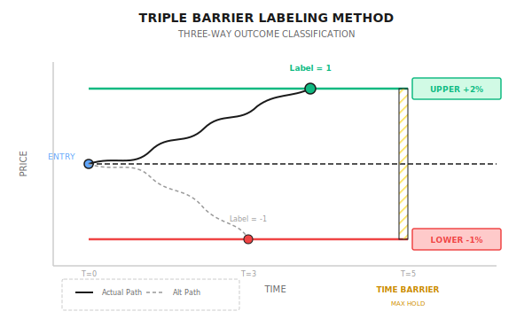

# Background: Triple Barrier Labeling Method

> "Traditional up/down labels ignore a key problem: how long can you hold?"

---

## The Problem with Traditional Labels

Suppose you use machine learning to predict whether AAPL will go up or down tomorrow:

```
Label = 1 if tomorrow's close > today's close else 0
```

**What's the problem?**

| Scenario | Tomorrow's Direction | Traditional Label | Actual Result |
|----------|---------------------|-------------------|---------------|
| Opens -3%, closes +0.5% | Up | 1 (correct) | Stopped out, lost 3% |
| Steady +2% gain | Up | 1 (correct) | Held, earned 2% |
| Rises 5%, closes +0.1% | Up | 1 (correct) | No take-profit, missed 5% |

Traditional labels completely ignore **volatility during the holding period** and **risk management**.

---

## Core Idea of Triple Barrier

Set three "barriers," and whichever is triggered first determines the label:



**Three Barriers**:
1. **Upper Barrier**: Price rises to take-profit level -> Label = 1
2. **Lower Barrier**: Price falls to stop-loss level -> Label = -1
3. **Vertical Barrier (Time)**: Holding period ends -> Label = 0 or based on final direction

---

## Detailed Calculation Example

**Setup**:
- Entry price: $185.00 (AAPL)
- Take-profit: 2% ($188.70)
- Stop-loss: 1% ($183.15)
- Max holding period: 5 days

**Scenario 1**: Day 2 hits $189.00
```
Result: Upper barrier triggered
Label: 1 (Profitable exit)
Actual return: +2%
```

**Scenario 2**: Day 3 drops to $182.50
```
Result: Lower barrier triggered
Label: -1 (Stop-loss exit)
Actual return: -1%
```

**Scenario 3**: 5 days oscillating between $184-$187
```
Result: Time barrier triggered
Label: 0 or based on final price
Actual return: Depends on exit price
```

---

## Dynamic Barriers: Volatility-Based

A fixed 2% take-profit is unreasonable in different market environments:

| Market State | Daily Avg Volatility | Fixed 2% Take-Profit | Problem |
|--------------|----------------------|----------------------|---------|
| Low volatility | 0.5% | Takes 4 days to reach | Time barrier may hit first |
| High volatility | 3% | Triggers same day | Fails to capture the trend |

**Solution**: Use ATR (Average True Range) or rolling standard deviation to define barriers

```
Upper Barrier = Entry Price x (1 + k x sigma)
Lower Barrier = Entry Price x (1 - k x sigma)

Where:
  sigma = Past 20 days return standard deviation
  k = Multiplier (typically 1-3)
```

**Example**:
- sigma = 1.5%
- k = 2
- Entry price = $185

```
Upper Barrier = $185 x (1 + 2 x 1.5%) = $190.55
Lower Barrier = $185 x (1 - 2 x 1.5%) = $179.45
```

---

## Asymmetric Barriers

In real trading, take-profit and stop-loss are often asymmetric:

| Strategy Type | Take-Profit Multiple | Stop-Loss Multiple | Win/Loss Ratio |
|---------------|---------------------|-------------------|----------------|
| Trend Following | 3sigma | 1sigma | 3:1 |
| Mean Reversion | 1sigma | 2sigma | 1:2 |
| High Win Rate | 1sigma | 1sigma | 1:1 |

**Trend Strategy Example**:
```
Take-profit = 3 x 1.5% = 4.5%
Stop-loss = 1 x 1.5% = 1.5%

Win rate only needs >25% to be profitable:
Expected value = Win rate x 4.5% - (1-Win rate) x 1.5%
At Win rate = 30%: Expected value = 0.3% (positive return)
```

---

## Importance of Label Distribution

Triple Barrier produces three types of labels; distribution affects model training:

| Label | Meaning | Ideal Ratio | Actual Reality |
|-------|---------|-------------|----------------|
| 1 | Take-profit exit | 33% | May be <20% in ranging markets |
| -1 | Stop-loss exit | 33% | May be <20% in trending markets |
| 0 | Time exit | 33% | Often >50% |

**Handling Class Imbalance**:
- Oversample minority class (SMOTE)
- Undersample majority class
- Adjust class weights
- Adjust barrier widths for more uniform distribution

---

## Comparison with Traditional Labels

| Dimension | Traditional Label | Triple Barrier |
|-----------|-------------------|----------------|
| Information Content | Direction only | Direction + Risk + Time |
| Consistency with Live Trading | Low | High |
| Computational Complexity | O(1) | O(T) per sample |
| Label Noise | High | Lower |
| Suitable Strategy | Simple prediction | Real trading systems |

---

## Multi-Agent Perspective

In multi-agent architecture, Triple Barrier can be applied like this:

```
Signal Agent: Predict labels (1, 0, -1)
     |
Risk Agent: Dynamically adjust barrier widths
     |
     - High volatility period -> Wider barriers, avoid frequent stop-losses
     - Low volatility period -> Narrower barriers, improve capital efficiency
     |
Execution Agent: Monitor barrier triggers, execute exits
```

---

## Common Misconceptions

**Misconception 1: Wider barriers are always better**

Wrong. Wider barriers reduce stop-loss triggers, but:
- Larger losses per trade
- Longer capital lockup
- May miss other opportunities

**Misconception 2: Time barrier is not important**

Very important. Without a time barrier, capital may be locked up long-term. If 5 days pass without triggering any barrier, the judgment may be wrong, and you should exit to reassess.

**Misconception 3: Triple Barrier labels are always better than traditional labels**

Not necessarily. If your strategy doesn't use take-profit/stop-loss (e.g., T+1 must sell next day), traditional labels may be more appropriate. Labeling method should match actual trading logic.

---

## Practical Recommendations

1. **Start Simple**: Use fixed percentage barriers first, add volatility adjustment after validation
2. **Check Label Distribution**: Adjust when three label types have very uneven ratios
3. **Backtest Consistently**: If training uses Triple Barrier, backtest should simulate same take-profit/stop-loss logic
4. **Consider Trading Costs**: Too narrow barriers lead to frequent trading, costs eat returns

---

## Summary

| Key Point | Explanation |
|-----------|-------------|
| Core Idea | Use take-profit, stop-loss, and time barriers to determine labels |
| Advantage | Labels consistent with actual trading logic, reduced noise |
| Key Parameters | Barrier width, symmetry, time duration |
| Dynamic Adjustment | Set barriers based on volatility (ATR or sigma) |
| Multi-Agent Application | Risk Agent adjusts barriers based on market state |
