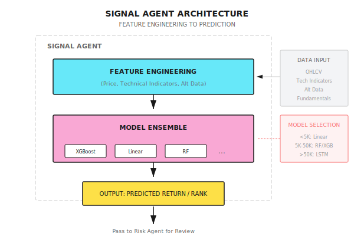

# Lesson 09: Supervised Learning in Quantitative Trading

> **Machine learning is not magic, but a magnifying glass for statistical patterns. If there's no pattern in the data, even the strongest model cannot extract Alpha.**

---

## From "Holy Grail" to "Tool"

In 2017, a hedge fund recruited a team of top AI researchers, promising to "revolutionize" quantitative trading with deep learning.

They built a 10-layer LSTM network, trained on 20 years of minute-level data, running on a GPU cluster for three months.

**Backtest result: 150% annualized return, Sharpe ratio of 4.0.**

The founder excitedly announced: "We've found the Holy Grail!"

**Three months after going live:**

- Month 1: +5% (as expected)
- Month 2: -8% (starting to worry)
- Month 3: -15% (panic)

Cumulative loss of 18%, while the S&P 500 gained 8% in the same period.

**What happened?**

1. **Overfitting to historical noise**: The 10-layer LSTM had millions of parameters, perfectly "memorizing" historical data, but those patterns were just noise
2. **Prediction does not equal profit**: The model's accuracy was 52%, which sounds decent, but after trading costs, it was a net loss
3. **Distribution drift**: The market structure in 2017 was already different from the training data (1997-2016)

**Lesson**: The correct role of machine learning in quantitative trading is not "predicting price movements," but **extracting weak but robust signals from noise**. This lesson teaches you how to use supervised learning correctly.

---

## 9.1 The Quantitative Perspective on Supervised Learning

### What is Supervised Learning?

Using data with known answers to "train" a model so it can predict answers for unknown data.

```
Training Data:
  Input X (Features)          ->  Output Y (Labels)
  [Yesterday's return, Volume, RSI]  ->  [Tomorrow up/down]
  [0.02, 1.5M, 65]            ->  [Up]
  [-0.01, 2.0M, 35]           ->  [Down]

What the model learns:
  "When RSI > 60 and volume increases, probability of rising tomorrow is higher"

Prediction phase:
  New input [0.01, 1.8M, 70]  ->  Model predicts [Up?]
```

### The "Labeling" Dilemma in Quantitative Trading

Traditional machine learning: Labels are clear (cat/dog, spam/not spam)

Quantitative problem: **How should labels be defined?**

| Labeling Approach | Problem |
|-------------------|---------|
| "Tomorrow up = 1, down = 0" | 0.01% gain and 5% gain are both "up"? |
| "5-day return > 1%" | During those 5 days, it might drop 10% first then recover |
| "Return itself" | Too much noise, model struggles to find patterns |
| "Positions with Sharpe > 1" | Requires look-back over entire holding period, look-ahead bias risk |

**The correct approach**: Labels should reflect **executable trading decisions**, not abstract prediction targets.

### Common Misconceptions

| Misconception | Reality |
|---------------|---------|
| "Higher accuracy is better" | 52% accuracy with 3:1 win/loss ratio is far better than 70% accuracy with 1:1 ratio |
| "Complex models are stronger" | Financial data has low signal-to-noise ratio, simple models are often more robust |
| "More features are better" | Too many features lead to curse of dimensionality and overfitting |
| "Deep learning is omnipotent" | Deep learning requires massive data, which quantitative trading usually lacks |

---

## 9.2 Feature Engineering: The Core Battleground of Quantitative Trading

> 80% of Alpha comes from feature engineering, not model selection.

### Types of Features

| Feature Type | Examples | Information Source |
|--------------|----------|-------------------|
| **Price Features** | Returns, volatility, momentum | OHLCV |
| **Technical Indicators** | RSI, MACD, Bollinger Bands | Price-derived |
| **Statistical Features** | Skewness, kurtosis, autocorrelation | Distribution characteristics |
| **Cross-Asset Features** | Sector momentum, market sentiment | Related assets |
| **Alternative Data** | Satellite imagery, social media | External data |

### Feature Construction Example

Suppose we have daily data for AAPL, we construct the following features:

```
Base Data (5 days):
Date      Open    High    Low     Close   Volume
Day 1    $180   $182   $178   $181   10M
Day 2    $181   $185   $180   $184   12M
Day 3    $184   $186   $183   $183   11M
Day 4    $183   $184   $180   $181   15M
Day 5    $181   $183   $179   $182   13M

Feature Calculation (after Day 5 close):

1. Momentum Features
   5-day return = (182 - 181) / 181 = 0.55%
   3-day return = (182 - 184) / 184 = -1.09%

2. Volatility Features
   5-day return sequence: [1.66%, -0.54%, -1.09%, 0.55%]
   Daily volatility = std() = 1.11%
   Annualized volatility = 1.11% x sqrt(252) = 17.6%

3. Volume Features
   5-day average volume = (10+12+11+15+13)/5 = 12.2M
   Today's volume / average = 13/12.2 = 1.07 (slightly above average)

4. Price Position
   5-day high = $186, low = $178
   Current position = (182-178)/(186-178) = 50% (middle position)
```

### Standards for Good Features

| Standard | Verification Method | Consequences if Not Met |
|----------|---------------------|------------------------|
| **Predictive Power** | Univariate test IC > 0.03 | Waste of computational resources |
| **Stability** | IC variation small across periods | Overfitting to specific periods |
| **Low Correlation** | Correlation with existing features < 0.7 | Information redundancy |
| **Interpretable** | Can explain the logic clearly | Hard to debug |

### Practical Methods for Feature Selection

**Method 1: Univariate Screening**

Calculate the correlation between each feature and the label (IC, Information Coefficient):

```
IC = corr(Feature ranking, Return ranking)

Good features: IC mean > 0.03, IC stability (IC/std(IC)) > 0.5
```

**Method 2: Importance Pruning**

Train a simple model (like Random Forest), examine feature importance:

```
If top 5 features contribute > 80% importance:
  -> Keep only top 5-10 features
  -> Other features may be noise
```

**Method 3: Recursive Elimination**

Gradually remove the least important features, observe model performance:

```
Starting: 50 features, Sharpe 1.2
Reduced to 30: Sharpe 1.3 (actually improved!)
Reduced to 10: Sharpe 1.4 (continues to improve)
Reduced to 5: Sharpe 1.1 (starts declining)

-> Optimal feature count is around 10
```

---

## 9.3 Common Models and Their Use Cases

### Model Comparison

| Model | Pros | Cons | Use Cases |
|-------|------|------|-----------|
| **Linear Regression** | Simple, interpretable, resists overfitting | Only captures linear relationships | Factor investing, risk models |
| **Random Forest** | Non-linear, resists overfitting, feature importance | Slow, poor at extrapolation | Classification, feature selection |
| **XGBoost/LightGBM** | Powerful, fast, handles missing values | Easy to overfit, black box | General classification/regression |
| **LSTM** | Captures temporal dependencies | Needs large data, slow | Only for data-rich scenarios |
| **Transformer** | Powerful attention mechanism | Even larger data needs, hard to train | Research frontier, rare in production |

### Model Failure Conditions

**Linear Model Failures:**
- Feature-return relationship is non-linear
- Strong interaction effects exist (e.g., "low valuation + high momentum")

**Tree Model Failures:**
- Need to extrapolate (predict values outside training range)
- Features change continuously (tree models make step-wise predictions)

**Deep Learning Failures:**
- Data size < 100,000 samples (usually overfits)
- Poor feature quality (garbage in, garbage out)
- Severe distribution drift (history does not represent future)

### Practical Choices in Quantitative Trading

```
Ask yourself: How much data do I have?

Data < 5,000 samples (e.g., 20 years of daily data)
  -> Linear model, Ridge regression
  -> Features < 20

Data 5,000-50,000 samples (e.g., 1 year of minute data)
  -> Random Forest, XGBoost
  -> Features 20-50

Data > 50,000 samples (e.g., tick data)
  -> Can try LSTM/Transformer
  -> But still need to verify if they outperform simple models
```

---

## 9.4 Special Challenges of Financial Data

### Low Signal-to-Noise Ratio

Financial signals are extremely weak:

| Data Type | Signal-to-Noise Ratio | Achievable Predictive Power |
|-----------|-----------------------|----------------------------|
| Image Recognition | High | Accuracy 95%+ |
| Natural Language | Medium | Accuracy 80%+ |
| Financial Prediction | **Extremely Low** | 52-55% accuracy is already top-tier |

**Why is financial signal-to-noise so low?**
- Markets are nearly efficient: Obvious patterns are quickly arbitraged away
- Many participants: Patterns you find, others are using too
- Noise dominates: 90% of short-term price movement is random fluctuation

### Non-Stationary Distribution

Training data and prediction data have different distributions:

```
Training Set (2015-2019):
  Average volatility 15%
  Trend-dominated

Test Set (2020):
  Volatility spikes to 80%
  Extreme rallies and crashes

-> Model fails in 2020
```

**Coping Methods:**
- Use rolling windows, retrain constantly
- Feature normalization using rolling statistics
- Model different regimes separately

### Class Imbalance

If using "Big gain (>3%) = 1, otherwise = 0":

```
Big gain days: ~5%
Normal days: ~95%

Model learns to "always predict 0", 95% accuracy, but completely useless
```

**Coping Methods:**
- Adjust class weights
- Use AUC instead of accuracy for evaluation
- Stratified sampling to ensure training set class balance

---

## 9.5 Model Evaluation: Not About Accuracy

### Quantitative-Specific Evaluation Metrics

| Metric | Calculation | Good Standard |
|--------|-------------|---------------|
| **IC (Information Coefficient)** | corr(Prediction ranking, Actual return ranking) | > 0.03 |
| **IR (Information Ratio)** | IC mean / IC standard deviation | > 0.5 |
| **Long-Short Return** | Top quintile - Bottom quintile return difference | Significantly positive |
| **Turnover-Adjusted Return** | Return - Trading costs | Still positive |

### Model Evaluation Example

Suppose the model predicts tomorrow's return ranking for 100 stocks:

```
Model Predicted Ranking (high->low):
  Stock A: 1 (predicted to rise most)
  Stock B: 2
  ...
  Stock Z: 100 (predicted to fall most)

Actual Return Ranking (high->low):
  Stock A: 5
  Stock B: 10
  ...
  Stock Z: 95

IC = corr([1,2,...,100], [5,10,...,95])
   = 0.85 (predicted ranking highly correlated with actual ranking)
```

**Interpretation:**
- IC = 0.85 means predicted ranking is highly consistent with actual ranking
- If you go long Top 10 and short Bottom 10, expect significant excess returns
- But in real markets, IC is usually only 0.02-0.05

### Real-World Expectations

```
Top quantitative funds' IC: 0.03-0.05
Average quantitative strategy IC: 0.01-0.03
Random guessing IC: 0

Don't aim for IC > 0.1, that's almost certainly overfitting
```

### Production-Grade IC Calculation

The simple IC calculation shown earlier is fine for quick analysis, but production systems need robust handling of edge cases. Here is a production-ready implementation:

```python
import numpy as np
from scipy.stats import spearmanr

def calculate_ic(
    signals: np.ndarray,
    returns: np.ndarray,
    method: str = "spearman"
) -> float:
    """Calculate Information Coefficient (IC) - correlation between signals and returns

    Args:
        signals: Prediction signal array
        returns: Actual returns array
        method: "spearman" (recommended) or "pearson"

    Returns:
        IC value, range [-1, 1]
    """
    if len(signals) != len(returns):
        raise ValueError("signals and returns must have same length")
    if len(signals) < 2:
        return 0.0

    # Handle missing values - essential for production
    mask = ~(np.isnan(signals) | np.isnan(returns))
    signals, returns = signals[mask], returns[mask]

    if len(signals) < 2:
        return 0.0

    if method == "spearman":
        ic, _ = spearmanr(signals, returns)
    else:
        ic = np.corrcoef(signals, returns)[0, 1]

    return float(ic) if not np.isnan(ic) else 0.0
```

#### Why Spearman is Preferred Over Pearson

| Aspect | Spearman | Pearson |
|--------|----------|---------|
| **Outlier Sensitivity** | Robust - uses ranks | Highly sensitive - single outlier can distort |
| **Relationship Type** | Captures monotonic (non-linear) | Only captures linear |
| **Distribution Assumption** | None required | Assumes normality |
| **Financial Data Fit** | Better - returns have fat tails | Poor - violates normality assumption |

**Key insight**: Financial returns are notorious for fat tails and outliers. A single extreme day (like a market crash) can completely distort Pearson correlation. Spearman converts values to ranks first, making it immune to outlier magnitude.

#### Usage Examples

**Basic IC Calculation:**

```python
# Daily signals and next-day returns
signals = np.array([0.02, -0.01, 0.03, 0.01, -0.02])
returns = np.array([0.015, -0.005, 0.02, 0.008, -0.01])

ic = calculate_ic(signals, returns)
print(f"IC: {ic:.4f}")  # IC: 0.9000 (strong correlation)
```

**Rolling IC (Time Series):**

```python
def rolling_ic(
    signals: pd.Series,
    returns: pd.Series,
    window: int = 20
) -> pd.Series:
    """Calculate rolling IC over a sliding window"""
    ic_series = pd.Series(index=signals.index, dtype=float)

    for i in range(window, len(signals)):
        sig_window = signals.iloc[i-window:i].values
        ret_window = returns.iloc[i-window:i].values
        ic_series.iloc[i] = calculate_ic(sig_window, ret_window)

    return ic_series

# Example: 20-day rolling IC
rolling_ic_values = rolling_ic(signal_series, return_series, window=20)
```

**Information Ratio (IR) Calculation:**

```python
def calculate_ir(ic_series: pd.Series) -> float:
    """Calculate Information Ratio = mean(IC) / std(IC)

    IR > 0.5 indicates a robust signal
    """
    ic_clean = ic_series.dropna()
    if len(ic_clean) < 2 or ic_clean.std() == 0:
        return 0.0
    return ic_clean.mean() / ic_clean.std()

# Example
ir = calculate_ir(rolling_ic_values)
print(f"IR: {ir:.2f}")  # IR > 0.5 is good
```

#### Production Notes

1. **Data Alignment**: Ensure signals and returns are properly aligned. Signals at time T should correspond to returns from T to T+1 (or your prediction horizon). Off-by-one errors are the most common IC calculation bug.

2. **Minimum Sample Size**: Use at least 30 observations for meaningful IC. With fewer samples, the correlation estimate has high variance and is unreliable.

3. **IC Decay Monitoring**: Track IC over time. A declining IC trend indicates:
   - Alpha decay (your signal is becoming crowded)
   - Regime change (market structure shifted)
   - Model drift (features no longer predictive)

```python
# IC decay detection
recent_ic = rolling_ic_values.tail(20).mean()
historical_ic = rolling_ic_values.tail(60).head(40).mean()

if recent_ic < historical_ic * 0.5:
    print("WARNING: IC has decayed by 50%+")
```

4. **Cross-Sectional vs Time-Series IC**:
   - **Cross-sectional IC**: Correlation across stocks at one point in time (typical for stock selection)
   - **Time-series IC**: Correlation over time for one asset (typical for timing signals)

   The implementation above works for both; just ensure your data is structured correctly.

---

## 9.6 Multi-Agent Perspective

### Model Selection for Signal Agent

In multi-agent systems, supervised learning models are the core of the Signal Agent:



### What to Do When Models Fail?

Signal Agent needs to detect whether its own model is failing:

| Detection Metric | Threshold | Triggered Action |
|------------------|-----------|------------------|
| Rolling IC < 0 for 20 consecutive days | - | Reduce signal weight by 50% |
| Prediction distribution anomaly | Skewness > 2 | Pause signal output |
| Model confidence declining | Prediction variance increasing | Notify Meta Agent |

**Key Design**: Signal Agent is not always correct; it needs a "self-doubt" mechanism.

---

## Code Implementation (Optional)

<details>
<summary>Expand code example</summary>

```python
import pandas as pd
import numpy as np
from sklearn.ensemble import RandomForestClassifier
from sklearn.model_selection import TimeSeriesSplit

def create_features(df: pd.DataFrame, lookback: int = 20) -> pd.DataFrame:
    """Build quantitative features"""
    features = pd.DataFrame(index=df.index)

    # Momentum features
    features['ret_1d'] = df['close'].pct_change(1)
    features['ret_5d'] = df['close'].pct_change(5)
    features['ret_20d'] = df['close'].pct_change(20)

    # Volatility features
    features['vol_20d'] = df['close'].pct_change().rolling(20).std()

    # Volume features
    features['vol_ratio'] = df['volume'] / df['volume'].rolling(20).mean()

    # Price position
    features['price_pos'] = (
        (df['close'] - df['low'].rolling(20).min()) /
        (df['high'].rolling(20).max() - df['low'].rolling(20).min())
    )

    return features.shift(1)  # Avoid look-ahead bias

def create_label(df: pd.DataFrame, horizon: int = 5, threshold: float = 0.02):
    """Create label: whether future n-day return exceeds threshold"""
    future_ret = df['close'].pct_change(horizon).shift(-horizon)
    label = (future_ret > threshold).astype(int)
    return label

def calculate_ic(predictions: pd.Series, returns: pd.Series) -> float:
    """Calculate Information Coefficient"""
    return predictions.corr(returns, method='spearman')

def walk_forward_train(df: pd.DataFrame, n_splits: int = 5):
    """Walk-Forward training and evaluation"""
    features = create_features(df)
    labels = create_label(df)

    # Align data
    valid_idx = features.dropna().index.intersection(labels.dropna().index)
    X = features.loc[valid_idx]
    y = labels.loc[valid_idx]

    tscv = TimeSeriesSplit(n_splits=n_splits)
    results = []

    for train_idx, test_idx in tscv.split(X):
        X_train, X_test = X.iloc[train_idx], X.iloc[test_idx]
        y_train, y_test = y.iloc[train_idx], y.iloc[test_idx]

        model = RandomForestClassifier(n_estimators=100, max_depth=5, random_state=42)
        model.fit(X_train, y_train)

        predictions = model.predict_proba(X_test)[:, 1]
        # Calculate forward returns (next 5 days), aligned with prediction horizon
        forward_returns = df.loc[X_test.index, 'close'].pct_change(5).shift(-5)
        ic = calculate_ic(pd.Series(predictions, index=X_test.index),
                         forward_returns)

        results.append({
            'test_start': X_test.index[0],
            'test_end': X_test.index[-1],
            'ic': ic,
            'accuracy': (model.predict(X_test) == y_test).mean()
        })

    return pd.DataFrame(results)
```

</details>

---

## Lesson Deliverables

After completing this lesson, you will have:

1. **Understanding of supervised learning's role in quantitative trading** - Know what it can and cannot do
2. **Practical feature engineering skills** - Able to construct and screen effective quantitative features
3. **Model selection framework** - Choose appropriate models based on data size
4. **Correct evaluation methods** - Use IC/IR instead of accuracy to evaluate models

### Acceptance Criteria

| Check Item | Acceptance Standard | Self-Test Method |
|------------|---------------------|------------------|
| **Feature Construction** | Can build 5 features from OHLCV data | Given price data, manually calculate feature values |
| **Model Selection** | Can recommend a model based on data size | Given "3 years daily" scenario, state recommendation |
| **IC Calculation** | Can explain what IC=0.03 means | Without notes, explain IC's business meaning |
| **Failure Detection** | Can list 3 model failure signals | Design Signal Agent's self-check logic |

---

## Lesson Summary

- [x] Understand supervised learning's correct role in quantitative trading: extracting weak signals, not predicting price movements
- [x] Master core feature engineering methods: construction, screening, evaluation
- [x] Recognize special challenges of financial data: low signal-to-noise, non-stationarity, class imbalance
- [x] Learn to use IC/IR instead of accuracy to evaluate models
- [x] Understand how Signal Agent integrates supervised learning models

---

## Further Reading

- *Advances in Financial Machine Learning* by Marcos Lopez de Prado
- [Background: LLM Research in Quantitative Trading](Background/LLM-Research-in-Quantitative-Trading.md) - Latest research directions

---

## Next Lesson Preview

**Lesson 10: From Models to Agents**

Models only output predictions, but trading requires decisions. How do you package a "prediction model" into an "Agent capable of making decisions"? In the next lesson, we bridge the gap from models to Agents.
