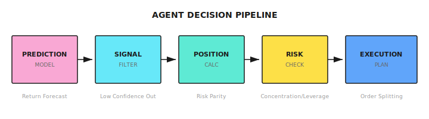
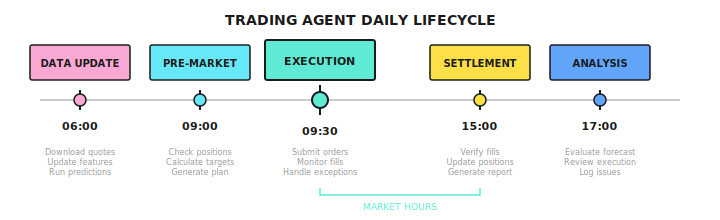
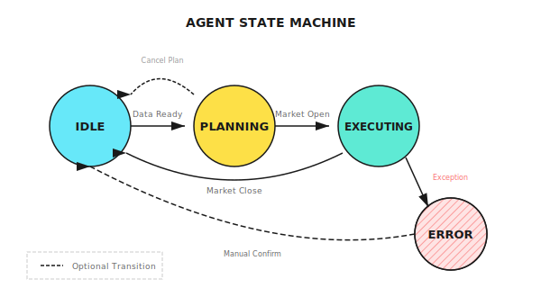
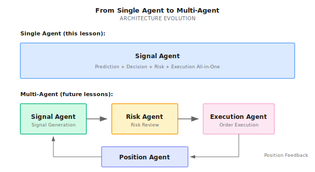

# Lesson 10: From Models to Agents

> **The model says "tomorrow will rise," but by how much? How much should you buy? When should you sell? The model doesn't answer these questions, but the Agent must.**

---

## The Limitations of Models

A quantitative team trained a high-quality prediction model:

- IC = 0.05 (top-tier level)
- Daily predictions for 500 stocks' return rankings
- Backtest validated stable and effective

They connected the model to their trading system with simple rules:
- Buy top 10 predicted stocks each day
- Allocate funds equally across each stock
- Sell after holding for 5 days

**First month**: +3% return, as expected

**Second month**: -5% return

What happened?

1. **Didn't consider correlations**: All 10 stocks bought were tech stocks; when the tech sector declined, all lost together
2. **Didn't consider volatility**: Some stocks had 5% daily volatility, others only 1%, but funds were equally distributed
3. **No stop-loss mechanism**: One stock kept falling 15%, still held until day 5
4. **Didn't handle unexpected events**: One stock was halted, capital was locked up

**Models are only responsible for "prediction," while Agents must be responsible for "decisions."** Decision-making involves:
- **What to buy?** (Asset selection)
- **How much to buy?** (Position sizing)
- **When to buy/sell?** (Timing)
- **What if something goes wrong?** (Exception handling)

This lesson teaches you how to upgrade a "prediction model" into an "Agent capable of decisions."

---

## 10.1 Prediction vs Decision

### Core Differences

| | Prediction Model | Trading Agent |
|--|-----------------|---------------|
| **Input** | Feature vector | Features + State + Constraints |
| **Output** | Predicted value/probability | Specific action |
| **Evaluation** | Prediction error (IC, MSE) | Return/Risk/Cost |
| **Time** | Point prediction | Continuous decision-making |
| **Error Handling** | None | Required |

### Intuitive Example

```
Model output:
  "AAPL expected return tomorrow +0.5%, confidence 60%"

Agent must answer:
  1. Should I buy? -> Need to compare with other stocks, consider current positions
  2. How much to buy? -> Need to consider capital, risk limits, correlations
  3. At what price? -> Market order or limit order? At what level?
  4. Where's the stop-loss? -> If prediction is wrong, how much loss before exit?
  5. When to sell? -> Target price, holding period, or dynamic take-profit?
```

### Agent's Decision Pipeline



---

## 10.2 Core Components of an Agent

### State

The Agent needs to know "what situation am I in":

| State Type | Example Content |
|------------|-----------------|
| **Market State** | Current price, volatility, volume, trend/range |
| **Position State** | Current holdings, cost basis, P&L, holding duration |
| **Account State** | Available cash, margin, leverage used |
| **System State** | Is API working? What's the latency? Any alerts? |

### Action Space

Actions the Agent can take:

```
Basic Actions:
  - BUY(symbol, quantity, order_type, price)
  - SELL(symbol, quantity, order_type, price)
  - HOLD()

Composite Actions:
  - REBALANCE(target_weights)
  - REDUCE_RISK(target_exposure)
  - CLOSE_ALL()

Constraints:
  - Single trade no more than 10% of available capital
  - Total leverage no more than 2x
  - Single stock no more than 20% of total position
```

### Decision Function

Maps state to action:

```
action = decide(state, prediction, constraints)

Example:
  state = {
    cash: $100,000,
    positions: {AAPL: 100 shares, $180 cost},
    market_regime: "trend"
  }

  prediction = {
    AAPL: +0.5%,
    MSFT: +0.8%,
    GOOGL: +0.3%
  }

  constraints = {
    max_position: 20%,
    max_drawdown: 10%,
    stop_loss: 5%
  }

  action = decide(state, prediction, constraints)
  -> BUY(MSFT, 50 shares, LIMIT, $380)
```

---

## 10.3 Position Sizing: From Prediction to Position

### Equal Weight (Simplest)

```
Rule: Buy Top N, allocate 1/N of funds to each

Example:
  Top 5 stocks, capital $100,000
  Each gets $20,000
```

**Problem**: Doesn't consider prediction strength, volatility differences, correlations

### Allocation by Prediction Strength

```
Rule: Stronger prediction, larger allocation

Predicted returns:
  AAPL: +1.0%
  MSFT: +0.5%
  GOOGL: +0.3%

Weight calculation:
  AAPL: 1.0 / 1.8 = 56%
  MSFT: 0.5 / 1.8 = 28%
  GOOGL: 0.3 / 1.8 = 16%
```

**Problem**: High volatility stocks may get too much weight

### Volatility Adjustment (Risk Parity)

```
Rule: Let each stock contribute equal risk

Volatility:
  AAPL: 25%
  MSFT: 20%
  GOOGL: 15%

Inverse volatility weights:
  AAPL: 1/0.25 = 4
  MSFT: 1/0.20 = 5
  GOOGL: 1/0.15 = 6.67

Normalized:
  AAPL: 4/15.67 = 26%
  MSFT: 5/15.67 = 32%
  GOOGL: 6.67/15.67 = 42%
```

### Kelly Formula (Optimal)

Theoretically optimal position size:

```
Kelly fraction = p/a - q/b

p = win rate
q = 1 - p
a = average loss rate
b = average win rate

Example:
  Win rate 55%, win/loss ratio 1.5:1
  Kelly = 0.55/1 - 0.45/1.5 = 0.55 - 0.30 = 25%

In practice: Use half-Kelly (12.5%) for more conservative approach
```

### Half-Kelly + Van Tharp Hybrid Model (Recommended)

**Why use a hybrid model?**

Using Kelly formula alone has two problems:
1. **Assumes infinite divisibility**: In reality, stocks have minimum trading units
2. **Ignores fat-tail risk**: During market crashes, losses can far exceed historical averages

Van Tharp's R-Multiple method addresses this gap - it forces stop-loss into position calculation, ensuring single-trade losses never exceed a fixed percentage of the account.

**The two methods' roles**:

| Method | Role | Purpose |
|--------|------|---------|
| **Half-Kelly** | Offense - sets upper bound | Maximize long-term compound growth |
| **Van Tharp R-Multiple** | Defense - sets lower bound | Survival - single loss never fatal |

**Formulas**:

```
Half-Kelly (Offensive Ceiling):
  f = (p × (b + 1) - 1) / b, then divide by 2

  p = win rate
  b = reward/risk ratio (average win / average loss)

Van Tharp R-Multiple (Defensive Floor):
  position_size = (equity × risk_pct) / stop_loss_distance

  equity = account equity
  risk_pct = risk per trade (typically 1%)
  stop_loss_distance = entry price - stop loss price
```

**Implementation Pattern**:

```python
def half_kelly(win_rate: float, reward_risk_ratio: float) -> float:
    """Calculate Half-Kelly position ceiling"""
    full_kelly = (win_rate * (reward_risk_ratio + 1) - 1) / reward_risk_ratio
    return max(0, full_kelly / 2)

def van_tharp_limit(equity: float, risk_pct: float, stop_loss_dist: float, price: float) -> float:
    """Calculate Van Tharp position ceiling (returns position ratio)"""
    max_loss = equity * risk_pct
    shares = max_loss / stop_loss_dist
    position_value = shares * price
    return position_value / equity

# Final position = minimum of all three
strategy_cap = half_kelly(win_rate=0.55, reward_risk_ratio=1.5)  # e.g., 0.10 (10%)
risk_cap = van_tharp_limit(equity=100000, risk_pct=0.01, stop_loss_dist=5, price=100)  # e.g., 0.08 (8%)
max_notional_per_pair = 0.05  # Hard limit: no more than 5% per trade

final_position = min(strategy_cap, risk_cap, max_notional_per_pair)
```

**Worked Example**:

```
Account: $100,000
Strategy history: 55% win rate, 1.5:1 reward/risk ratio
Target: AAPL at $200, stop-loss at $190 (distance $10)

Step 1: Half-Kelly Ceiling
  f = (0.55 × 2.5 - 1) / 1.5 / 2 = 0.375 / 2 = 18.75%
  -> Maximum investment $18,750

Step 2: Van Tharp Floor
  Max loss per trade = $100,000 × 1% = $1,000
  Shares allowed = $1,000 / $10 = 100 shares
  Position value = 100 × $200 = $20,000
  -> By risk control, max investment $20,000

Step 3: Hard Limit
  Per-trade cap = $100,000 × 5% = $5,000

Final position = min($18,750, $20,000, $5,000) = $5,000
-> Buy 25 shares of AAPL
```

**Core Principle**:

> **Half-Kelly defines the offensive ceiling; Van Tharp R-Multiple defines the survival floor.**

Combining both ensures:
1. Not too conservative when opportunities arise (Kelly's mathematical optimization)
2. Not fatal when judgment is wrong (Van Tharp's risk control floor)
3. Hard limits prevent over-concentration (regardless of model confidence)

### Position Calculation Example

Assumptions:
- Capital $100,000
- Max single position 20% ($20,000)
- Max total position 80% ($80,000)

Model predicts Top 3:

| Stock | Predicted Return | Volatility | Raw Weight | Risk-Adjusted Weight | Final Position |
|-------|------------------|------------|------------|----------------------|----------------|
| AAPL | +1.0% | 25% | 40% | 30% | $24,000 -> **$20,000** (capped) |
| MSFT | +0.8% | 20% | 32% | 35% | $28,000 -> **$20,000** (capped) |
| GOOGL | +0.7% | 15% | 28% | 35% | $28,000 -> **$20,000** (capped) |

Final: AAPL/MSFT/GOOGL each $20,000, total position 60%

---

## 10.4 Risk Control Integration

### Agent's Built-in Risk Rules

| Rule Type | Example | Triggered Action |
|-----------|---------|------------------|
| **Stop-Loss** | Single position loss > 5% | Close position |
| **Take-Profit** | Single position gain > 10% | Reduce position by 50% |
| **Total Drawdown** | Account drawdown > 15% | Stop opening new positions |
| **Concentration** | Single stock > 25% | Prohibit adding more |
| **Time** | Holding > 20 days | Force close position |

### Collaboration with Risk Agent

```
Signal Agent proposes:
  "Buy AAPL $30,000"

Agent internal check:
  OK - Single trade < max position
  OK - Enough cash available
  X  - If bought, tech sector will exceed 60%

Internal processing options:
  A) Reduce order to $15,000
  B) Simultaneously sell some other tech stocks
  C) Abandon this trade

-> Choose A, submit $15,000 order to Risk Agent for review

Risk Agent review:
  OK - Meets account-level risk controls
  OK - No anomalies
  -> Approve for execution
```

---

## 10.5 Exception Handling

### Required Exception Handling

| Exception Type | Scenario | Handling Method |
|----------------|----------|-----------------|
| **Order Rejection** | Insufficient funds, stock halted | Log, adjust plan |
| **Partial Fill** | Insufficient liquidity | Decide whether to chase |
| **Price Gap** | Overnight big move | Re-evaluate stop-loss price |
| **API Timeout** | Network issues | Retry mechanism + circuit breaker |
| **Missing Data** | Data source failure | Use backup data source or pause |

### Exception Handling Design Principles

1. **Fail Fast**: When uncertain, stop rather than continue executing
2. **Graceful Degradation**: Have backup plans when main functionality fails
3. **Human Intervention**: Severe exceptions trigger alerts, wait for human decision
4. **Post-Mortem Audit**: All exceptions are logged for review

---

## 10.6 Agent Lifecycle

### Daily Process



### State Machine Perspective



---

## 10.7 Multi-Agent Perspective

### Signal Agent's Position

```
Signal Agent Responsibilities:
  - Run prediction models
  - Generate raw signals (prediction rankings/returns)
  - Initial position calculation
  - Signal confidence assessment

Signal Agent Does Not:
  - Final order decision (Risk Agent)
  - Order execution (Execution Agent)
  - Position monitoring (Position Agent)
```

### From Single Agent to Multi-Agent



This lesson covers the simplified version of "single Agent does everything." Starting from Lesson 11, we'll split different responsibilities into specialized Agents.

---

## Code Implementation (Optional)

<details>
<summary>Expand code example</summary>

```python
from dataclasses import dataclass
from typing import Dict, List, Optional
from enum import Enum

class OrderType(Enum):
    MARKET = "market"
    LIMIT = "limit"

@dataclass
class Order:
    symbol: str
    quantity: int
    side: str  # "buy" or "sell"
    order_type: OrderType
    price: Optional[float] = None

@dataclass
class Position:
    symbol: str
    quantity: int
    avg_cost: float
    current_price: float

    @property
    def pnl_pct(self) -> float:
        return (self.current_price - self.avg_cost) / self.avg_cost

class TradingAgent:
    def __init__(
        self,
        capital: float,
        max_position_pct: float = 0.2,
        max_total_exposure: float = 0.8,
        stop_loss_pct: float = 0.05
    ):
        self.capital = capital
        self.max_position_pct = max_position_pct
        self.max_total_exposure = max_total_exposure
        self.stop_loss_pct = stop_loss_pct
        self.positions: Dict[str, Position] = {}

    def get_current_exposure(self) -> float:
        """Calculate current total exposure as fraction of capital"""
        total_value = sum(
            pos.quantity * pos.current_price
            for pos in self.positions.values()
        )
        return total_value / self.capital

    def calculate_position_size(
        self,
        symbol: str,
        prediction: float,
        volatility: float,
        current_price: float
    ) -> int:
        """Calculate position size"""
        # Check total exposure limit
        current_exposure = self.get_current_exposure()
        remaining_exposure = self.max_total_exposure - current_exposure
        if remaining_exposure <= 0:
            return 0  # Already at max total exposure

        # Raw weight based on prediction strength
        raw_weight = abs(prediction)

        # Volatility adjustment
        vol_adjusted_weight = raw_weight / volatility

        # Cap single position, also respect remaining exposure headroom
        capped_weight = min(vol_adjusted_weight, self.max_position_pct, remaining_exposure)

        # Calculate shares
        position_value = self.capital * capped_weight
        shares = int(position_value / current_price)

        return shares

    def check_stop_loss(self) -> List[Order]:
        """Check stop-loss triggers"""
        orders = []
        for symbol, pos in self.positions.items():
            if pos.pnl_pct < -self.stop_loss_pct:
                orders.append(Order(
                    symbol=symbol,
                    quantity=pos.quantity,
                    side="sell",
                    order_type=OrderType.MARKET
                ))
        return orders

    def generate_orders(
        self,
        predictions: Dict[str, float],
        volatilities: Dict[str, float],
        prices: Dict[str, float]
    ) -> List[Order]:
        """Generate orders"""
        orders = []

        # 1. Check stop-loss first
        stop_loss_orders = self.check_stop_loss()
        orders.extend(stop_loss_orders)

        # 2. Calculate target positions
        for symbol, pred in predictions.items():
            if pred > 0.001:  # Only process positive predictions
                target_shares = self.calculate_position_size(
                    symbol, pred,
                    volatilities.get(symbol, 0.2),
                    prices[symbol]
                )

                current_shares = self.positions.get(symbol, Position(symbol, 0, 0, 0)).quantity
                diff = target_shares - current_shares

                if diff > 0:
                    orders.append(Order(
                        symbol=symbol,
                        quantity=diff,
                        side="buy",
                        order_type=OrderType.LIMIT,
                        price=prices[symbol] * 0.999  # Slightly below current price
                    ))
                elif diff < 0:
                    orders.append(Order(
                        symbol=symbol,
                        quantity=-diff,
                        side="sell",
                        order_type=OrderType.LIMIT,
                        price=prices[symbol] * 1.001  # Slightly above current price
                    ))

        return orders
```

</details>

---

## Lesson Deliverables

After completing this lesson, you will have:

1. **Prediction-to-decision transformation mindset** - Understand how model outputs become concrete trading actions
2. **Agent architecture design** - Design methods for state, action space, and decision function
3. **Position sizing skills** - Calculation methods for equal weight, prediction-weighted, risk parity
4. **Exception handling awareness** - Know which exceptions must be handled

### Acceptance Criteria

| Check Item | Acceptance Standard | Self-Test Method |
|------------|---------------------|------------------|
| **Prediction vs Decision** | Can state 3 core differences | Without notes, list differences |
| **Position Calculation** | Can manually calculate risk parity weights | Given 3 stocks' volatilities, calculate weights |
| **Decision Pipeline** | Can draw complete flow from prediction to order | Draw on blank paper |
| **Exception Handling** | Can list 5 types of exceptions that must be handled | Design exception handling table |

**Scenario Exercise:**

Model predicts: AAPL +1.2%, TSLA +0.8%, MSFT +0.5%
Volatility: AAPL 25%, TSLA 50%, MSFT 20%
Capital: $100,000, max single position 20%

Question: Using risk parity calculation, how much capital should be allocated to each stock?

<details>
<summary>Click to see answer</summary>

Inverse volatility:
- AAPL: 1/0.25 = 4
- TSLA: 1/0.50 = 2
- MSFT: 1/0.20 = 5
- Total: 11

Normalized weights:
- AAPL: 4/11 = 36.4%
- TSLA: 2/11 = 18.2%
- MSFT: 5/11 = 45.4%

Capital allocation (considering 20% single position cap):
- AAPL: $36,400 -> **$20,000** (capped)
- TSLA: $18,200 -> $18,200
- MSFT: $45,400 -> **$20,000** (capped)

Final: AAPL $20k, TSLA $18.2k, MSFT $20k, total position 58.2%

</details>

---

## Lesson Summary

- [x] Understand the core differences between prediction models and trading Agents
- [x] Master Agent's core components: state, action space, decision function
- [x] Learn multiple position sizing methods: equal weight, prediction-weighted, risk parity, Kelly
- [x] Recognize required exception types and handling principles
- [x] Understand Signal Agent's position in multi-agent systems

---

## Further Reading

- *Active Portfolio Management* by Grinold & Kahn - Classic work on position management
- [Lesson 15: Risk Control and Money Management](../Part4-Multi-Agent/Lesson-15-Risk-Control-and-Money-Management.md) - More detailed risk control content

---

## Part 3 Summary

Congratulations on completing the Machine Learning stage!

| Lesson | Key Takeaways |
|--------|---------------|
| Lesson 09 | Supervised learning's role in quantitative trading, feature engineering, model selection, IC evaluation |
| Lesson 10 | Transformation from prediction to decision, Agent architecture, position sizing |

**Next Stage Preview:**

Part 4 will dive into Multi-Agent Systems:
- Lesson 11: Why Multi-Agent is Needed
- Lesson 12: Market Regime Detection
- Lesson 13: Regime Misjudgment and Systemic Collapse Patterns
- Lesson 14: LLM Applications in Quantitative Trading
- Lesson 15: Risk Control and Capital Management
- Lesson 16: Portfolio Construction and Risk Exposure Management
- Lesson 17: Online Learning and Strategy Evolution

You will learn how to build a complete multi-agent trading system, letting different expert Agents collaborate to complete the full workflow from analysis to execution.
